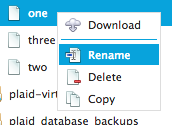

.. sectionauthor:: Genova Morel <genova.morel@tartansolutions.com>
.. sectionauthor:: Paul Morel <paul.morel@tartansolutions.com>

File and Folder Management
==========================

.. sidebar:: This Page

   .. contents::
      :local:

Account Types and Navigation
----------------------------

Shared Accounts
~~~~~~~~~~~~~~~

Shared accounts provide access to files stored in various locations
including:

- Amazon S3
- Azure Cloud Storage
- Rackspace Cloudfiles
- Dropbox
- Google Drive
- Local Servers via SFTP

Shared account access is controlled in three different modes:

-  Workspace - Share with all members of the current workspace
-  Member - Share with specific members of the workspace
-  Role - Share with specific security groups in the workspace

Only account owners will have the ability to know which type of sharing mode is being
used, members will not. They simply will or will not be able to use the account.

To access shared accounts, first select the main **Document** page then select "Shared Accounts" along the top of the page.
This will open a list of accounts to explore, provided the member has been 
given access to at least one shared account.

|Document Tab SA|

Private Accounts
~~~~~~~~~~~~~~~~

Private accounts operate much like shared accounts but are only viewable 
by the owners. This is particularly useful for storing sensitive information 
that is not intended for wider sharing.

To access private accounts, first select the main **Document** page then select "My Private Accounts" along the top of the page. This will open a list of accounts to explore, provided the member has 
private accounts already established.

|My Private Accounts Tab|

File Explorer
-------------

Several file operations are available. All operations are accessible from a right-click 
menu within the file browser. The right-click menu provides specific options depending on
whether a folder or file is selected.

To open the file explorer, click on the folder icon (far left) from the list of private or shared accounts.  |Demo Data Icon|

**Folder** options consist of uploading new folders, creating new folders, and renaming, deleting, and downloading current folders as ZIPs while **file** options consist of downloading new files and renaming, deleting, and refreshing current files.

|Folder File Select Options|  

To navigate to the file explorer:

1) Open Document
2) Select "Shared Accounts" along the top of the page

|Document Tab SA|

3) Click the folder icon (far left) for Demo Data

|Demo Data Icon|

The various file and folder operations available in the file explorer are detailed below:

Upload a File
~~~~~~~~~~~~~~~

1) Open Document
2) Select "Shared Accounts" along the top of the page
3) Click the folder icon (far left) for Demo Data
4) Browse to appropriate directory
5) Right-click and select "Upload Here".

|Upload File Select|

.. note:: Multiple files may be uploaded at one time.

Download a File
~~~~~~~~~~~~~~~~~~~~~~~~~~~~~~

1) Open Document
2) Select "Shared Accounts" along the top of the page
3) Click the folder icon (far left) for Demo Data
4) Browse to appropriate directory
5) Left-click to select the desired file

|File Select|

6) Right-click and select "Download"

|Download File Select|

Rename a File
~~~~~~~~~~~~~~~~~~~~~~~~~~~~~~

1) Open Document
2) Select "Shared Accounts" along the top of the page
3) Click the folder icon (far left) for Demo Data
4) Browse to appropriate directory
5) Left-click to select the desired file

|File Select|

6) Right-click and select "Rename"

|Rename File Select|

Move a File
~~~~~~~~~~~~~~~~~~~~~~~~~~~~~~

1) Open Document
2) Select "Shared Accounts" along the top of the page
3) Click the folder icon (far left) for Demo Data
4)  Browse to appropriate directory
5) Left-click to select the desired file

|File Select|

6) Drag into desired folder
7) Select "Move File" 

|Move File Select|

Copy a File
~~~~~~~~~~~~~~~~~~~~~~~~~~~~~~

1) Open Document
2) Select "Shared Accounts" along the top of the page
3) Click the folder icon (far left) for Demo Data
4) Browse to appropriate directory
5) Left-click to select the desired file

|File Select|

6) Right-click and select "Copy"

|Copy File Select|

Delete a File
~~~~~~~~~~~~~~~

1) Open Document
2) Select "Shared Accounts" along the top of the page
3) Click the folder icon (far left) for Demo Data
4) Browse to appropriate directory
5) Left-click to select the desired file

|File Select|

6) Right-click and select "Delete"

|Delete File Select|

Create a Folder
~~~~~~~~~~~~~~~~~~~~~~~~~~~~~~

1) Open Document
2) Select "Shared Accounts" along the top of the page
3) Click the folder icon (far left) for Demo Data.
4) Click "New Top Level Folder"

|New Folder Select|

5) Enter a folder name of your choosing
6) Click "Create"

|Name Create Folder|

Rename a Folder
~~~~~~~~~~~~~~~~~~~~~~~~~~~~~~

1) Open Document
2) Select "Shared Accounts" along the top of the page
3) Click the folder icon (far left) for Demo Data.
4) Browse to appropriate directory
5) Left-click to select the desired folder

|Folder Select|

6) Right-click and select "Rename"

|Rename Folder Select|

Move a Folder
~~~~~~~~~~~~~~~~~~~~~~~~~~~~~~

1) Open Document
2) Select "Shared Accounts" along the top of the page
3) Click the folder icon (far left) for Demo Data
4) Browse to appropriate directory
5) Left-click to select the desired folder

|Folder Select|

1) Drag into desired folder
2) Select "Move Folder" 

|Move Folder Select|

Download Folder Contents (zip file)
~~~~~~~~~~~~~~~~~~~~~~~~~~~~~~~~~~~~~~~~~~~~~

The "Download as Zip" option is for downloading many files at once. 
This option will zip (compress) the entire contents of the selected folder 
and download the zip file (.zip extension). For easy navigation, the zip file 
retains the directory structure that exists in the file explorer.

To download a file as a zip:

1) Open Document
2) Select "Shared Accounts" along the top of the page
3) Click the folder icon (far left) for Demo Data.
4) Browse to appropriate directory
5) Left-click to select the desired folder

|Folder Select|

6) Right-click and select "Download as ZIP"

|Download Folder as ZIP Select|

Delete a Folder
~~~~~~~~~~~~~~~~~~~~~~~~~~~~~~

1) Open Document
2) Select "Shared Accounts" along the top of the page
3) Click the folder icon (far left) for Demo Data.
4)  Browse to appropriate directory
5) Left-click to select the desired folder

|Folder Select|

6) Right-click and select "Delete"

|Delete Folder Select|

.. |Document Tab SA| image:: ../../_static/img/plaidcloud/document/Common/1_Document_Tab_SA.png
.. |Demo Data Icon| image:: ../../_static/img/plaidcloud/document/Common/2_Demo_Data_Icon.png
.. |Manage Accounts Tab| image:: ../../_static/img/plaidcloud/document/Common/2_Manage_Accounts_Tab.png
.. |File Select| image:: ../../_static/img/plaidcloud/document/Common/3_File_Select.png
.. |STS Select File| image:: ../../_static/img/plaidcloud/document/Common/3_STS_Select_File.png

.. |Delete Folder Select| image:: ../../_static/img/plaidcloud/document/Accounts/Shared_Accounts/File_Explorer/Delete_a_Folder/4_Delete_Folder_Select.png
