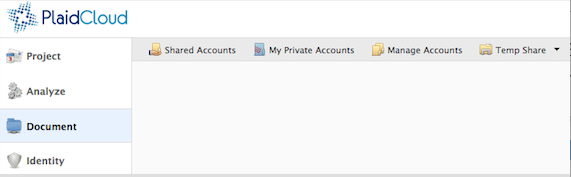

.. sectionauthor:: Genova Morel <genova.morel@tartansolutions.com>
.. sectionauthor:: Paul Morel <paul.morel@tartansolutions.com>

Document
!!!!!!!!

.. sidebar:: This Topic

   .. contents::
      :local:

   .. toctree::
      :maxdepth: 1
      :includehidden:
      :glob:

      *

Description
-----------

PlaidCloud Document (accessible from the main PlaidCloud navigation on the left side
of the screen) is a file management tool that allows for easy file management within
PlaidCloud. This tool provides members of each workspace with four different 
file sharing options:

-  Shared temporary storage (files are automatically removed after 24 hours)
-  Personal temporary storage dropbox (files are automatically removed after 24 hours)
-  Shared account access
-  Private account access

The temporary storage options are always available to members. Shared and 
private account access requires additional setup. An explanation of each
file sharing option can be found below:

|all document options|

.. |Document Tab SA| image:: ../../_static/img/plaidcloud/document/Common/1_Document_Tab_SA.png
.. |Demo Data Icon| image:: ../../_static/img/plaidcloud/document/Common/2_Demo_Data_Icon.png
.. |Manage Accounts Tab| image:: ../../_static/img/plaidcloud/document/Common/2_Manage_Accounts_Tab.png
.. |File Select| image:: ../../_static/img/plaidcloud/document/Common/3_File_Select.png
.. |STS Select File| image:: ../../_static/img/plaidcloud/document/Common/3_STS_Select_File.png
.. |Folder Select| image:: ../../_static/img/plaidcloud/document/Common/3_Folder_Select.png

