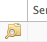
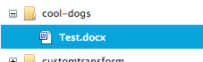

.. sectionauthor:: Genova Morel <genova.morel@tartansolutions.com>
.. sectionauthor:: Paul Morel <paul.morel@tartansolutions.com>

Managing Accounts
=================

.. sidebar:: This Page

   .. contents::
      :local:

Document is not restricted to the admin/user paradigm. Members are free to 
create their own accounts provided they have been granted access to do so. 
However, in many contexts, having an "official" group or responsible party 
for account administration is expected.

Managing Access Control
-----------------------

Four types of access restrictions are available for an account: Private, Workspace,
Member Only, and Security Group. The type of restriction set for a user is editable at any time from the account form.

To reach the edit the account form:

1) Open Document
2) Select "Manage Accounts" along the top of the page

|Manage Accounts Tab|

3) Click the edit icon   |Edit Restrictions Icon|

4) Select the desired restriction located under "Security Model"

|Access Restriction Select|

.. note:: Depending on the selected access restriction, there will be different options for assigning which members or security groups are allowed access.

The **"All Workspace Members"** access is the simplest since it provides access to all
members of the workspace and does not require any additional assignment of members.

The **"Specific Members Only"** access setting requires assignment of each member to
an account. To do so, simply click the members icon and drag desired members from the "Unassigned Members" column on
the left to the "Assigned Members" column on the right or vice vera to remove members. For workspaces with large numbers
of members, this approach can often require more effort than desired, which is where security groups become useful.

This option is particularly useful when combined with the single sign-on option of dynamically assigning members based
on a list of groups sent with the authentication.

|Member Icon Select|

|Member Assignment|

The **"Specific Security Groups Only"** option enables assigning specific security groups permission to access the
account. With access restrictions relying on association with a security group or groups, the administration of
account access for larger groups is much simpler. To edit assigned groups, click the groups icon and drag desired groups
from the "Unassigned Groups" column on the left to the "Assigned Groups" column on the right or vice versa to remove groups.

|Group Icon Select|

|Group Assignment|

Remote agents will often use Document accounts to store files or move files among systems. To allow 
remote agents access to Document accounts agents **MUST** have permission granted. This is a security feature to limit
unwanted access to potentially sensitive information. To add agents, click the agent icon and drag desired agents from
the "Unassigned Agents" column on the left to the "Assigned Agents" column on the right or vice versa to remove agents.

|Agent Icon Select|

|Agent Assignment| 

Managing Ownership
------------------

The member who creates the account is assigned as the owner by default.
However, Document accounts are designed to support multiple owners. This feature is helpful when a team of people is responsible for managing account access or when there is member turnover.

Adding and removing owners is similar to adding and removing access
permissions. To do so, simply click the owners icon (located under "Manage Accounts" tab under the **Document** page)
then drag new owners from the "Unassigned Members" column on the left to the "Assigned Members" column on the right or vice versa to remove owners.

|Owner Icon Select 1|

|Owner Assignment|

Because only owners have the ability to view and edit an account,
account administration is set up with two levels.

1) The member needs security access to view and manage accounts in general
2) The member must be an owner of the account to view, manage, and change settings of accounts

.. note:: A member will only see accounts they are assigned as owners to in the list of accounts to manage.

Managing Backup Sets
--------------------

Document enables the backup of any account on a nightly basis. This
feature permits backup across different cloud storage providers and
on local systems. Essentially, any account is a valid target for the
backup of another account. 

.. note:: You cannot backup to the same account.

The backup process is not limited to a single backup destination. It is
possible to have multiple redundant backup locations specified if this
is a desired approach. For example, the backup of an internal server to
another server may be one location with a second backup sent to Amazon 
S3 for off-site storage.

By using the prefix feature, it's possible to have a single backup
account contain the backups from multiple other accounts. Each account backup
set begins its top level folder(s) with a different prefix, making it easy
to distinguish the originating location and the restoration process.  For example, if you have three different
Document accounts but want to set their backup destination to the same location, using a prefix would allow
all three accounts to backup properly without the fear of a name collision.

To reach the backup set table:

1) Open Document 
2) Select "Manage Accounts"

|Manage Accounts Tab|

3) Click the backup icon 

|Backup Icon Select|

Creating a Backup Set
~~~~~~~~~~~~~~~~~~~~~~~

To create a new backup set:

1) Open Document 
2) Select "Manage Accounts"
3) Click the backup icon  
4) Click the "New Backup Set" button 

|New Backup Set Select|

5) Complete the required fields
6) Click "Create"

|New Backup Set Form Create|

The backup process is now scheduled to run nightly (US Time).

Updating a Backup Set
~~~~~~~~~~~~~~~~~~~~~~~

To update a backup set:

1) Open Document 
2) Select "Manage Accounts"
3) Click the backup icon  
4) Click the edit icon of the desired backup set

|Edit Icon Select|

5) Adjust the desired information
6) Click "Update"

|Edit Backup Set Form Update|

Deleting a Backup Set
~~~~~~~~~~~~~~~~~~~~~~~

To delete a backup set:

1) Open Document 
2) Select "Manage Accounts"
3) Click the backup icon  
4) Click the delete icon of the desired backup set  |Delete Icon Select|
5) Click "delete" again

.. note:: The backup sets already present will not be deleted but the backup process will no longer run.  You can remove the existing backups using Document file and directory management processes.

Managing Accounts
-----------------

Accounts access grants various cloud-based storage services, including Amazon S3, Wasabi, Dropbox, Google Drive, Azure Blob Storage
Swift, Ceph, and SFTP. To access the accounts, access
credentials must be provided. Depending on the service, providing access
credentials occurs via various methods. Please refer to the individual service 
to understand how to generate the required credentials.

The account management form allows the configuration of the storage
connection information and a start path. A start path allows
those who use the account to begin their browsing of the directory
structure further down the directory tree. This particular option is
useful when you have multiple teams that need segregated file
storage, but you only want one underlying storage service account.

For example, you could set a start path of teams/team\_1/ for team 1 and
teams/team\_2 for team 2. When a member opens the Team 1 Document
account they will begin file navigation inside team/team\_1. They will
not be able to move up the tree and see anything above teams/team\_1.

The below screenshot illustrates the directory structure as seen by the 
administrator with no start path applied.

Using the same storage account credentials as the account above but
assigning a start path for the Team 1 Document Account reveals this
directory structure to the members using the account:

Controlling individual access is normally onerous and usually requires each 
member to  have an individual account with the storage provider. In addition, 
most cloud storage providers only restrict access at a top level so controlling 
access at various levels is not possible. Managing access with PlaidCloud and 
using Document for cloud storage simplifies access management for Amazon S3 and 
various other storage services.

To manage accounts, first:

1) Open Document 
2) Select "Manage Accounts"

|Manage Accounts Tab|

Creating a Document Account
~~~~~~~~~~~~~~~~~~~~~~~~~~~

To create a document account:

1) Open Document
2) Select "Manage Accounts"
3) Click the "New Account" button

|New Account Select|

4) Complete the required fields
5) Click "Create"

|New Account Form Create|

Updating a Document Account
~~~~~~~~~~~~~~~~~~~~~~~~~~~

To update a document account:

1) Open Document
2) Select "Manage Accounts"
3) Click the edit icon of the desired account  |Edit Icon Select|
4) Update the account form as desired
5) Click "Update"

|Edit Account Form Update|

Deleting a Document Account
~~~~~~~~~~~~~~~~~~~~~~~~~~~

To delete a document account:

1) Open Document
2) Select "Manage Accounts"
3) Click the delete icon of the desired account  |Delete Icon Select|
4) Click "Delete" again

.. note:: This will not delete the files stored in the account, only the account that provides access.  Please delete all files and directories prior to deleting the account or you may continue to incur storage charges.

Controlling Ownership of a Document Account
~~~~~~~~~~~~~~~~~~~~~~~~~~~~~~~~~~~~~~~~~~~

To control ownership of an account:

1) Open Document
2) Select "Manage Accounts"
3) Click the owners icon of the desired account  |Owner Icon Select|

.. note:: You must be an owner to do this 

4) In the management form, add or remove owners as needed by dragging them between lists
5) Click "Update Access Control List"

|Manage Owner Form Update|

Controlling Access to a Document Account
~~~~~~~~~~~~~~~~~~~~~~~~~~~~~~~~~~~~~~~~

Access to accounts is controlled through three different approaches:

1) **Workspace wide access**
2) **Member specific list**
3) **Security group specific list**

To control access to an account:

4) Open Document
5) Select "Manage Accounts"
6) Either create a new account or edit an existing one (Steps above)
7) In the account form, select the desired "Security Model"

|Security Model Tab|

8) Click "Create" or "Update" depending on the current operation

.. note:: The current owner will be added automatically to the Member list if a member based security model is selected and the current owner's security groups will be added automatically to the Security Group list if security group based security model is selected

Controlling Access by PlaidLink Agents
~~~~~~~~~~~~~~~~~~~~~~~~~~~~~~~~~~~~~~

Since PlaidLink agents operate on remote systems, it is desirable to have explicit access to control which can be
revoked if those external systems are compromised or simply to understand which external systems have access to
documents.

.. note:: Members never have knowledge of or access to the storage account credentials. This is a vast improvement over other applications or browsers plugins that require sharing of these credentials.

.. |Document Tab SA| image:: ../../_static/img/plaidcloud/document/Common/1_Document_Tab_SA.png

.. |Manage Accounts Tab| image:: ../../_static/img/plaidcloud/document/Common/2_Manage_Accounts_Tab.png

.. |STS Select File| image:: ../../_static/img/plaidcloud/document/Common/3_STS_Select_File.png
.. |Folder Select| image:: ../../_static/img/plaidcloud/document/Common/3_Folder_Select.png

.. |Edit Backup Set Form Update| image:: ../../_static/img/plaidcloud/document/Managing_Accounts/Managing_Backup_Sets/5_Edit_Backup_Set_Form_Update.png

