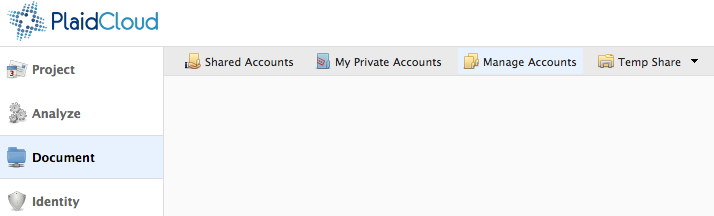
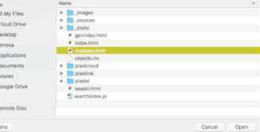

.. sectionauthor:: Genova Morel <genova.morel@tartansolutions.com>
.. sectionauthor:: Paul Morel <paul.morel@tartansolutions.com>

Temporary Storage
=================

.. sidebar:: This Page

   .. contents::
      :local:

Temporary storage may sound counter intuitive, but real world use has shown it
to be valuable. Typically, permanent storage is used to move large files between 
members or among other systems, and file cleanup in these storage locations often 
happens haphazardly at best. This causes storage to fill with files that shouldn't
be there and will eventually require manual cleanup. Temporary storage is perfect 
for sharing or transferring these types of large files because the files are automatically
deleted after 24 hours. To view temporary storage options in **Document**, select the "Temp Share" menu at the top of the screen.

|Temp Share Tab|

Shared Temporary Storage
------------------------

Shared temporary storage is viewable by all members of the workspace but 
**is not** viewable across workspaces. To access the shared temporary storage
area, select the "Temp Share" menu and click "Workspace Temp Share" to display 
a table of files currently in the workspace's Temp Share area.

|STS Workspace Select|

To add new files to a shared temporary storage location, follow the
instructions below:

1) Select the "Temp Share" menu along the top of the main **Document** page 
2) Click "Workspace Temp Share"
3) Click "Browse" to browse locally stored items

|STS Browse Workspace|

4) Selected desired file and then click "Open"

|STS Select File| 

5) Click "Upload" to upload the file to the temporary storage location

|STS Upload File|

To download existing files from temporary storage, simply click on left-most icon,
which represents the file type.   |STS Download File|

To manually delete a file, click the red delete icon to the left of the file name.   |STS Delete File|

Additional details on file management can be found below under "File Explorer".

Personal Temporary Storage
--------------------------

Personal temporary storage is only viewable by the member to which
the temp share belongs. This storage option is beneficial because 
it's accessible across workspaces. This functionality makes it easy to 
move or use files across workspaces if the member is working in multiple workspaces
simultaneously.

All members of the workspace can upload files to a members personal share 
as a dropbox. 

To upload a file to another member's personal share, follow the below instructions:

1) Select the "Temp Share" menu along the top of the main **Document** page
2) Select "Drop File to Member Temp". A list of members will be displayed.

|pts select drop file|

3) Click the left-most icon associated with the member of your choosing

|pts select icon|

4) Click "Browse" to browse locally stored items

|pts browse file|

5) Select desired file and then click "Open" 

|STS Select File|

6) Click "Upload" to upload the file to the member's personal storage

|pts upload file|

Additional details on file uploading can be found below under "File Explorer".

.. |Document Tab SA| image:: ../../_static/img/plaidcloud/document/Common/1_Document_Tab_SA.png
.. |Demo Data Icon| image:: ../../_static/img/plaidcloud/document/Common/2_Demo_Data_Icon.png

.. |File Select| image:: ../../_static/img/plaidcloud/document/Common/3_File_Select.png

.. |Folder Select| image:: ../../_static/img/plaidcloud/document/Common/3_Folder_Select.png

