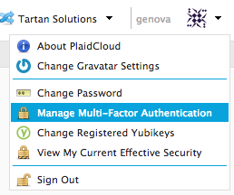

.. sectionauthor:: Genova Morel <genova.morel@tartansolutions.com>
.. sectionauthor:: Paul Morel <paul.morel@tartansolutions.com>

Identity 
========

.. sidebar:: This Topic

   .. contents::
      :local:

   .. toctree::
      :maxdepth: 1
      :includehidden:
      :glob:

      *

PlaidCloud makes all authentication and role based security easy to control 
from one centralized location: The "Identity" tab located on the left side of the screen.

|identity tab|

Identity provides the foundation for member management, security, and different types of authentication processes.

**Member management** includes everything from viewing current members to adding new ones to having the ability to send mass emails. 

**Security** is a main focus for PlaidCloud. This subset of the Identity tab allows you to perform security audits, set
up security groups and default security groups for new members, and control the approved security level of each member.

**Authentication** is where security starts. PlaidCloud offers more than just a password only authentication, although
that is an option. Two-factor authentication and Single Sign-on are also authentication processes PlaidCloud offers,
both of which offer higher security than password only without too much additional effort.

More information on these topics can be found under the associated tab under the "Identity"

.. |gravatar icon select| image:: ../../_static/img/plaidcloud/identity/common/1_gravatar_icon_select.png
.. |identity tab| image:: ../../_static/img/plaidcloud/identity/common/1_the_identity_tab.png

