.. sectionauthor:: Genova Morel <genova.morel@tartansolutions.com>
.. sectionauthor:: Paul Morel <paul.morel@tartansolutions.com>

Member Management
=================
   
.. sidebar:: This Page

   .. contents::
      :local:

Identity provides the ability to add, remove, and/or suspend members of the
workspace. Since PlaidCloud members can be members of multiple clouds,
removing a member from the workspace does not delete the member account.

Adding Members
--------------

How To Add a Member
~~~~~~~~~~~~~~~~~~~

1) Open Identity
2) Select the "Member" tab 

|identity member tab|

3) Click "All" in the dropdown menu to display members

|member all select|

4) Click "Add Workspace Member" 

|add member to workspace select|

5) Complete all required fields on the member form
6) Click the "Create" button

|create new member form|

New Member Welcome Email
~~~~~~~~~~~~~~~~~~~~~~~~

After adding a new member, a welcome email with sign-in credentials will be sent to their provided email address. The
welcome email can be customized to provide additional information so new members have a better idea as to why they are receiving an email.
 
 To update or view the welcome email:

1) Open Identity
2) Select the "Member" tab
3) Click "Email Welcome Message" from the dropdown menu

|email welcome message select|

4) Make any additions or changes desired
5) Click the "Update" button

|update welcome email select|

Viewing and Managing Member Sessions
------------------------------------

To view the current member sessions: 

1) Open Identity
2) Select the "Member" tab 
3) Click "Session Manager" in the dropdown menu

|identity member session manager tab|

From this table, it's possible to view session information (current sessions and last activity) as well as terminate sessions if desired.

To terminate a session simply right click to highlight the section you wish to delete, then click the "End Selected Sessions" button in the upper left.

|terminate session select|

Managing Distribution (Distro) Lists
------------------------------------

Distribution lists, Distros, are simply email distribution lists managed from within
PlaidCloud. They provide an easy way to quickly send reports, files, and/or other
information to groups. The Distribution list feature allows for the management of 
lists on a workspace by workspace basis. This eliminates the need to rely on external lists that may over or under cover the intended audience.

To manage lists:

1) Open Identity
2) Select the "Distro Lists" tab 

|identity distro list tab|

3) Click the "Create New Distro List" button to create a new list

|create new distro list select|

4) Complete all required fields of the Distro List form
5) Click the "create" button

|create distro list select|

.. note:: Distro lists can include both workspace members and non-members. 

To manage workspace members for each list, select the workspace icon (cloud) in the table.  |member workspace icon|

To manage non-members, click on the globe icon.  |non member workspace icon|  

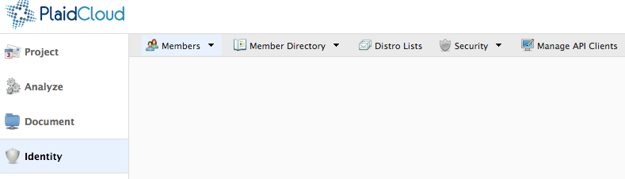
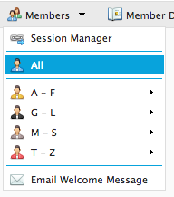
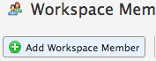
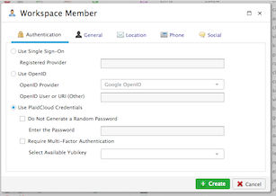
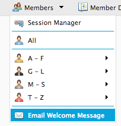
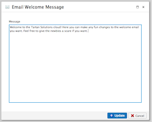
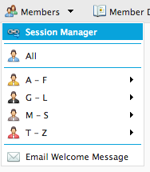
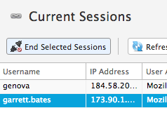
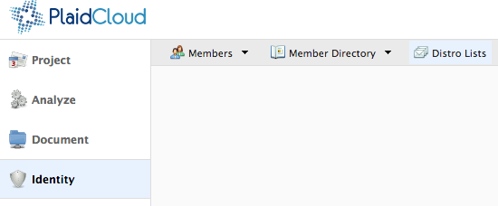
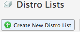
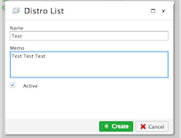

.. |gravatar icon select| image:: ../../_static/img/plaidcloud/identity/common/1_gravatar_icon_select.png
.. |identity tab| image:: ../../_static/img/plaidcloud/identity/common/1_the_identity_tab.png
.. |manage multi factor auth select| image:: ../../_static/img/plaidcloud/identity/common/3_manage_multi_factor_auth_select.png
