.. sectionauthor:: Genova Morel <genova.morel@tartansolutions.com>
.. sectionauthor:: Paul Morel <paul.morel@tartansolutions.com>

Managing Security
=================

.. sidebar:: This Page

   .. contents::
      :local:

Security and access management for PlaidCloud is straightforward because all access is granted based on which security groups a member is associated, and the security groups a member belongs to are easily customizable to the access constraints desired.

.. note:: Each workspace is allowed an unlimited number of security groups, but we recommend minimizing this number in order to ease management.

Managing Security Groups
------------------------

Security groups can be added, updated, or deleted. To manage security groups: 

1) Open Identity
2) Select the "Security" tab 
3) Click "Security Groups" in the dropdown menu (this will display a form with existing groups)

|managing security groups|

4) To add a group, click the "Create Security Group" 

|create security group select|

5) To edit permissions of a group, click on the left-most icon 

|edit permissions icon select|

To manage group members:

1) Open Identity
2) Select the "Security" tab
3) Click "Security Groups" in the dropdown menu
4) Click the Member icon 

|member icon select|

5) Drag desired members from the "Unassigned Members" column to the "Assigned Members" column or vice versa to remove members

|assigning members|

Setting Default Security Groups
-------------------------------

To reduce the time needed for adding new members, a set of default
security groups can be marked. This provides a baseline set of security
groups for new members without needing to manually assign each person.
The setting is available when adding a new security group be check the box at the bottom of the Security Group window that reads "Assign to New Users by Default".

|default security group|

Performing a Security Audit
---------------------------

It's often necessary to see a complete picture of group membership
across all members and groups. The security audit capability provides
exactly that. To perform a security audit:

1) Open Identity
2) Select the "Security" tab 
3) Click "Security Group Audit" in the dropdown menu 

|security group audit tab|

As all tables in PlaidCloud are exportable as a CSV file format, the group member 
associations are reviewable outside of PlaidCloud for either historical 
purposes or just some fun off-line viewing. 

To export from the "Security Group Audit" form:

1) Open Identity
2) Select the "Security" Tab
3) Click "Security Group Audit" in the dropdown menu
4) Click the small icon to the far right of "Username" in the table
5) Click "Export CSV" or "Export XLXS" depending on your preference

|export icon select|

Viewing Available Permission Settings
-------------------------------------

Each application being used in the workspace has specific available permissions. The security group permissions are based on these application permissions.

The complete list of available permission for each application is viewable from the Security Bin. To access this:

1) Open Identity
2) Select the "Security" 
3) Click "Security Bins" in the dropdown menu

|security bins tab|

To view the detailed security settings for each application, select the
tags icon on the far left.

|tags icon select|

This available security settings information is informational only. For
details on managing permissions, refer to 
`Managing Security Groups <index#managing-security-groups>`__

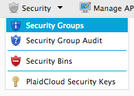
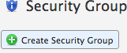
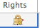

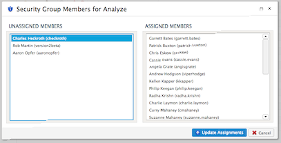
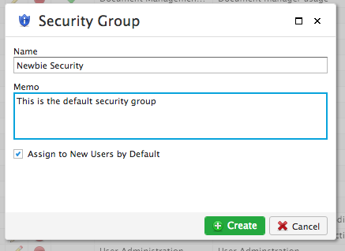
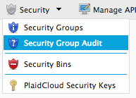
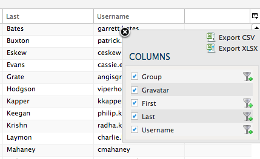
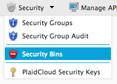
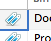
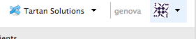
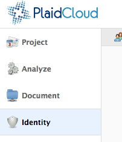
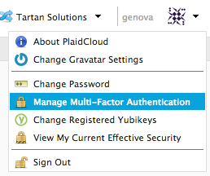
