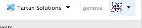
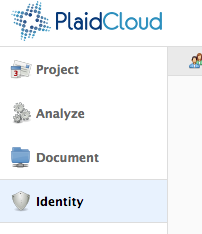

.. sectionauthor:: Genova Morel <genova.morel@tartansolutions.com>
.. sectionauthor:: Paul Morel <paul.morel@tartansolutions.com>

Member Authentication
======================
   
.. sidebar:: This Page

   .. contents::
      :local:

The Identity tab houses the security and authentication features that PlaidCloud focuses on in order to ensure a secure member platform. PLaidCloud offers three options for authentication types. They are:

-  Password Only
-  Two-Factor Authentication
-  Single Sign-On 

If the company who creates your account uses Single Sign-On, you will automatically have this method of authentication as your authentication type. If the company who creates your account uses password only or two-factor authentication as their authentication type, your account will automatically use password only as its authentication type.

If you choose to create a personal account, the default authentication type is password only. To change this to a two-factor authentication, reference the steps under the Two-Factor section.

.. note:: Members may have access to the Identity tab for security purposes or in order to manage members for the workspace. Details on managing security and authentication for new members or members without access can be found on the main "Identity" page.

Changing Passwords
------------------

For members using Two-Factor or Password-only authentication, password changes are simple and can be performed under the "Member" menu (gravatar icon) in the upper right corner. 

.. note:: The "Member" menu icon will be different for each user

1) Select the icon (gravatar) in the upper right

|gravatar icon select|

2) Click "Change Password" in the dropdown menu

|change password select|

3) Enter your current password where requested
4) Enter your new password where requested
5) Re-enter your password (for confirmation)
6) Click the "Update" button to save

|change password form|
   
Please note that only strong password are accepted and the new password must be different from the current one.

Password Only Authentication
----------------------------

Password-only authentication is the simplest and least secure, even with cryptic passwords. This option may be ideal for those looking to 
maintain quick and convenient access without too much concern for the security risks. To be fair, password-only authentication is the
most widely used on the web, including banking sites.

Two-Factor Authentication
-------------------------

Two-Factor, or multi-factor, authentication provides a substantial increase in security over "password only" because it requires both
something "you know" (the password) and something "you have" (the access key). In other words, the password alone will not enable access.

Passwords are susceptible to security threats because they represent a *single* piece of information that a malicious person needs to gain access; Two-Factor provides
additional security by requiring *additional information* to sign in. For this reason we **strongly** urge you to use Two-Factor for the safety of your account, not
only on PlaidCloud, but on other websites that support it.

To learn more about Two-Factor authentication, please refer to this `more in-depth explanation </docs/identity/about-two-factor-authentication>`__.

Enabling Two-Factor
~~~~~~~~~~~~~~~~~~~
To enable Two-Factor and set your authentication code preferences:

1) Select the icon (gravatar) in the upper right

|two factor auth tab|

2) Click "Manage Multi-Factor Authentication" in the dropdown menu

|two factor option menu|

3) Select your preferred type of Two-Factor authentication code delivery

Types of Two-Factor Authentication
~~~~~~~~~~~~~~~~~~~~~~~~~~~~~~~~~~

PlaidCloud has three options for receiving this additional information:

1. Via smartphone app (Google Authenticator, Authy, or FreeOTP)
2. Via text message (or SMS)
3. Via a YubiKey from `Yubico <http://yubico.com>`

Smartphone-based Authentication
^^^^^^^^^^^^^^^^^^^^^^^^^^^^^^^
To get your code via a smartphone app, you will need to download an authenticator app, such as Google Authenticator, for your 
`iOS <https://itunes.apple.com/us/app/google-authenticator/id388497605?mt=8>`__
or `Android <https://play.google.com/store/apps/details?id=com.google.android.apps.authenticator2>`__ device.
Note that there are other compatible authenticator apps that can be used, but this article assumes you're using the Google Authenticator app.

After downloading the app, open it and follow the in-app setup instructions.

If you already have the authenticator set up:

1) Tap the "+" button 

|plus select|

2) Select "Scan barcode"

|scan barcode select|

3) Open "Manage Multi-Factor Authentication" under the gravatar icon on PlaidCloud

|manage multi factor auth select|

4) Select "Configure Authenticator" on PlaidCloud

|configure auth select|

5) When prompted, use your phone to scan the QR code displayed on PlaidCloud 

|prompt barcode scan|

After scanning the QR code, your authenticator app should display a six-digit authentication code which changes every 30 
seconds. **Enter this code** into the text box at the bottom of the PlaidCloud "Configure SmartPhone Authentication" screen 
which should still be pulled up from the previous steps and **select "Verify."**

If the code is valid, Two-Factor will be enabled for your account and you will be shown a list of backup codes.

Once enabled, you can select "Manage Multi-Factor Authentication" again to view your backup codes or to disable Two-Factor.

SMS-based Authentication
^^^^^^^^^^^^^^^^^^^^^^^^
To use SMS-based Authentication:

1) Open "Manage Multi-Factor Authentication" under the gravatar icon on PlaidCloud
2) Select "Configure SMS" on PlaidCloud

|configure sms select|

3) Enter your mobile phone number and carrier
4) Click "Submit" 

|submit select|

You will then be sent a text message containing an authentication code. **Enter this code** in the window that appears in PlaidCloud. If the code is valid, Two-Factor will be enabled for your account and SMS will send you a different code to enter whenever you log in.

Once enabled, you can select "Manage Multi-Factor Authentication" again to update your contact information or to disable Two-Factor.

YubiKey Authentication
^^^^^^^^^^^^^^^^^^^^^^

If using Yubikeys - hardware authentication devices manufactured by Yubico - members can register up to five YubiKeys for their account. 

We have both a managed pool of PlaidCloud YubiKeys that can be administered by
the person responsible for your workspace access security, or members can choose to use any standard YubiKey.

.. note:: Keys from the PlaidCloud YubiKey pool (YubiKeys specifically issued by PlaidCloud) count towards the five key limit.

To enable YubiKey authentication, you must first register at least one YubiKey. To register a YubiKey:

1) Select the icon (gravatar) in the upper right

|gravatar icon select|

2) Click "Change Registered YubiKeys" in the dropdown menu

|change registered yubikeys select|

3) Place the cursor in an open spot on the "My Registered YubiKeys" form
4) Insert the YubiKey into your computer
5) Press the YubiKey one-time password (OTP) button
6) When the OTP is filled in, click the "Update" button in the form to save

|update yubikey select|

After you register at least one YubiKey you can configure it to your account. To do so:

1) Select the gravatar icon
2) Click "Manage Multi-Factor Authentication"
3) Select "Configure YubiKey"
4) Enter one of your YubiKey OTPs in the provided form. 

If the OTP is valid, Two-Factor will be enabled for your account and you will need to enter a YubiKey OTP each time you log in.

PlaidCloud YubiKey Pool
^^^^^^^^^^^^^^^^^^^^^^^

The Managed YubiKey Pool provides an easy way to manage two-factor authentication for members of the workspace. The managed keys are branded
with the PlaidCloud logo and can be shipped directly to members or in bulk to an administrator.

|plaidcloud yubikey|

The managed pool provides advantages over individual Yubkikeys in the
following ways:

-  Lost keys are easily replaced without the member needing to store recovery codes
-  Assignment of keys is point and click. Members don't have to register the key.
-  View YubiKey assignments and revoke keys with a point and click interface
-  Order and ship new keys directly to members
-  Managed YubiKeys are fully compatible with other services that accept YubiKey OTPs
-  YubiKeys can be reassigned to other members without compromising security as member turn-over occurs
   
To order new keys:

1) Open Identity
2) Select the "Security" tab
3) Click "PlaidCloud Security Keys" in the dropdown menu

|plaidcloud security key tab|

4) Click the "Order More Keys" button in the form

|order more keys select|

If managed keys were ordered, they will appear in the managed keys
table. 

From the key assignment form, keys can be assigned, marked as unassigned, or marked as lost. In addition, each key can have a memo
attached for keeping track of notes related to issuance of the key. To do this simply click the edit icon and make the desired adjustments. 

|edit icon select|

|key information adjust update|

Managed keys are a one-time cost. There are no additional on-going charges for their use. Managed Yubikeys are $30 each plus shipping.

What Recovery Codes Do
------------------------

For security reasons, PlaidCloud Support cannot immediately restore access to accounts with two-factor authentication enabled if you
lose your phone or YubiKey. Recovery codes allow for you to still access your account with a lost phone or YubiKey and then reconfigure it from there. 

After successfully setting up your two-factor authentication, you'll be provided with a set of randomly generated recovery codes that you should view and save. We strongly
recommend saving your recovery codes immediately. However, these codes can be downloaded at any point after enabling two-factor authentication. For more 
information, see `Downloading your two-factor authentication recovery codes </docs/identity/downloading-your-two-factor-authentication-recovery-codes>`__.

.. note:: If you do not have a backup code or a backup key registered a much more stringent process is followed that may require several days to validate the authenticity of the access request and maintain PlaidCLoud security.

Lost YubiKey
~~~~~~~~~~~~

You can provide an SMS number as part of your profile. If you lose access to both your registered set of YubiKeys and your recovery
codes, a backup SMS number can get you back in to your account. 

.. note:: This is not an automated process so regaining access may require some time.

If the member is using a **managed pool key** and loses it, the workspace pool
administrator can mark the key as lost and issue a new one. This reduces the risk of being locked out of an account or having to retain recovery codes. 

To do so:

1) Open Identity
2) Select "Security"
3) Click "PlaidCloud Security Keys"

|plaidcloud security key tab|

4) Click the edit icon

|edit icon select|

5) Select "Lost" under the Key Usage Information section
6) Click "Update"

|yubikey lost select update|

This will mark the key as lost and allow you to issue a new one. 

Single Sign-On
--------------

Single Sign-On requires an external service to perform the actual authentication process while PlaidCloud
simple receives a positive or negative response. Use of Single Sign-On can reduce the administrative requirements for managing
passwords across multiple applications and ensure good member management practices when employees leave or access restrictions are applied.

Single Sign-On is by far the easiest to use for members and is as secure as the authentication process used by the external party. Single
Sign-On helps ensure passwords are up to date and synchronized with other services the member interacts with.

While Single Sign-On does requires a more extensive authentication process behind the scenes and usually requires technical coordination with IT
and/or network security, it can be used by anyone, although it is typically used by larger companies and academic institutions.

For more information on setting up and managing Single Sign-On see the `Organization and Workspace management area. </docs/workspaces/organization>`__

.. |manage multi factor auth select| image:: ../../_static/img/plaidcloud/identity/common/3_manage_multi_factor_auth_select.png
