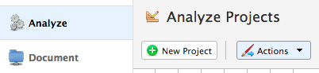
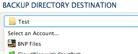
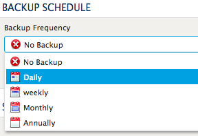
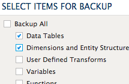

.. sectionauthor:: Genova Morel <genova.morel@tartansolutions.com>
.. sectionauthor:: Paul Morel <paul.morel@tartansolutions.com>

Archives
========

.. sidebar:: This Page

   .. contents::
      :local:

Creating an Archive
-------------------

Projects normally contain critical processes and logic which are important to archive so, if need 
be, you can restore the project back to a specific state. PlaidCloud allows you to archive 
projects at any point in time.

Creation of archives complements the built-in point-in-time tracking of PlaidCloud by allowing for specific
points in time to be captured.  This might be particularly useful before a major change or to capture the exact
state of a production environment for posterity.

A **full backup** includes all of the data tables included in the project. This can make the archive quite 
large depending on the volume of data in the project. 

A **partial backup** can be used if all of the project data can be derived from other sources. If this 
is the case, it is not necessary to archive the data in the project and still have it remain elsewhere. 
Partial archives can save time and storage space when creating the archive.

To archive a project:

1) Open Analyze
2) Select the "Projects" tab

Restoring an Archive
--------------------

Once you have an archive, you may want to restore it. You can restore an archive into a new project or into an existing project.

To restore an archive:

1) Open Analyze
2) Select the "Projects" tab

Archiving Schedule
------------------

Archives can also serve as a periodic backup of your project. PlaidCloud allows you to manage the backup schedule 
and set the retention period of the backup archives to what is most convenient or desired.

Since all changes to a project are automatically tracked, archving is not necessary for rollback purposes.  However, it
does provide a specific snapshot of the project state which is often useful for control purposes and/or having the ability
to recover to a known point.

To set an archiving schedule:

1) Open Analyze
2) Select the "Projects" tab
3) Click the backup icon

|backup icon|

4) Choose a directory destination in a **Document** account

|directory document select|

5) Choose the backup frequency and retention

|backup frequency select|

6) Choose which items to backup

|backup items select|

7) Click "Update"

