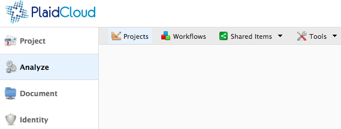
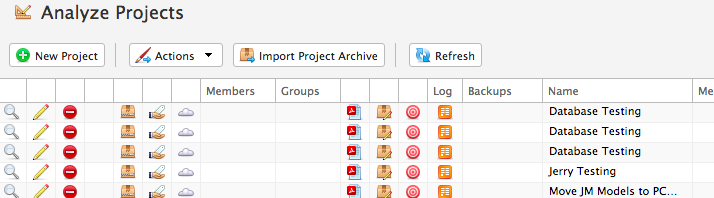

.. sectionauthor:: Genova Morel <genova.morel@tartansolutions.com>
.. sectionauthor:: Paul Morel <paul.morel@tartansolutions.com>

Projects
!!!!!!!!

.. sidebar:: This Page

   .. contents::
      :local:

   .. toctree::
      :maxdepth: 1
      :includehidden:
      :glob:

      *

Description
-----------
Within **Analyze**, the Projects function provides a level of compartmentalization that makes controlling access and
modifying privileges much easier. Projects are what provide the primary segregation of data in the Analyze tab.

While Projects fall under Analyze, workflows fall under Projects meaning that Projects contain workflows. Workflows,
simply put, perform a wide range of tasks including data transformation pipelines, data analysis, and even ETL
processes. More information on workflows can be found under the "Workflows" section.

Accessing Projects
------------------

To access Projects:

1) Open Analyze
2) Select "Projects" from the top menu bar

|analyze projects tab|

This displays the **Projects Table**. From here, you will see a list of projects for which you have access. There may
be additional projects within the workspace but if you are not an owner or assigned to the project, they will not visible to you.

|projects table|

.. |log icon select| image:: ../../_static/img/plaidcloud/projects/common/1_log_icon_select.png
.. |member icon select| image:: ../../_static/img/plaidcloud/projects/common/1_member_icon_select.png
.. |projects action select| image:: ../../_static/img/plaidcloud/projects/common/2_projects_action_select.png
