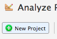
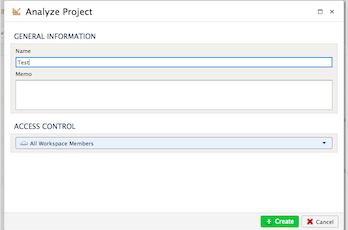
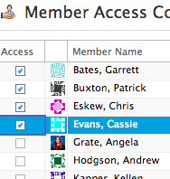
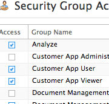
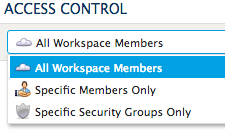
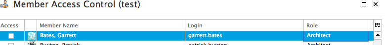
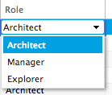
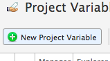
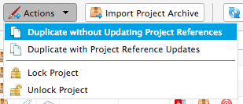
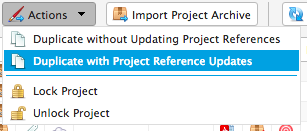

.. sectionauthor:: Genova Morel <genova.morel@tartansolutions.com>
.. sectionauthor:: Paul Morel <paul.morel@tartansolutions.com>

Managing Projects
=================

.. sidebar:: This Page

   .. contents::
      :local:

Searching
---------

Searching for projects is accomplished by using the filter box in the lower left of the hierarchy.  The search filter
will search project names and labels for matches and show the results in the hierarhcy above.

Creating New Projects
---------------------

To create a new project:

1) Open Analyze
2) Select "Projects" from the top menu bar
3) Click the "New Project" button 

|new project select|

4) Complete the form information including the "Access Control" section

|new project form|

5) Click "Create"

The project is now ready for updating access permissions, adding owners, and creating workflows.

.. note:: By default the project will be accessible by all members of the current workspace.

Automatic Change Tracking
-------------------------

All changes to a project including workflows, data editors, hierarchies, table structures, and 
UDFs are tracked and allow point-in-time recovery of the state.  This allows for easy recovery from
user introduced problems or simply copying a different point-in-time to another project for comparison.

In addition to overall tracking, projects and their elements also allow for versioning.  Not only is creating
a version easy, you can also merge changes from one version to another easily too.  This provides a simple way
to keep track of snapshots or to create a version for development and then be able to merge those changes
into the non-development version when you want.

Managing Project Access
-----------------------

Types of Access
~~~~~~~~~~~~~~~

Project security has been simplified into three types of access:

  - All Workspace Members
  - Specific Members Only
  - Specific Security Groups Only

Setting the project security is accomplished by:

1) Open Analyze
2) Select "Projects"
3) Click the edit icon of the project you want to restrict

|edit icon select|

4) Choose desired restriction under "Access Control"

|restriction select|

5) Click "Update"

All Workspace Members
^^^^^^^^^^^^^^^^^^^^^^

The "All Workspace Members" access is the simplest since it provides access to all
members of the workspace and does not require any additional assignment of members.

Specific Members Only
^^^^^^^^^^^^^^^^^^^^^^

The "Specific Members Only" access setting requires assignment of each member to the project. 

To assign members to a project:

1) Open Analyze
2) Select "Projects" from the top menu bar
3) Click the members icon
4) Grant access to members by selecting the check box next to their name in the "Access" column

|member access select|

5) Click "Update"

For clouds with large numbers of members, this approach can often require more effort than desired, which is where security groups become useful.

.. note:: To add members you must be a member of the workspace

Specific Security Groups Only
^^^^^^^^^^^^^^^^^^^^^^^^^^^^^^^
The "Specific Security Groups Only" option enables assigning specific security groups permission to access the account. With access restrictions
relying on association with a security group or groups, the administration of account access for larger groups is much simpler.
This is particularly useful when combined with single sign-on automatic group association. By using single sign-on to set member group assignments,
these groups can also enable and disable access to projects implicitly.

To edit assigned groups:

1) Open Analyze
2) Select "Projects" from the top menu bar
3) Click the security groups icon

|security group icon select|

4) Grant access to security groups by selecting the check box next to their name in the "Access" column

|security groups access|

5) Click "Update"

Setting Different Viewing Roles
-------------------------------

Many times a project may require several transformations and tables to complete intermediate steps while the end result
may end up only consisting of a few tables. Members do not always require viewing of all the elements of the project,
sometimes just the final product. PlaidCloud offers you the ability to set different viewing roles to easily declutter
and control the visibility of each member.

There are three built-in viewing roles:
- Architect
- Manager
- Explorer

The **Architect** role is the simplest as it allows full visibility and control of the project, workflows, tables, variables, data editors, hierarchies, and user defined functions.

The **Manager** and **Explorer** roles have no specific access privileges but can instead be custom defined. In other words, you can choose which items are visible to each group.  

.. note:: Manager and Explorer are not security groups, they only provide a convenient way of segregating duties and visibility of information.

You can make everyone an Architect if you feel visibility of everything within the project is needed, otherwise you can designate members as Manager and/or Explorer project members and control visibility that way.

To set the different role:

1) Open Analyze
2) Select "Projects"
3) Click the members icon
4) Select the member you whose role you would like to change

|member adjust select|

5) Double click their current role in the "Role" column
6) Select the desired role

|member role choose select|

7) Click "Update"

Managing Project Variables
--------------------------

When running a project or workflow it may be useful to set variables for recurring tasks in order to decrease clutter
and save time. These variables operate just like a normal algebraic variable would by allowing you to set what the
variable represents and what operation should follow it. PlaidCloud allows you to set these variables at the project
level which will effect all the workflows within that project, or at the workflow level which will only effect
that specific workflow.

To set a project level variable:

1) Open Analyze
2) Select "Projects"
3) Click the Manage Project Variables icon

|project variables icon|

From the Variables Table you can view the variables and view/edit the current values. You 
can also add new or delete existing variables by clicking the "New Project Variable" button.

|new project variable|

Cloning a Project
---------------------

When a project is cloned there may be project related references, such as workflow steps, 
that run within the project. For this, PlaidCloud offers two options for performing a full duplication:

- Duplicate with updating project references
- Duplicate without updating project references

Duplicating **with** updating project references means to have all of the related references point to the newly duplicated project.

To duplicate **with** updating project references:

1) Open Analyze
2) Select "Projects"
3) Select the project you would like to duplicate
4) Click the "Actions" button

|projects action select|

5) Select the "Duplicate with project reference updates" option

|duplicate with update select|

To duplicate **without** updating project references means to have all of the related references continue pointing to the original project.

To duplicate **without** updating project references:

1) Open Analyze
2) Select "Projects"
3) Select the project you would like to duplicate
4) Click the "Actions" button

|projects action select|

5) Select the "Duplicate without project reference updates" option

|duplicate without update select|

Viewing the Project Report
--------------------------

When a project or workflow is dynamic, maintaining detailed documentation becomes a challenge. To help solve this
problem, PlaidCloud provides the ability to generate a project-level report that gives detailed documentation of
workflows, workflow steps, user defined transforms, variables, and tables. This report is generated on-demand
and reflects the current state of the project.

To download the report:

1) Open Analyze
2) Select "Projects"
3) Click the report icon

|report icon select|

.. |log icon select| image:: ../../_static/img/plaidcloud/projects/common/1_log_icon_select.png
.. |member icon select| image:: ../../_static/img/plaidcloud/projects/common/1_member_icon_select.png
.. |projects action select| image:: ../../_static/img/plaidcloud/projects/common/2_projects_action_select.png

