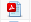

Project Log
===========

.. sidebar:: This Page

   .. contents::
      :local:

Viewing and Sorting the Project Log
-----------------------------------

As things happen within a project, such as assigning new members or running workflows, the **Project Log** stores the
events. The Project Log consolidates the view of all the individual workflow logs in order to provide a more
comprehensive view of the project activities. PlaidCloud also enables the viewer to sort and filter the
Project Log and view details of a particular log entry.

To view the Project Log:

1) Open Analyze
2) Select "Projects"
3) Click the log icon

|log icon select|

To sort and filter the Project Log:

4) Click the small icon to the right of the log and the left of the "log message"

|CSV icon select|

5) Select desired guidelines

To view details of a particular log entry:

6) Right click on the desired log entry and view the "Log Message" box for details

|view log details|

Clearing the Project Log
------------------------

Clearing the Project Log may be desirable from time to time. 

.. note:: Clearing the Project Log will include deleting all of the sub-logs for each workflow.

To clear the Project Log:

1) Open Analyze
2) Select "Projects"
3) Click the log icon

|log icon select|

4) Click the "Clear Log" button

|clear log select|

Viewing the Project Report
--------------------------

When a project or workflow is dynamic, maintaining detailed documentation becomes a challenge. To help solve this
problem, PlaidCloud provides the ability to generate a project-level report that gives detailed documentation of
workflows, workflow steps, user defined transforms, variables, and tables. This report is generated on-demand
and reflects the current state of the project.

To download the report:

1) Open Analyze
2) Select "Projects"
3) Click the report icon

|report icon select|

.. |log icon select| image:: ../../_static/img/plaidcloud/projects/common/1_log_icon_select.png
.. |member icon select| image:: ../../_static/img/plaidcloud/projects/common/1_member_icon_select.png
.. |projects action select| image:: ../../_static/img/plaidcloud/projects/common/2_projects_action_select.png

