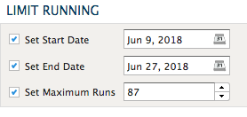

.. sectionauthor:: Genova Morel <genova.morel@tartansolutions.com>
.. sectionauthor:: Paul Morel <paul.morel@tartansolutions.com>

Event Scheduler
================

.. sidebar:: This Page

   .. contents::
      :local:
      
Description
-----------

Scheduling specific workflows can be a useful organization tool so PlaidCloud provides the ability to do so. Using event
scheduler, you can schedule a workflow to run by month, day, hour, minute, or even on a financial workday schedule.
If using the financial workday schedule approach, PlaidCloud also allows configuration of holiday schedules using various holiday calendars.

To view events:

1) Open Analyze
2) Select "Tools"
3) Click "Event Scheduler"

|analyze tools event scheduler|

This will open the **Events Table** showing all the current events configured for the workspace.

If the event is active, the "Active" icon will be displayed.  |active event icon|

The Events Table will also indicate whether the event is scheduled by month, day, hour and minute or workday under the event description column.

Creating an Event
-----------------

To create an event:

1) Open Analyze
2) Select "Tools"
3) Click "Event Scheduler"
4) Click "Add Scheduled Event"

|add event select|

5) Complete the required fields
6) Click "create"

|new schedule form create|

The **Limit Running** section allows you to schedule an event to run for a specific time period and a specific number of times.

|limit running section|

Otherwise, you can set the workflow to run using the **classic schedule** approach. To do so: 

1) Click the "Event Schedule" tab of the Event table

|event schedule tab select|

2) Under the "Schedule type" select "Use Classic Schedule"

|schedule type classic|

3) Select the specific months, hours, minutes, and days you want the workflow to run

|month hour minute select|

To set the workflow to run using the workday schedule approach:

4) Click the "Event Schedule" tab of the Event table

|event schedule tab select|

5) Under the "Schedule type" select "Use Workday Schedule"
6) Choose the workday you would like the workflow to run on

|schedule type workday|

.. note:: By default, the timezone for events is set to UTC but can be adjusted using the "Timezone" field.

Editing an Event
----------------

To edit an event:

1) Open Analyze
2) Select "Tools"
3) Click "Event Scheduler"
4) Click the edit icon  |edit icon select|
5) Adjust desired fields
6) Click "Update"

Deleting an Event
-----------------

To delete an event:

1) Open Analyze
2) Select "Tools"
3) Click "Event Scheduler"
4) Click the delete icon  |delete icon select|
5) Click delete again

Pausing an Event
----------------

To temporarily pause an event:

1) Open Analyze
2) Select "Tools"
3) Click "Event Scheduler"
4) Click the edit icon
5) Uncheck the "Active" checkbox

|active check select|

6) Click "Update"

Saving the event with it marked as not active means the event will no longer run on the specified schedule until it's reactivated.

Running Events on Demand
------------------------

To run an event immediately:

1) Open Analyze
2) Select "Tools"
3) Click "Event Scheduler"
4) Select the desired event or events
5) Click "Run Selected Events"

|run selected events select|

.. |delete icon select| image:: ../../_static/img/plaidcloud/tools/common/1_delete_icon_select.png
.. |edit icon select| image:: ../../_static/img/plaidcloud/tools/common/1_edit_icon_select.png

.. |add event select| image:: ../../_static/img/plaidcloud/tools/events_schedule/creating_an_event/1_add_event_select.png

