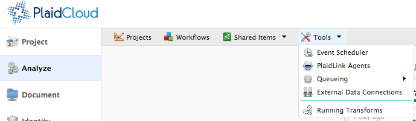

.. sectionauthor:: Genova Morel <genova.morel@tartansolutions.com>
.. sectionauthor:: Paul Morel <paul.morel@tartansolutions.com>

Tools
!!!!!!

.. sidebar:: Tools
   
   .. contents::
      :local:

   .. toctree::
      :maxdepth: 1
      :includehidden:
      :glob:

      *
      
Description
-----------

The tools section helps you manage workflow options and data analysis. PlaidCloud includes tools such as event scheduling,
data connections to various other data sources, and message queues for asynchronous operations. In addition, PlaidLink
agents are also managed in the tools section, enabling remote operations to support analysis when operating in a closed
environment with no direct external access.

To access the tools section:

1) Open Analyze
2) Select "Tools" from the top bar

|analyze tools tab|

.. |delete icon select| image:: ../../_static/img/plaidcloud/tools/common/1_delete_icon_select.png
.. |edit icon select| image:: ../../_static/img/plaidcloud/tools/common/1_edit_icon_select.png

