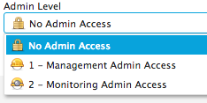

.. sectionauthor:: Genova Morel <genova.morel@tartansolutions.com>
.. sectionauthor:: Paul Morel <paul.morel@tartansolutions.com>

Message Queues
==============

.. sidebar:: This Page

   .. contents::
      :local:
      

Description
-----------

In order to ease the transition between new applications it may sometimes be desired and necessary for business teams
to coordinate services and processes using services that cannot communicate in real-time. PlaidCloud provides a high performance messaging
queue to handle asyncronous communication, with a wide range of delivery options. These options include:

  - Direct exchange
  - Fanout exchange
  - Topic exchange
  - Headers exchange

This function is provided by RabbitMQ clusters and is not intended to replace internal message 
queueing systems, although PlaidCloud's message queue is capable of that.

Click here (https://www.rabbitmq.com/tutorials/tutorial-two-python.html) for additional information from RabbitMQ.

Virtual Hosts (vHosts)
----------------------

Virtual Hosts (vHosts) can be thought of as small, isolated message servers used for specific purposes such as queues,
exchanges, and bindings. PlaidCloud uses vHosts to form its foundation for the message broker infrastructure.

To view current vHosts

1) Open Analyze 
2) Select the "Tools" menu
3) Hover over "Queueing" in the dropdown menu
4) Click "vHosts"

|queueing vhost select|

This will open the **vHosts Table** in the workspace, which includes vHost information and access to Queues,
Permissions, Bindings, and Exchanges related to the vHost.

Creating vHosts
~~~~~~~~~~~~~~~~

To create a vHost:

1) Open Analyze 
2) Select the "Tools" menu
3) Hover over "Queueing" in the dropdown menu
4) Click "vHosts"
5) Click "Add vHost"

|add vhost select|

6) Name the vHost for future referencing
7) Click "Create"

|new vhost form create|

Once the vHost is created, it will be tagged with its reference to a workspace identifier. For example, if you create a
vHost with the name of 'super' and its identifier is 890,  the actual name of the user will be 'cloud_890_super'.
This allows for unique vHosts without constant name collisions.

Deleting vHosts
~~~~~~~~~~~~~~~

To delete a vHost:

1) Open Analyze 
2) Select the "Tools" menu
3) Hover over "Queueing" in the dropdown menu
4) Click "vHosts"
5) Click the delete icon  |delete icon select|
6) Click "Delete" again

|delete form select|

.. note:: Deleting a vHost will delete all of its associated permissions, bindings, queues, and exchanges.

vHost Queues
-------------

To reach and view vHost Queues:

1) Open Analyze 
2) Select the "Tools" menu
3) Hover over "Queueing" in the dropdown menu
4) Click "vHosts"
5) Click the queues icon of the desired vHost  |queues icon select|

This will open the **Queues Table** which displays the list of queues and other important information related to the
vHost, including its message state, consumers, and rate of message processing.

Creating Queues
~~~~~~~~~~~~~~~

To create a queue:

1) Open Analyze 
2) Select the "Tools" menu
3) Hover over "Queueing" in the dropdown menu
4) Click "vHosts"
5) Click the queues icon of the desired vHost
6) Click "Add Queue"

|add queue select|

This will open a form where you can provide a name, durability level, and determine if the queue should be deleted when no consumers are present.

|new queue form|

Durability is useful if a message needs to be retained in the event of a system failure or restart. If you choose not to
create a durable queue then, the message will be lost after a restart. Although durability is useful, it is not always desired.

Creating a durable queue results in a slightly slower process because each message must be stored in permanent storage.
We suggest then that you only create a durable queue when the message is critical and 
use non-durable queues when a message is executed right away or is not critical.

Deleting Queues
~~~~~~~~~~~~~~~

To delete a queue:

1) Open Analyze 
2) Select the "Tools" menu
3) Hover over "Queueing" in the dropdown menu
4) Click "vHosts"
5) Click the queues icon of the desired vHost
6) Click the delete icon of the desired queue  |delete icon select|

.. note:: When a queue is deleted, any consumers listening on the queue will be disconnected from the queue.

Purging a Queue
~~~~~~~~~~~~~~~

Purging a queue will delete all messages in that queue. 

.. note:: Messages that have already been acknowledged will not be purged because at least one member has received and marked the message as incomplete.

To purge a queue:

1) Open Analyze 
2) Select the "Tools" menu
3) Hover over "Queueing" in the dropdown menu
4) Click "vHosts"
5) Click the queues icon of the desired vHost
6) Click the purge icon of the desired queue  |purge icon select|
7) Click "Purge Queue"

|purge queue form|

vHost Exchanges
----------------

To view exchanges:

1) Open Analyze 
2) Select the "Tools" menu
3) Hover over "Queueing" in the dropdown menu
4) Click "vHosts"
5) Click the exchanges icon of the desired vHost  |exchanges icon select|

This will open the **Exchanges Table** which displays the list of all exchanges related to the vHost.

Deleting Exchanges
~~~~~~~~~~~~~~~~~~

1) Open Analyze 
2) Select the "Tools" menu
3) Hover over "Queueing" in the dropdown menu
4) Click "vHosts"
5) Click the exchanges icon of the desired vHost
6) Click the delete icon of the desired exchange  |delete icon select|
7) Click "Delete" again

vHost Bindings
---------------

To view bindings:

1) Open Analyze 
2) Select the "Tools" menu
3) Hover over "Queueing" in the dropdown menu
4) Click "vHosts"
5) Click the bindings icon of the desired vHost  |bindings icon select|

This will open the **Bindings Table** which displays the list of bindings and other important information related to the vHost.

Creating Bindings
~~~~~~~~~~~~~~~~~

1) Open Analyze 
2) Select the "Tools" menu
3) Hover over "Queueing" in the dropdown menu
4) Click "vHosts"
5) Click the bindings icon of the desired vHost
6) Click "Add Binding"

|add bindings select|

7) Complete the desired fields
8) Click "Submit"

Deleting Bindings
~~~~~~~~~~~~~~~~~

To delete bindings:

1) Open Analyze 
2) Select the "Tools" menu
3) Hover over "Queueing" in the dropdown menu
4) Click "vHosts"
5) Click the bindings icon of the desired vHost
6) Click the delete icon of the desired binding  |delete icon select|
7) Click "Delete" again

vHost Permissions
-------------------

To view permissions:

1) Open Analyze 
2) Select the "Tools" menu
3) Hover over "Queueing" in the dropdown menu
4) Click "vHosts"
5) Click the permissions icon of the desired vHost  |permissions icon select|

This will open the **Permissions Table** which displays the list of users and their permissions related to the vHost.

Creating Permissions
~~~~~~~~~~~~~~~~~~~~

To create a permission:

1) Open Analyze 
2) Select the "Tools" menu
3) Hover over "Queueing" in the dropdown menu
4) Click "vHosts"
5) Click the permissions icon of the desired vHost
6) Click "Add Permissions"

|add permissions select|

7) Complete the required fields
8) Click "Submit"

|new permissions form create|

Deleting Permissions
~~~~~~~~~~~~~~~~~~~~

To delete permissions:

1) Open Analyze 
2) Select the "Tools" menu
3) Hover over "Queueing" in the dropdown menu
4) Click "vHosts"
5) Click the permissions icon of the desired vHost
6) Click the delete icon of the desired permission  |delete icon select|
7) Click "Delete" again

|delete permissions form|

Users
------

In order to access messages in the message queue, you must first set up users. PlaidCloud allows you to create an unlimited number of users in order to suit your needs. 

.. note:: Because users can be granted permission to access multiple vHosts without needing different access levels, it is unnecessary to create one user for every vHost. 

To view users who may access vHost and messaging services:

1) Open Analyze 
2) Select the "Tools" menu
3) Hover over "Queueing" in the dropdown menu
4) Click "Users"

|tools users select|

This will open the **User Table** which displays users currently in the workspace and their admin Level permissions.

Creating Users
~~~~~~~~~~~~~~

To create a new user:

1) Open Analyze 
2) Select the "Tools" menu
3) Hover over "Queueing" in the dropdown menu
4) Click "Users"
5) Click "Add User"

|add user select|

6) Complete the required fields
7) Click "Create"

|add user form create|

.. note:: You cannot edit any of the settings, including the password, after creating the user.

Controlling User Access
~~~~~~~~~~~~~~~~~~~~~~~~

The Admin Level setting provides the user with different privileges. PlaidCloud provides three levels of access:

- No Admin Access
- Management Admin Access
- Monitoring Admin Access 

|user access options|

**No Admin Access** provides no administrative access but allows the user to utilize all other permission based access.

**Management Admin Access** provides full permission based access as well as the following:

  - List virtual hosts to which they can log in
  - View all queues, exchanges and bindings in "their" virtual hosts
  - View and close their own channels and connections
  - View "global" statistics covering all their virtual hosts, including activity by other usersr	

**Monitoring Admin Access** provides everything "Management Admin Access" provides as well as the following:

  - List all virtual hosts, including ones they could not log into via AMQP
  - View other users's connections and channels
  - View node-level data such as memory use and clustering
  - View truly global statistics for all virtual hosts

Deleting Users
~~~~~~~~~~~~~~

To delete a user:

1) Open Analyze 
2) Select the "Tools" menu
3) Hover over "Queueing" in the dropdown menu
4) Click "Users"
5) Click the delete icon of the desired user  |delete icon select|
6) - Click "Delete" again

|delete user form|

.. note:: Deleting a user will automatically remove all permissions granted to the user on all vHosts.

.. |delete icon select| image:: ../../_static/img/plaidcloud/tools/common/1_delete_icon_select.png
.. |edit icon select| image:: ../../_static/img/plaidcloud/tools/common/1_edit_icon_select.png

.. |purge icon select| image:: ../../_static/img/plaidcloud/tools/message_queues/vhost_queues/purging_a_queue/1_purge_icon_select.png

