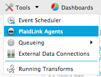
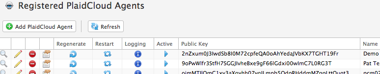
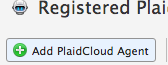
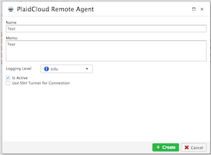

.. sectionauthor:: Genova Morel <genova.morel@tartansolutions.com>
.. sectionauthor:: Paul Morel <paul.morel@tartansolutions.com>

PlaidLink Agents
================

.. sidebar:: This Page

   .. contents::
      :local:
      

Description
-----------

Sometimes its necessary and desired to access data or run processes from a 
remote system that does not allow external access. This is common in enterprise 
environments behind firewalls. PlaidCloud allows this ability by using PlaidLink 
which enables remote systems access behind a firewall or where direct access from PlaidCloud is not desired.

PlaidLink operates using an agent-based system. This means an agent, the remote user, is installed on a system inside
the firewall or other restricted area. The agent can then connect to PlaidCloud using an outbound initiation process
over a secure HTTPS websocket connection, meaning it is as secure as any other encrypted web connection and does not
usually require you to open non-standard ports. Before gaining access, the agent must identify itself by sending its
agent identifier. From this, if the agent has a successful authentication process, the agent is granted access to the approved operations.

PlaidLink can be installed on Windows, Unix, and Linux systems and run under low privlege users.  On Windows systems, PlaidLink can
operate as a Windows Service with full control from the Service panel.  On linux or unix systems, it can run as a deamon.

Managing Agents
----------------

1) Open Analyze
2) Select "Tools"
3) Click "PlaidLink Agents"

|plaidlink agents select|

This brings you to the **PlaidLink Agents Table** where you can view, modify, and obtain credentials for the list of available agents.

|plaidlink agents table|

Creating an Agent
-----------------

1) Open Analyze
2) Select "Tools"
3) Click "PlaidLink Agents"
4) Click "Add PlaidLink Agent"

|add plaidlink agent select|

5) Complete the required fields

|plaidlink agent form|

6) Click "Create"

.. note:: The rest of the information for an agent that is not present on the new agent form will be generated automatically.

7) Assign the agent to security groups necessary to access resources needed to perform its job

8) Assign the agent to Document accounts necessary to access documents needed to perform its job

.. Caution:: Be sure to assign agents to security groups and document accounts or the agent will not have access

Obtaining Agent Credentials
---------------------------

To configure PlaidLink agents on the remote system you must first obtain the agent's identifying information in order
to maintain security. This information includes both a public and a private key.

To obtain these keys:

1) Open Analyze
2) Select "Tools"
3) Click "PlaidLink Agents"
4) Click the edit icon  |edit icon select|

This will open a form where you can view the public and private key values.

Please see the PlaidLink installation documentation if you need to install the agent: :doc:'../../../plaidlink/getting_started.rst'

Regenerating Agent Credentials
------------------------------

It may be a good idea to periodically regenerate the public and private keys and update the configuration of remote systems in order to maintain security.

To regenerate the credentials:

1) Open Analyze
2) Select "Tools"
3) Click "PlaidLink Agents"
4) Click the regenerate icon  |regenerate icon select|

Once the credentials have been regenerated, they can be obtained in the same way a new agent's credentials are obtained (described above).

Enabling and Disabling an Agent
-------------------------------

To disable an agent:

1) Open Analyze
2) Select "Tools"
3) Click "PlaidLink Agents"
4) Uncheck the "Active" checkbox  |active agent checkbox|

.. note:: When an agent is not marked as active, remote systems will not be able to connect using those agent credentials.

