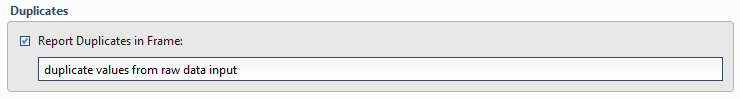

Duplicates
~~~~~~~~~~~~~~
To report duplicates, select the **Report Duplicates in Table** checkbox and then specify an output table which will contain all of the duplicate records.

.. todo:: Add screenshots, description, and update parameters

.. Caution:: This will **not** remove the duplicate items from the target data table. To remove duplicate items, use the **Distinct** menu options as specified in the [Table Data Selection](../transforms/common_features#table-data-selection) section.