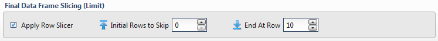

Final Data Table Slicing (Limit)
~~~~~~~~~~~~~~~~~~~~~~~~~~~~~~~~~~~

To limit the data, simply check the **Apply Row Slicer** box and then
specify the following:

-  **Initial Rows to Skip:** Rows of data to skip (column header row is not included in count)
-  **End at Row:** Last row of data to include. This is
   different from simply counting rows at the end to drop

.. todo:: Add screenshots, description, and update parameters

