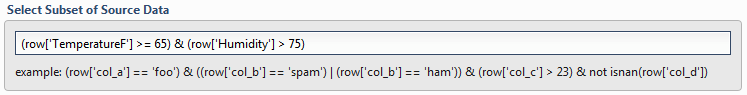

.. sectionauthor:: Genova Morel <genova.morel@tartansolutions.com>
.. sectionauthor:: Paul Morel <paul.morel@tartansolutions.com>

Select Subset of Source Data
~~~~~~~~~~~~~~~~~~~~~~~~~~~~~

Any valid Python expression is acceptable to subset the data.  Please see `Expressions <../index#expressions>`__ for more details and examples.

.. Note:: Compound filters **must** have individual elements wrapped in parentheses. For example, if filtering for Temperature and Humidity, a valid filter would look like this: 

   .. code-block:: postgresql
