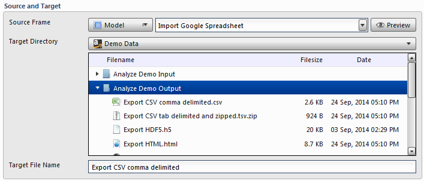

Source and Target
~~~~~~~~~~~~~~~~~~
To establish the source and target, first select the data table to be exported from the **Source Table** dropdown menu. Next, select the target file path from PlaidCloud Document using the dropdown menu to select the appropriate account before navigating to the actual directory in the section immediately below. Finally, provide the target file with a descriptive name. 

.. note:: Providing a file extension is advised, but not required by Analyze. The data table will be exported into the appropriate file format with or without an extension.
