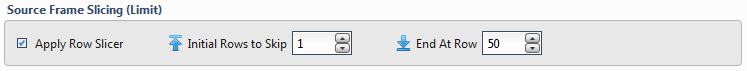

.. sectionauthor:: Genova Morel <genova.morel@tartansolutions.com>
.. sectionauthor:: Paul Morel <paul.morel@tartansolutions.com>

Source Table Slicing (Limit)
~~~~~~~~~~~~~~~~~~~~~~~~~~~~~~~~~~

To limit the data, check the **Apply Row Slicer** box and then specify the following:

- **Initial Rows to Skip:** Rows of data to skip (column header row is **not** included in count)
- **End at Row:** Last row of data to include. Note that this is different from simply counting rows at the end to drop

