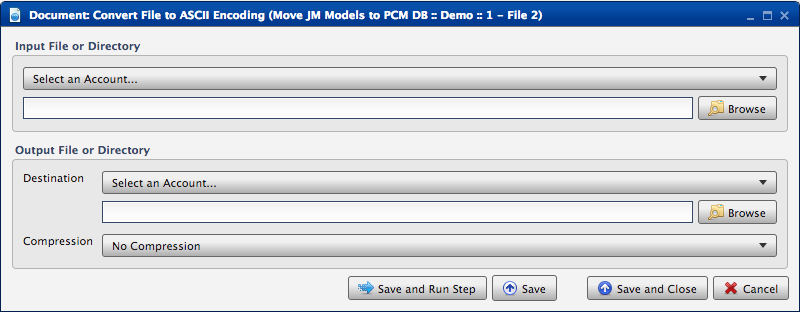
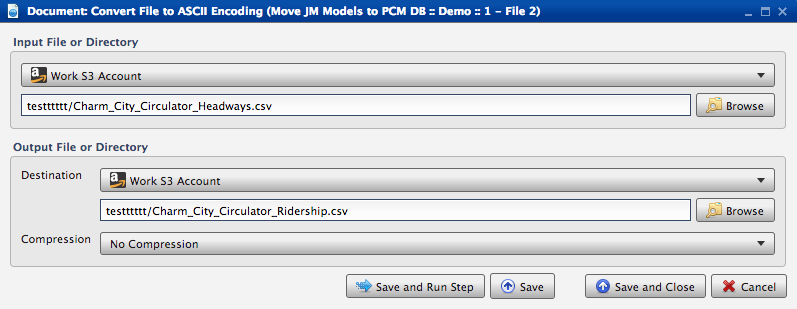

.. sectionauthor:: Paul Morel <paul.morel@tartansolutions.com>
.. sectionauthor:: Michael Rea <michael.rea@tartansolutions.com>

Convert Document Encoding to ASCII
==================================

.. toctree::
   :maxdepth: 2
   :includehidden:

.. sidebar:: This Page

   .. contents::
      :local:    

+---------------------+-------------------------------+
| Parameter           | Value                         |
+=====================+===============================+
| **Category**        | Document                      |
+---------------------+-------------------------------+
| **Operation**       | document\_convert\_encoding   |
+---------------------+-------------------------------+
| **Workflow Icon**   | |Icon|                        |
+---------------------+-------------------------------+
| **Input Type**      |                               |
+---------------------+-------------------------------+
| **Output Type**     |                               |
+---------------------+-------------------------------+

Description
-----------

Updates file encoding and converts all characters to ASCII. This is
particularly useful if the source of information has mixed encodings or
other tools don't support certain encodings.

Workflow Configuration Forms
----------------------------

Examples
--------

Select the input file and browse for the file within that location. Select the desired output
location, and browse to select the desired location for the file. Save and run. |Document Convert File to ASCII
Encoding|

.. todo:: Screenshots, description, and update parameters coming soon

.. |Icon| image:: https://plaidcloud.com/client/resource/fugue/icons/document-globe.png
