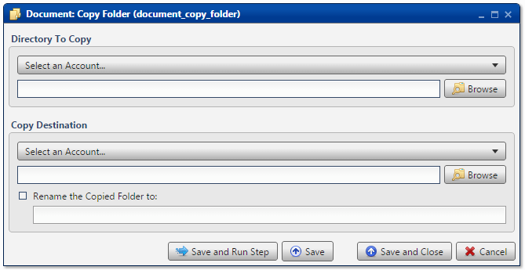
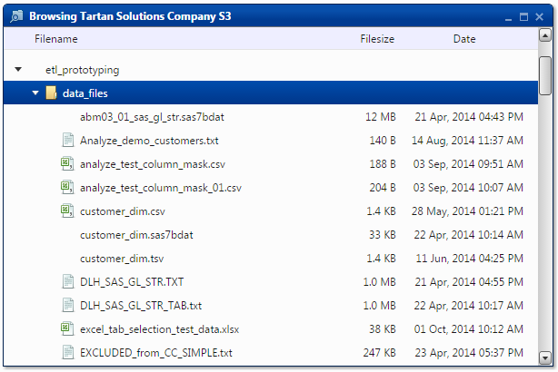
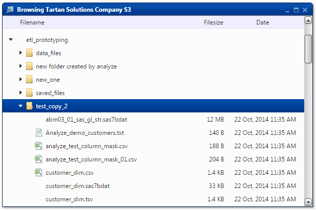

.. sectionauthor:: Paul Morel <paul.morel@tartansolutions.com>
.. sectionauthor:: Michael Rea <michael.rea@tartansolutions.com>

Copy Document Directory
=========================

.. toctree::
   :maxdepth: 2
   :includehidden:

.. sidebar:: This Page

   .. contents::
      :local:    

+---------------------+-----------------------------+
| Parameter           | Value                       |
+=====================+=============================+
| **Category**        | Document                    |
+---------------------+-----------------------------+
| **Operation**       | document\_copy\_directory   |
+---------------------+-----------------------------+
| **Workflow Icon**   | |Icon|                      |
+---------------------+-----------------------------+
| **Input Type**      |                             |
+---------------------+-----------------------------+
| **Output Type**     |                             |
+---------------------+-----------------------------+

Description
-----------

Copy an entire directory within PlaidCloud Document.

Copy Directory
--------------

First, select the appropriate account from the dropdown menu.

Next, press the **Browse** button to select the directory you'd like to copy.

Select Destination
------------------

First, select the appropriate account from the dropdown menu.

Next, press the **Browse** button to select the destination for the
copied directory. If desired, the copied directory can be given a new
name. To do so, simply check the **Rename the Copied Folder to:** box
and type in a new name.

 .. important:: The default behavior is to overwrite anything which
    already exists. Be careful to not accidentally overwrite.

Workflow Configuration Forms
----------------------------

Examples
--------

In this example, the *etl\_prototyping/data\_files/* directory is copied
into the *etl\_prototyping/* directory. It is renamed to
*test\_copy\_2*.

As you can see below, the source and target directories have the same
contents.

The copied directory's files all contain the same timestamp as they were
created during the copy.

.. |Icon| image:: https://plaidcloud.com/client/resource/fugue/icons/folders.png
