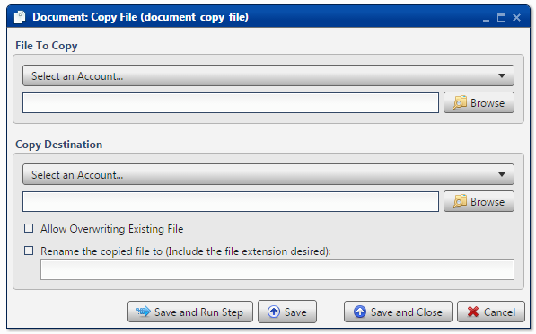
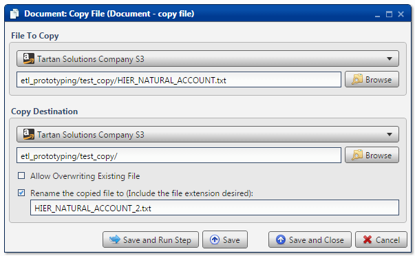
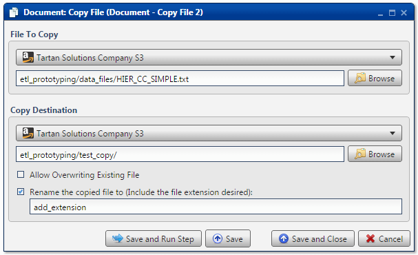

.. sectionauthor:: Paul Morel <paul.morel@tartansolutions.com>
.. sectionauthor:: Michael Rea <michael.rea@tartansolutions.com>

Copy Document File
=========================

.. toctree::
   :maxdepth: 2
   :includehidden:

.. sidebar:: This Page

   .. contents::
      :local:    

+---------------------+------------------------+
| Parameter           | Value                  |
+=====================+========================+
| **Category**        | Document               |
+---------------------+------------------------+
| **Operation**       | document\_copy\_file   |
+---------------------+------------------------+
| **Workflow Icon**   | |Icon|                 |
+---------------------+------------------------+
| **Input Type**      |                        |
+---------------------+------------------------+
| **Output Type**     |                        |
+---------------------+------------------------+

Description
-----------

Copy a single file within PlaidCloud Document.

File To Copy
------------

First, select the appropriate account from the dropdown menu.

Next, press the **Browse** button to select the file you'd like to copy.

Select Destination
------------------

First, select the appropriate account from the dropdown menu.

Next, press the **Browse** button to select the destination for the
copied file.

By default, Analyze will not allow files to be overwritten. Instead, a
numerical suffix will be added to each subsequent copy. To overwrite the 
existing file, simply check the **Allow Overwriting Existing File** box.

To rename the file, check the **Rename the copied file to** box and type in a new name.

.. note:: Be sure to provide a file extension when changing the name
    of the file. The file will  be created successfully without an
    extension, but operating systems won't know its type.

Workflow Configuration Forms
----------------------------

Examples
--------

Extension Provided
~~~~~~~~~~~~~~~~~~

In this example, the file, *HIER\_NATURAL\_ACCOUNT.txt*, is copied from
the *etl\_prototyping/data\_files/* directory. It is copied to
*etl\_prototyping/test\_copy/* and renamed to
*HIER\_NATURAL\_ACCOUNT\_2.txt*. Since the **Allow Overwriting Existing
File** option is not checked, a numerical suffix will be added to the subsequent copy.

No Extension Provided
~~~~~~~~~~~~~~~~~~~~~

In this example, the file, *HIER\_CC\_SIMPLE.txt*, is copied from the
*etl\_prototyping/data\_files/* directory. It is copied to
*etl\_prototyping/test\_copy/* and renamed to *add\_extension*. Note
that since no extension is provided, Document will not show what type
the file is, even though it will be a valid text file. This is
inadvisable. Also, since the **Allow Overwriting Existing File** option 
is not checked, a numerical suffix will be added to the subsequent copy.

   
.. |Icon| image:: https://plaidcloud.com/client/resource/fugue/icons/documents.png
