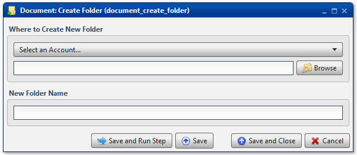

.. sectionauthor:: Paul Morel <paul.morel@tartansolutions.com>
.. sectionauthor:: Michael Rea <michael.rea@tartansolutions.com>

Create Document Directory
============================

.. toctree::
   :maxdepth: 2
   :includehidden:

.. sidebar:: This Page

   .. contents::
      :local:    

+---------------------+-------------------------------+
| Parameter           | Value                         |
+=====================+===============================+
| **Category**        | Document                      |
+---------------------+-------------------------------+
| **Operation**       | document\_create\_directory   |
+---------------------+-------------------------------+
| **Workflow Icon**   | |Icon|                        |
+---------------------+-------------------------------+
| **Input Type**      |                               |
+---------------------+-------------------------------+
| **Output Type**     |                               |
+---------------------+-------------------------------+

Description
-----------

Create a new directory within PlaidCloud Document.

Where to Create New Folder
--------------------------

First, select the appropriate account from the dropdown menu.

Next, press the **Browse** button to select the parent directory.

New Folder Name
---------------

Type the name for the new directory.

.. note:: If the directory already exists, no action is taken.

Workflow Configuration Forms
----------------------------

Examples
--------

In this example, the Document directory, *created\_by\_analyze*, is
created within the *etl\_prototyping/* parent directory.

.. |Icon| image:: https://plaidcloud.com/client/resource/fugue/icons/folder--plus.png
