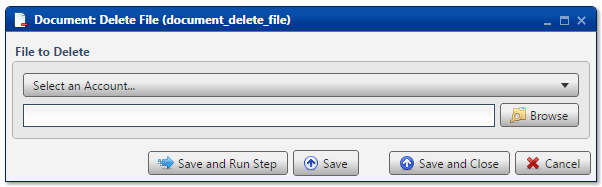

.. sectionauthor:: Paul Morel <paul.morel@tartansolutions.com>
.. sectionauthor:: Michael Rea <michael.rea@tartansolutions.com>

Delete Document File
=========================

.. toctree::
   :maxdepth: 2
   :includehidden:

.. sidebar:: This Page

   .. contents::
      :local:    

+---------------------+--------------------------+
| Parameter           | Value                    |
+=====================+==========================+
| **Category**        | Document                 |
+---------------------+--------------------------+
| **Operation**       | document\_delete\_file   |
+---------------------+--------------------------+
| **Workflow Icon**   | |Icon|                   |
+---------------------+--------------------------+
| **Input Type**      |                          |
+---------------------+--------------------------+
| **Output Type**     |                          |
+---------------------+--------------------------+

Description
-----------

Delete an existing file from within PlaidCloud Document.

File to Delete
--------------

First, select the appropriate account from the dropdown menu.

Next, press the **Browse** button to select the file to delete.

.. note:: If the file doesn't exist (already deleted), no action is taken.

Workflow Configuration Forms
----------------------------

Examples
--------

In this example, the Document file,
*etl\_prototyping/test\_copy/add\_extension*, is deleted. Remember from
a `previous
example <../transforms/document_copy_file#no-extension-provided>`__ that
this file wasn't given an extension.

.. |Icon| image:: https://plaidcloud.com/client/resource/fugue/icons/document--minus.png
