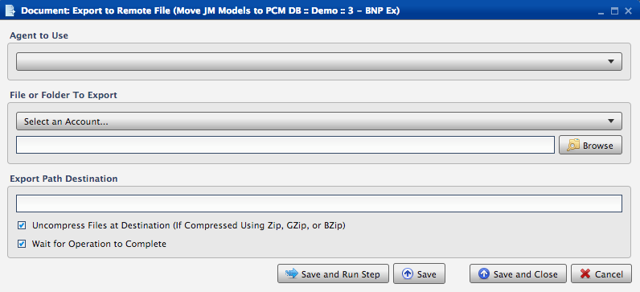
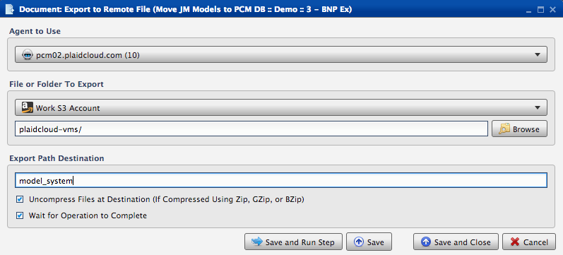

.. sectionauthor:: Paul Morel <paul.morel@tartansolutions.com>
.. sectionauthor:: Michael Rea <michael.rea@tartansolutions.com>

Document - Remote Export File
==============================

.. toctree::
   :maxdepth: 2
   :includehidden:

.. sidebar:: This Page

   .. contents::
      :local:    

+---------------------+----------------------------------+
| Parameter           | Value                            |
+=====================+==================================+
| **Category**        | Document                         |
+---------------------+----------------------------------+
| **Operation**       | document\_remote\_export\_file   |
+---------------------+----------------------------------+
| **Workflow Icon**   | |Icon|                           |
+---------------------+----------------------------------+
| **Input Type**      |                                  |
+---------------------+----------------------------------+
| **Output Type**     |                                  |
+---------------------+----------------------------------+

Description
-----------

Exports a file to a remote file system using a PlaidLink agent
installed within the firewall.

Workflow Configuration Forms
----------------------------

Examples
--------

First, make a selection from the "Agent to Use" dropdown. Next, brose for the file or folder path under "File or Folder to Export". Then enter the location under "Export Path Destination". Finally, select "Save and Run Step".

|Document Remote Export|

.. |Icon| image:: https://plaidcloud.com/client/resource/fugue/icons/blue-document-export.png
