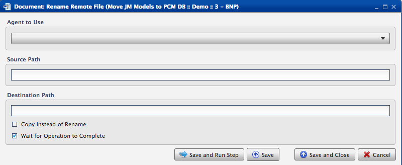
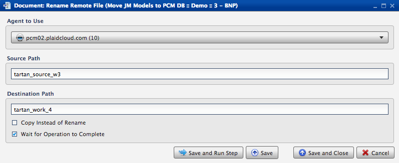

.. sectionauthor:: Paul Morel <paul.morel@tartansolutions.com>
.. sectionauthor:: Michael Rea <michael.rea@tartansolutions.com>

Document - Remote Rename File
===============================

.. toctree::
   :maxdepth: 2
   :includehidden:

.. sidebar:: This Page

   .. contents::
      :local:    

+---------------------+----------------------------------+
| Parameter           | Value                            |
+=====================+==================================+
| **Category**        | Document                         |
+---------------------+----------------------------------+
| **Operation**       | document\_remote\_rename\_file   |
+---------------------+----------------------------------+
| **Workflow Icon**   | |Icon|                           |
+---------------------+----------------------------------+
| **Input Type**      |                                  |
+---------------------+----------------------------------+
| **Output Type**     |                                  |
+---------------------+----------------------------------+

Description
-----------

Renames or moves a remote file system file using a PlaidLink agent
installed within the firewall.

Workflow Configuration Forms
----------------------------

Examples
--------

First, make a selection from the "Agent to Use" dropdown. Next, enter "Source Path" and "Destination Path". Finally, select "Save and Run Step". 

|Document Remote Rename File|

.. |Icon| image:: https://plaidcloud.com/client/resource/fugue/icons/blue-document-rename.png
