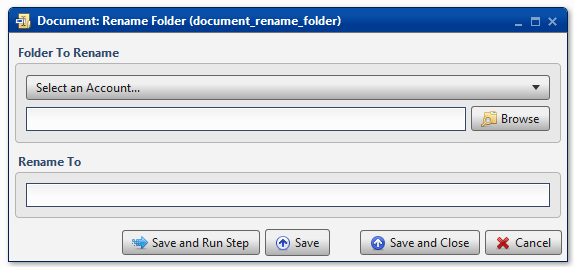

.. sectionauthor:: Paul Morel <paul.morel@tartansolutions.com>
.. sectionauthor:: Michael Rea <michael.rea@tartansolutions.com>

Rename Document Directory
=================================

.. toctree::
   :maxdepth: 2
   :includehidden:

.. sidebar:: This Page

   .. contents::
      :local:    

+---------------------+-------------------------------+
| Parameter           | Value                         |
+=====================+===============================+
| **Category**        | Document                      |
+---------------------+-------------------------------+
| **Operation**       | document\_rename\_directory   |
+---------------------+-------------------------------+
| **Workflow Icon**   | |Icon|                        |
+---------------------+-------------------------------+
| **Input Type**      |                               |
+---------------------+-------------------------------+
| **Output Type**     |                               |
+---------------------+-------------------------------+

Description
-----------

Rename an existing directory within PlaidCloud Document.

Folder to Rename
----------------

First, select the appropriate account from the dropdown menu.

Next, press the **Browse** button to select the directory to
be renamed.

Rename To
---------

Type the new name for the directory.

.. note:: If the renamed directory already exists, no action is
    taken.

Workflow Configuration Forms
----------------------------

Examples
--------

In this example, the Document directory,
*etl\_prototyping/created\_by\_analyze/*, is renamed to
*renamed\_by\_analyze*. Note that the parent directory is not listed in
the **Rename To** section.

.. |Icon| image:: https://plaidcloud.com/client/resource/fugue/icons/folder-rename.png
