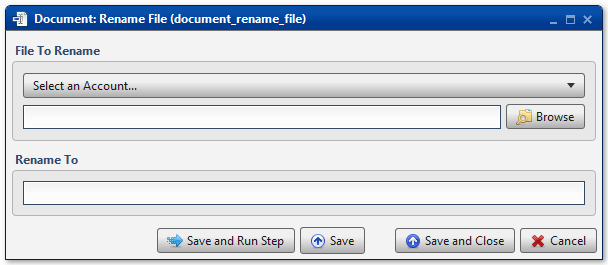

.. sectionauthor:: Paul Morel <paul.morel@tartansolutions.com>
.. sectionauthor:: Michael Rea <michael.rea@tartansolutions.com>

Rename Document File
=========================

.. toctree::
   :maxdepth: 2
   :includehidden:

.. sidebar:: This Page

   .. contents::
      :local:    

+---------------------+--------------------------+
| Parameter           | Value                    |
+=====================+==========================+
| **Category**        | Document                 |
+---------------------+--------------------------+
| **Operation**       | document\_rename\_file   |
+---------------------+--------------------------+
| **Workflow Icon**   | |Icon|                   |
+---------------------+--------------------------+
| **Input Type**      |                          |
+---------------------+--------------------------+
| **Output Type**     |                          |
+---------------------+--------------------------+

Description
-----------

Rename an existing file within PlaidCloud Document.

File to Rename
--------------

First, select the appropriate account from the dropdown menu.

Next, press the **Browse** button to select the file to be
renamed.

.. note:: If the renamed file already exists, no action is taken.

Rename To
---------

Type the new name for the file.

Workflow Configuration Forms
----------------------------

Examples
--------

In this example, the Document file,
*etl\_prototyping/test\_copy/HIER\_NATURAL\_ACCOUNT.txt*, is renamed to
*HIER\_NATURAL\_ACCOUNT\_renamed.txt*. Note that the parent directory is
not listed in the **Rename To** section.

.. |Icon| image:: https://plaidcloud.com/client/resource/fugue/icons/document-rename.png
