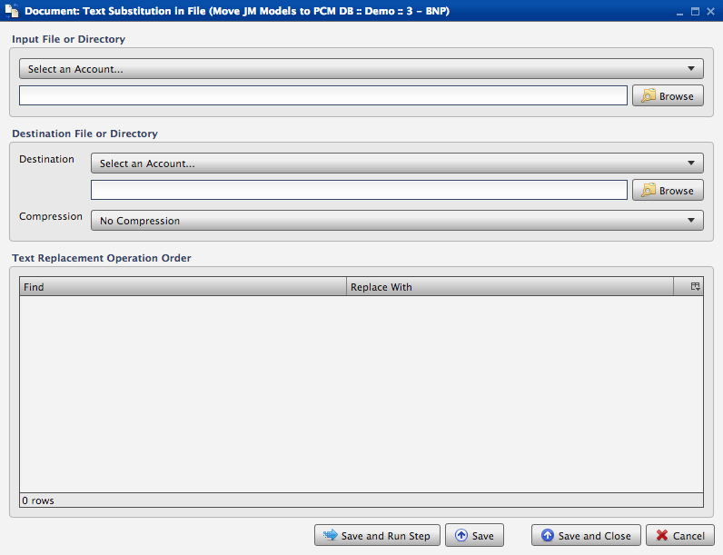

.. sectionauthor:: Paul Morel <paul.morel@tartansolutions.com>
.. sectionauthor:: Michael Rea <michael.rea@tartansolutions.com>

Document Text Substitution
============================

.. toctree::
   :maxdepth: 2
   :includehidden:

.. sidebar:: This Page

   .. contents::
      :local:    

+---------------------+--------------------------------+
| Parameter           | Value                          |
+=====================+================================+
| **Category**        | Document                       |
+---------------------+--------------------------------+
| **Operation**       | document\_text\_substitution   |
+---------------------+--------------------------------+
| **Workflow Icon**   | |Icon|                         |
+---------------------+--------------------------------+
| **Input Type**      |                                |
+---------------------+--------------------------------+
| **Output Type**     |                                |
+---------------------+--------------------------------+

Description
-----------

Performs text substitution in the specified file.

Workflow Configuration Forms
----------------------------

Examples
--------

Under "Input File or Directory", make a selection from the "Account" dropdown and select the "Browse" button to find the desired file. Under "Destination File or Directory", make a selection from the "Destination" dropdown and, if compression is desired, the "Compression" dropdown (Note: "No Compression" is the default.). Finally, select "Save and Run Step".

|Document Text Substitution in File|

.. |Icon| image:: https://plaidcloud.com/client/resource/fugue/icons/document-convert.png
