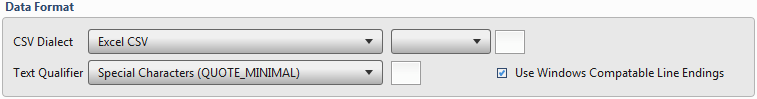
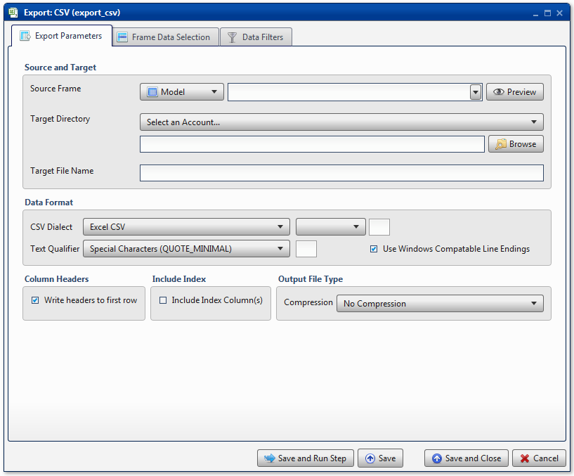
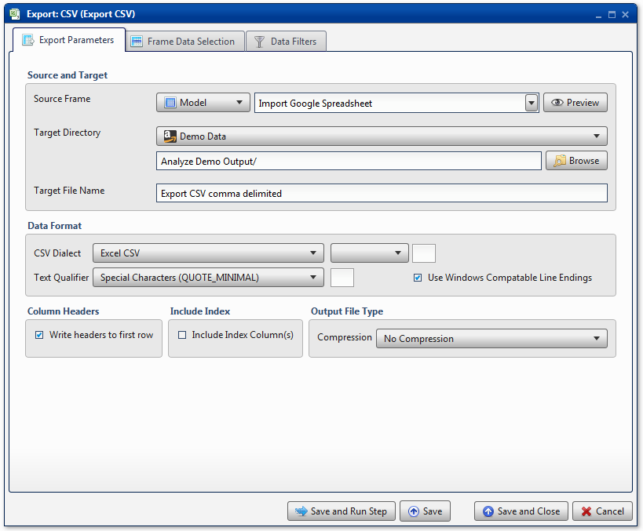
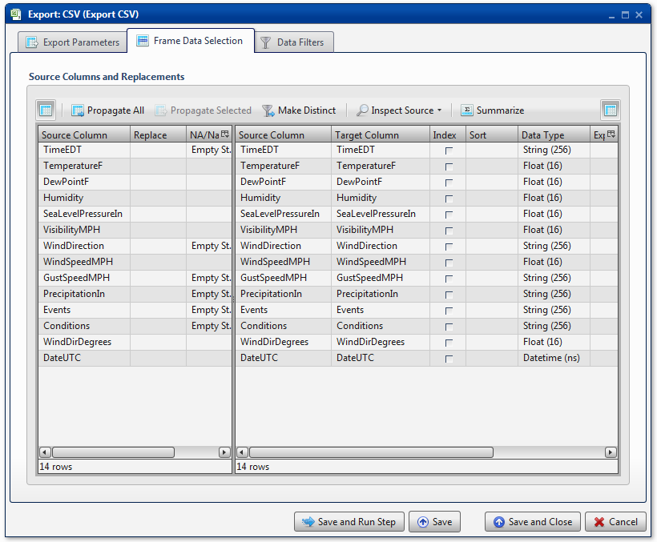
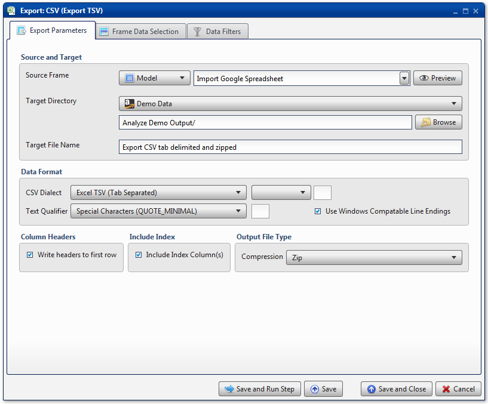
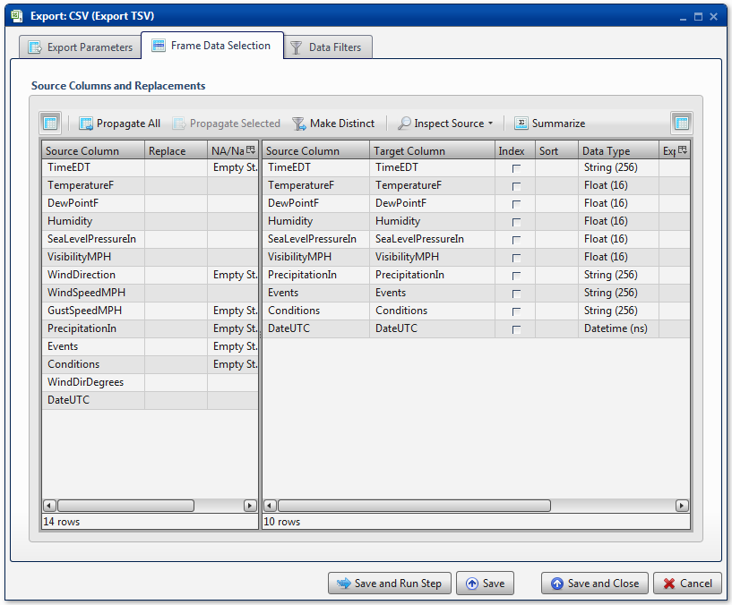
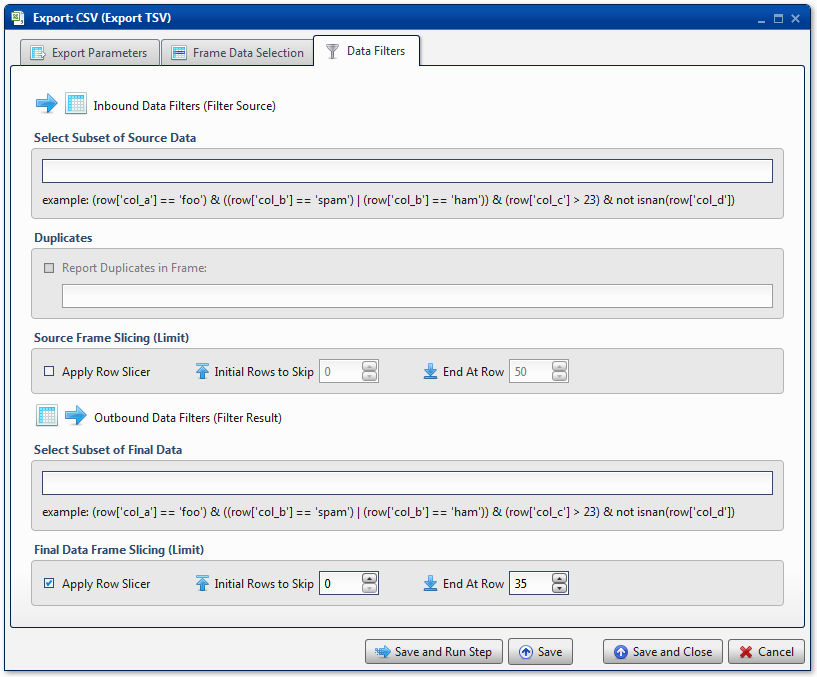

.. sectionauthor:: Paul Morel <paul.morel@tartansolutions.com>
.. sectionauthor:: Michael Rea <michael.rea@tartansolutions.com>

Export to CSV
================

.. toctree::
   :maxdepth: 2
   :includehidden:

.. sidebar:: This Page

   .. contents::
      :local:    

+---------------------+----------------------------+
| Parameter           | Value                      |
+=====================+============================+
| **Category**        | Export                     |
+---------------------+----------------------------+
| **Operation**       | export\_csv                |
+---------------------+----------------------------+
| **Workflow Icon**   | |Icon|                     |
+---------------------+----------------------------+
| **Input Type**      | PlaidCloud Analyze Table   |
+---------------------+----------------------------+
| **Output Type**     | PlaidCloud Document File   |
+---------------------+----------------------------+

Description
-----------

Export an Analyze data table to PlaidCloud Document as a CSV delimited file.

Export Parameters
-----------------

Source and Target
~~~~~~~~~~~~~~~~~

See details here: 
`Source and Target <../transforms/common_features#source-and-target>`__

Data Format
~~~~~~~~~~~

The Export CSV transform is used to export data tables into delimited
text files saved in PlaidCloud Document. This includes, but is not
limited to, the following delimiter types:

-  Excel CSV (comma separated)
-  Excel TSV (tab separated)
-  User Defined Separator -->

   -  comma (,)
   -  pipe (\|)
   -  semicolon (;)
   -  tab
   -  space ( )
   -  other/custom (tilde, dash, etc)

To specify a custom delimiter, select **User Defined Separator -->** and
then **Other -->**, and type the custom delimiter into the text box.

The **Text Qualifier** section allows users to specify how to handle the
data with regards to quotation marks and escape characters. Choose from
the following settings:

-  Special Characters (QUOTE\_MINIMAL): Quote fields with special
   characters (anything that would confuse a parser configured with the
   same dialect and options). This is the default setting.
-  All (QUOTE\_ALL): Quote everything, regardless of type.
-  Non-Numeric (QUOTE\_NONNUMERIC): Quote all fields that are not
   integers or floats. When used with the reader, input fields that are
   not quoted are converted to floats.
-  None (QUOTE\_NONE): Do not quote anything on output. Quote characters
   are included in output with the escape character provided by the
   user. Note that only a single escape character can be provided.

Lastly, the **Use Windows Compatible Line Endings** checkbox is selected
by default to ensure compatibility with Windows systems. It is advisable
to leave this setting on unless working in a unix-only environment.

.. include:: ../common/column_headers.rst

.. include:: ../common/output_file_type.rst

.. include:: ../common/table_data_selection.rst

.. include:: ../common/data_filters.rst

.. include:: ../common/select_subset_of_source_data.rst

.. include:: ../common/duplicates.rst

Source Table Slicing (Limit)
~~~~~~~~~~~~~~~~~~~~~~~~~~~~

See details here: 
`Source Table Slicing <../transforms/common_features#source-table-slicing-limit>`__

Select Subset of Final Data
~~~~~~~~~~~~~~~~~~~~~~~~~~~

See details here: 
`Select Subset of Final Data <../transforms/common_features#select-subset-of-final-data>`__

Final Data Table Slicing (Limit)
~~~~~~~~~~~~~~~~~~~~~~~~~~~~~~~~

See details here: 
`Final Data Table Slicing <../transforms/common_features#final-data-table-slicing-limit>`__

Workflow Configuration Forms
----------------------------

Examples
--------

Export CSV Comma Delimited
~~~~~~~~~~~~~~~~~~~~~~~~~~

In this example, the Analyze target table, *Import Google Spreadsheet*,
is exported to a text file named *Export CSV comma delimited*. As
suggested by the name, the output file is comma delimited and will be
given a *.csv* file extension. The target directory is the *Analyze Demo
Output* directory of PlaidCloud Document. No compression is used.

All columns are mapped from source to target as *Float*, *String*, or
*Datetime* data types, for number data, string data, and date data,
respectively. No additional operations are performed.

Export CSV Tab Delimited and Compressed
~~~~~~~~~~~~~~~~~~~~~~~~~~~~~~~~~~~~~~~

In this example, the Analyze target table, *Import Google Spreadsheet*,
is exported to a text file named *Export CSV tab delimited and zipped*.
As suggested by the name, the output file is tab delimited and will be
given a *.tsv* file extension. The target directory is the *Analyze Demo
Output* directory of PlaidCloud Document. The **Index** column is used. 
*Zip* compression is used, so the file itself will be saved within a Zip file.

Only a subset of columns are mapped from source to target as *Float*,
*String*, or *Datetime* data types, for number data, string data, and
date data, respectively. No additional operations are performed.

**Final Data Frame Slicing (Limit)** is used to limit final output to 35
rows of data.

.. |Icon| image:: https://plaidcloud.com/client/resource/fugue/icons/document-excel-csv.png

