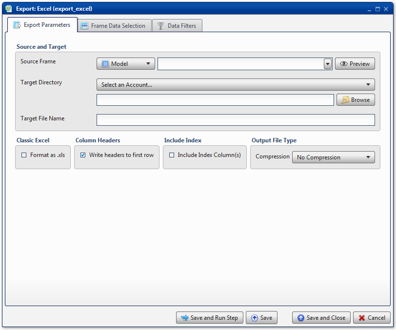
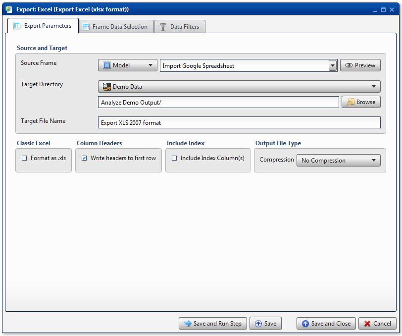
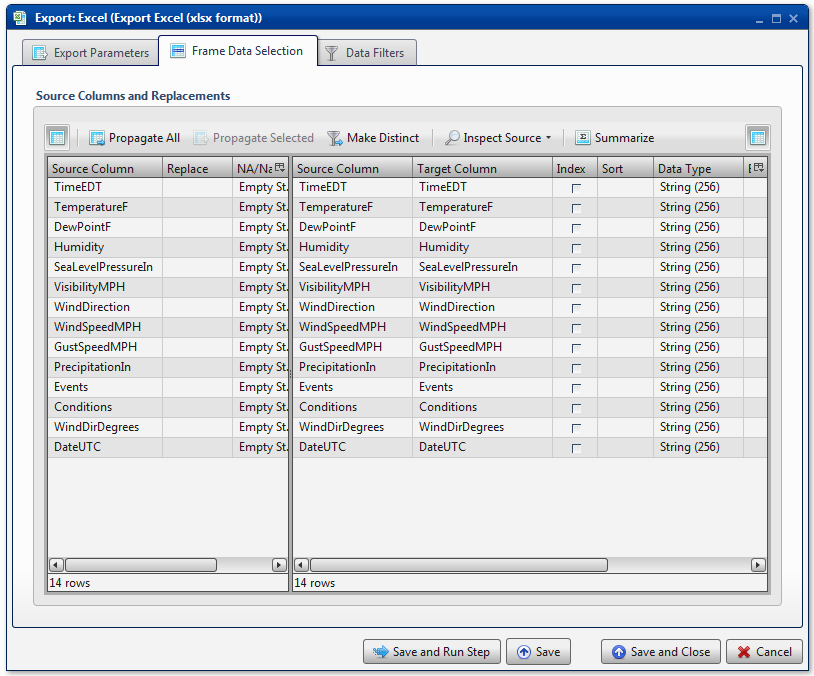
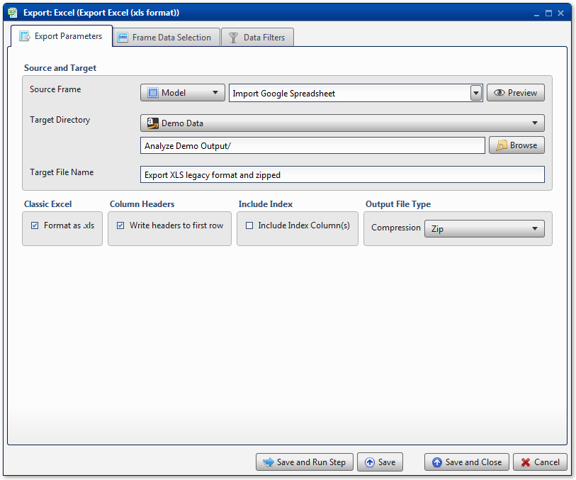
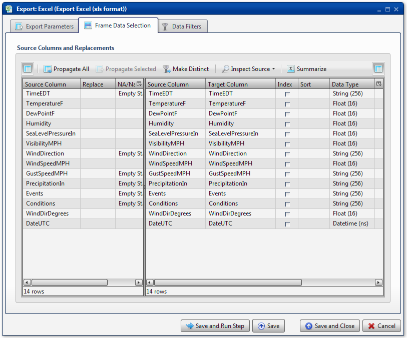

.. sectionauthor:: Paul Morel <paul.morel@tartansolutions.com>
.. sectionauthor:: Michael Rea <michael.rea@tartansolutions.com>

Export to Excel
=============================

.. toctree::
   :maxdepth: 2
   :includehidden:

.. sidebar:: This Page

   .. contents::
      :local:    

+---------------------+----------------------------+
| Parameter           | Value                      |
+=====================+============================+
| **Category**        | Export                     |
+---------------------+----------------------------+
| **Operation**       | export\_excel              |
+---------------------+----------------------------+
| **Workflow Icon**   | |Icon|                     |
+---------------------+----------------------------+
| **Input Type**      | PlaidCloud Table           |
+---------------------+----------------------------+
| **Output Type**     | Excel File                 |
+---------------------+----------------------------+

Description
-----------

Export an Analyze data table to PlaidCloud Document as a Microsoft 
Excel file. PlaidCloud Analyze supports modern
versions of Microsoft Excel (2007-2016) as well as legacy versions
(2000/2003).

Export Parameters
-----------------

.. include:: ../common/source_and_target.rst

Classic Excel
~~~~~~~~~~~~~

By default, Analyze creates Microsoft Excel files in the 2007+ format.
If your system is still using legacy versions of Excel (2000/2003),
select the **Format as .xls** checkbox to create files which will still
be readable by the older versions.

.. include:: ../common/table_data_selection.rst

.. include:: ../common/data_filters.rst

.. include:: ../common/select_subset_of_source_data.rst

.. include:: ../common/source_table_slicing.rst

.. include:: ../common/duplicates.rst

.. include:: ../common/source_table_slicing.rst

.. include:: ../common/final_data_table_slicing.rst

Include Index
~~~~~~~~~~~~~

See details here: `Include Index`_

Output File Type
~~~~~~~~~~~~~~~~

See details here: `Output File Type`_

Table Data Selection
--------------------

See details here: `Table Data Selection`_

Data Filters
------------

See details here: `Data Filters`_

Select Subset of Source Data
~~~~~~~~~~~~~~~~~~~~~~~~~~~~

See details here: `Select Subset of Source Data`_

Duplicates
~~~~~~~~~~

See details here: `Duplicates`_

Source Table Slicing (Limit)
~~~~~~~~~~~~~~~~~~~~~~~~~~~~

See details here: `Source Table Slicing`_

Select Subset of Final Data
~~~~~~~~~~~~~~~~~~~~~~~~~~~

See details here: `Select Subset of Final Data`_

Final Data Table Slicing (Limit)
~~~~~~~~~~~~~~~~~~~~~~~~~~~~~~~~

See details here: `Final Data Table Slicing`_

Workflow Configuration Forms
----------------------------

Examples
--------

Export Excel 2007-2016 File
~~~~~~~~~~~~~~~~~~~~~~~~~~~~

In this example, the Analyze target table, *Import Google Spreadsheet*,
is exported as a Microsoft Excel file named *Export XLS 2007 format*.
The output file will have a *.xlsx* extension. The target directory is
the *Analyze Demo Output* directory of PlaidCloud Document. No
compression is used.

Next, all columns are mapped in the **Table Data Selection**. No
additional operations are performed.

Export Excel Legacy File
~~~~~~~~~~~~~~~~~~~~~~~~~

In this example, the Analyze target table, *Import Google Spreadsheet*,
is exported as a legacy Microsoft Excel file named *Export XLS legacy
format and zipped*. The output file will have a *.xls* extension. The
target directory is the *Analyze Demo Output* directory of PlaidCloud
Document. *Zip* compression is used, so the file itself will be saved
within a Zip file.

All columns are mapped from source to target as *Float*, *String*, or
*Datetime* data types, for number data, string data, and date data,
respectively. No additional operations are performed.

.. _Source and Target: ../transforms/common_features#source-and-target
.. _Column Headers: ../transforms/common_features#column-headers
.. _Include Index: ../transforms/common_features#include-index
.. _Output File Type: ../transforms/common_features#output-file-type
.. _Table Data Selection: ../transforms/common_features#table-data-selection
.. _Data Filters: ../transforms/common_features#data-filters
.. _Select Subset of Source Data: ../transforms/common_features#select-subset-of-source-data
.. _Duplicates: ../transforms/common_features#duplicates
.. _Source Table Slicing: ../transforms/common_features#source-table-slicing-limit
.. _Select Subset of Final Data: ../transforms/common_features#select-subset-of-final-data
.. _Final Data Table Slicing: ../transforms/common_features#final-data-table-slicing-limit

.. |Icon| image:: https://plaidcloud.com/client/resource/fugue/icons/document-excel-table.png
