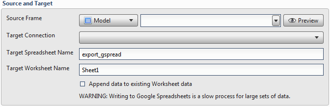
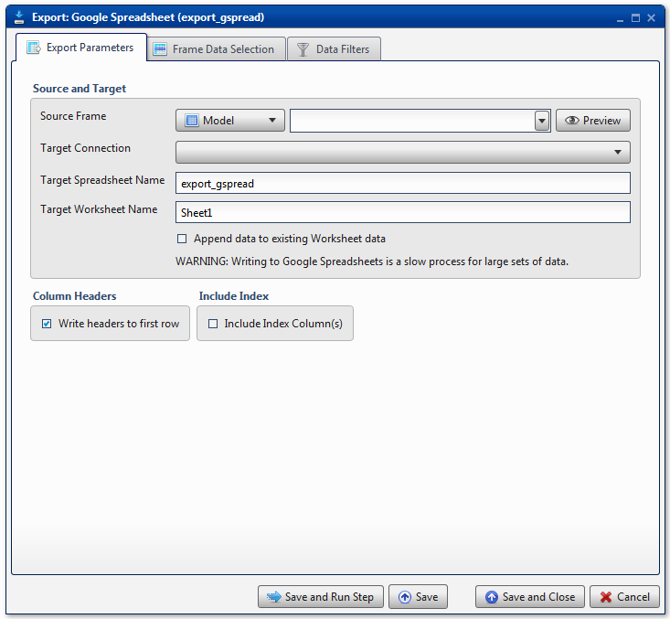
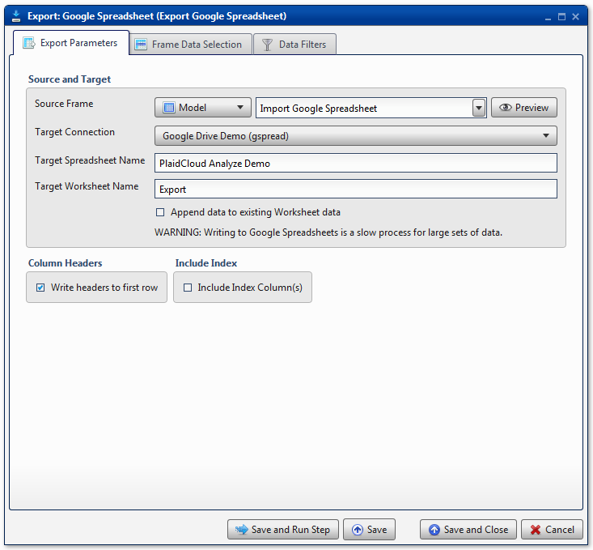
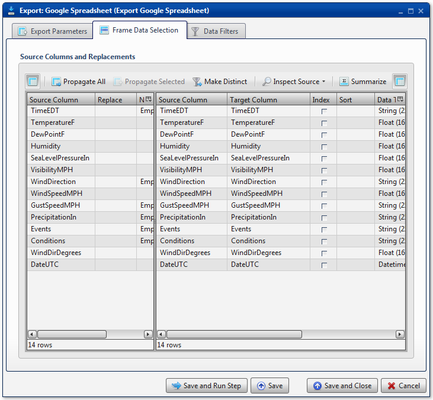

.. sectionauthor:: Paul Morel <paul.morel@tartansolutions.com>
.. sectionauthor:: Michael Rea <michael.rea@tartansolutions.com>

Export to Google Spreadsheet
=============================

.. toctree::
   :maxdepth: 2
   :includehidden:

.. sidebar:: This Page

   .. contents::
      :local:  

+---------------------+----------------------------+
| Parameter           | Value                      |
+=====================+============================+
| **Category**        | Export                     |
+---------------------+----------------------------+
| **Operation**       | export\_gspread            |
+---------------------+----------------------------+
| **Workflow Icon**   | |Icon|                     |
+---------------------+----------------------------+
| **Input Type**      | PlaidCloud Analyze Table   |
+---------------------+----------------------------+
| **Output Type**     | Google Spreadsheet         |
+---------------------+----------------------------+

Description
-----------

Export an Analyze data table to Google Drive
as a Google Spreadsheet. A valid Google account is required to use this
transform. User credentials must be set up in PlaidCloud Tools
prior to using the transform.

Export Parameters
-----------------

Source and Target
~~~~~~~~~~~~~~~~~

Select the **Source Table** from PlaidCloud Document using the dropdown
menu.

Next, specify the **Target Connection** information. For details on
setting up a Google Docs account connection, see here: 
`PlaidCloud Tools - Connection <../../tools/connection>`__. Once all necessary
accounts have been set up, select the appropriate account from the 
dropdown list.

Finally, provide the **Target Spreadsheet Name** and **Target Worksheet
Name**. If desired, select the **Append data to existing Worksheet
data** checkbox to append data to an existing Worksheet. If the target
worksheet does not yet exist, it will be created.

.. important::: Analyze does not check for existing Spreadsheets, so be
   cautious to not accidentally overwrite anything.

.. include:: ../common/table_data_selection.rst

.. include:: ../common/data_filters.rst

.. include:: ../common/select_subset_of_source_data.rst

.. include:: ../common/duplicates.rst

Source Table Slicing (Limit)
~~~~~~~~~~~~~~~~~~~~~~~~~~~~

See details here: 
`Source Table Slicing <../transforms/common_features#source-table-slicing-limit>`__

Select Subset of Final Data
~~~~~~~~~~~~~~~~~~~~~~~~~~~

See details here: 
`Select Subset of Final Data <../transforms/common_features#select-subset-of-final-data>`__

Final Data Table Slicing (Limit)
~~~~~~~~~~~~~~~~~~~~~~~~~~~~~~~~

See details here: 
`Final Data Table Slicing <../transforms/common_features#final-data-table-slicing-limit>`__

Workflow Configuration Forms
----------------------------

Examples
--------

In this example, the Analyze target table, *Import Google Spreadsheet*,
is exported to the Google Spreadsheet, *PlaidCloud Analyze Demo*. The
**Target Worksheet Name** is *Export*. By default, the data will
overwrite any existing data on the *Export* worksheet. If the worksheet
doesn't exist, it will be created.

All columns are mapped from source to target as *Float*, *String*, or
*Datetime* data types, for number data, string data, and date data,
respectively. No additional operations are performed.

.. |Icon| image:: https://plaidcloud.com/client/resource/fugue/icons/drive-download.png
