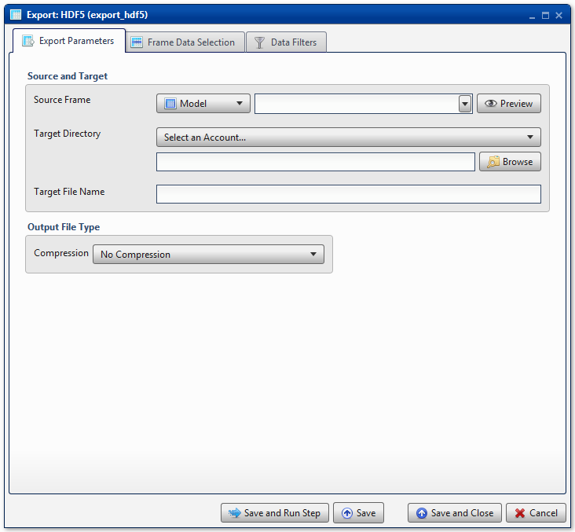
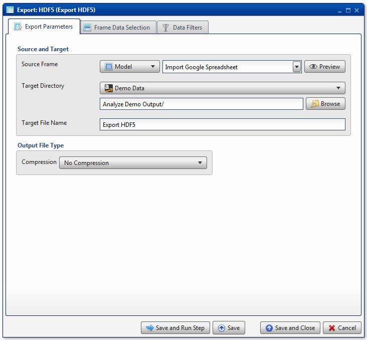
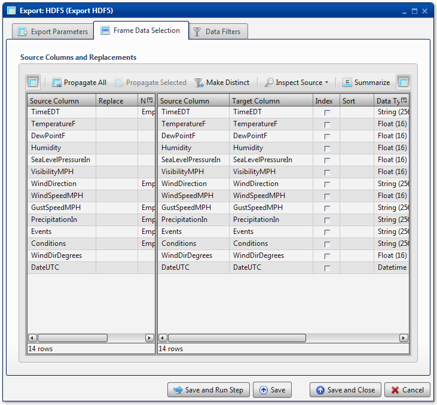

.. sectionauthor:: Paul Morel <paul.morel@tartansolutions.com>
.. sectionauthor:: Michael Rea <michael.rea@tartansolutions.com>

Export to HDF
=============================

.. toctree::
   :maxdepth: 2
   :includehidden:

.. sidebar:: This Page

   .. contents::
      :local:  

+---------------------+----------------------------+
| Parameter           | Value                      |
+=====================+============================+
| **Category**        | Export                     |
+---------------------+----------------------------+
| **Operation**       | export\_hdf                |
+---------------------+----------------------------+
| **Workflow Icon**   | |Icon|                     |
+---------------------+----------------------------+
| **Input Type**      | PlaidCloud Analyze Table   |
+---------------------+----------------------------+
| **Output Type**     | PlaidCloud Document File   |
+---------------------+----------------------------+

Description
-----------

Export an Analyze data table to PlaidCloud Document as an HDF5 file.

For more details on HDF5 files, see the HDF Group's official website
here: http://www.hdfgroup.org/HDF5/.

Export Parameters
-----------------

Source and Target
~~~~~~~~~~~~~~~~~

See details here: 
`Source and Target <../transforms/common_features#source-and-target>`__

.. include:: ../common/output_file_type.rst

.. include:: ../common/table_data_selection.rst

.. include:: ../common/data_filters.rst

.. include:: ../common/select_subset_of_source_data.rst

.. include:: ../common/duplicates.rst

Source Table Slicing (Limit)
~~~~~~~~~~~~~~~~~~~~~~~~~~~~

See details here: 
`Source Table Slicing <../transforms/common_features#source-table-slicing-limit>`__

Select Subset of Final Data
~~~~~~~~~~~~~~~~~~~~~~~~~~~

See details here: 
`Select Subset of Final Data <../transforms/common_features#select-subset-of-final-data>`__

Final Data Table Slicing (Limit)
~~~~~~~~~~~~~~~~~~~~~~~~~~~~~~~~

See details here: 
`Final Data Table Slicing <../transforms/common_features#final-data-table-slicing-limit>`__

Workflow Configuration Forms
----------------------------

Examples
--------

In this example, the Analyze target table, *Import Google Spreadsheet*,
is exported to an HDF file named *Export HDF5*. The target directory is
the *Analyze Demo Output* directory of PlaidCloud Document. No
compression is used.

All columns are mapped from source to target as *Float*, *String*, or
*Datetime* data types, for number data, string data, and date data,
respectively. No additional operations are performed.

.. |Icon| image:: https://plaidcloud.com/client/resource/fugue/icons/table.png
