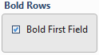
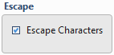
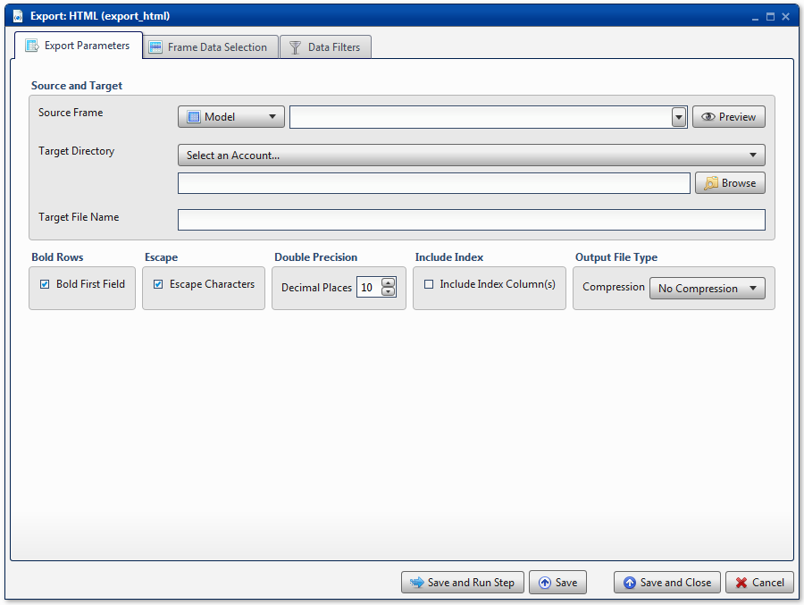
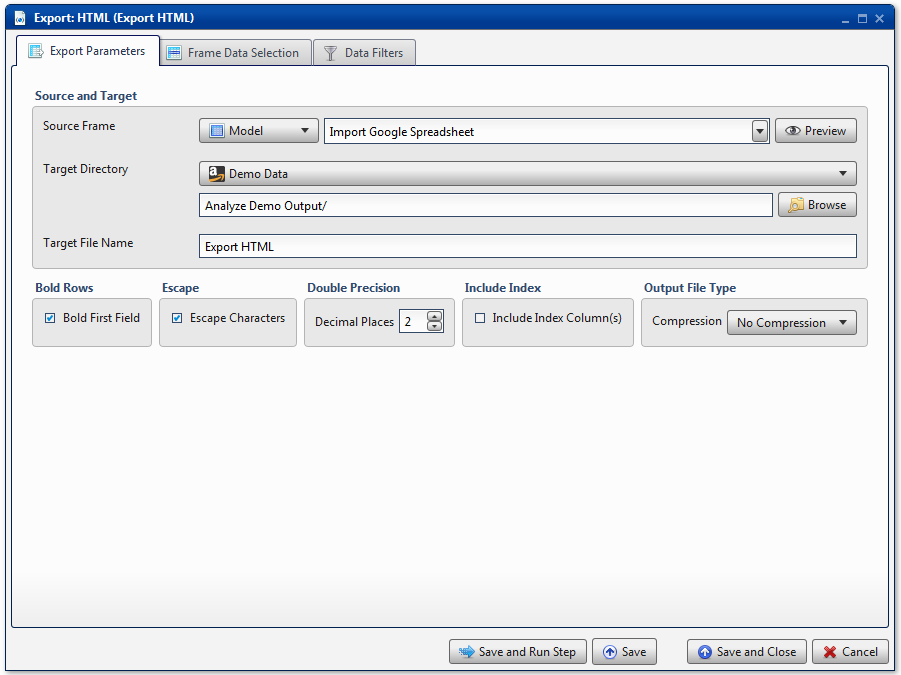
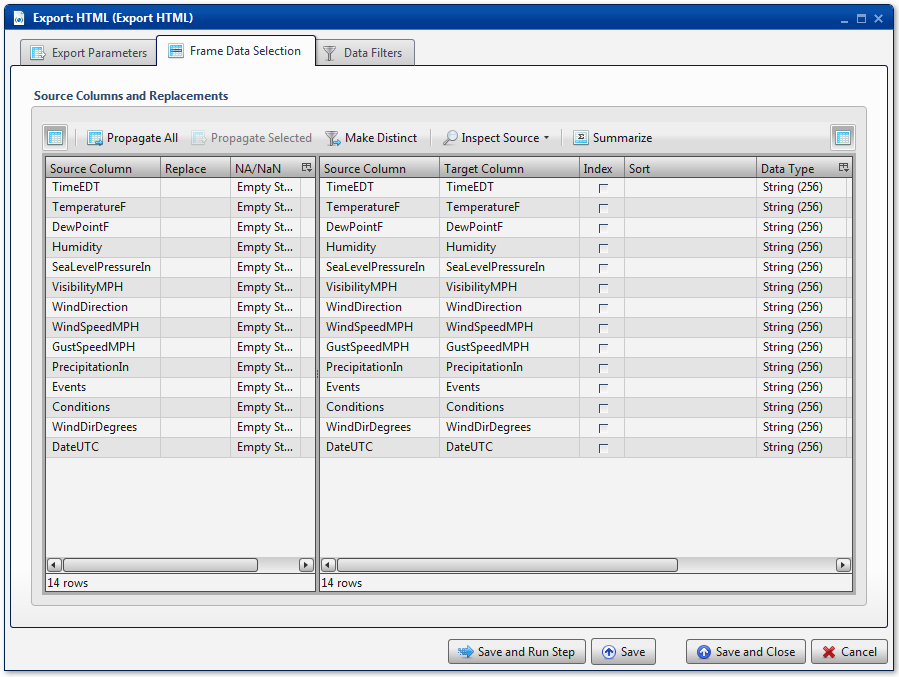

.. sectionauthor:: Paul Morel <paul.morel@tartansolutions.com>
.. sectionauthor:: Michael Rea <michael.rea@tartansolutions.com>

Export HTML
=============================

.. toctree::
   :maxdepth: 2
   :includehidden:

.. sidebar:: This Page

   .. contents::
      :local:    

+---------------------+----------------------------+
| Parameter           | Value                      |
+=====================+============================+
| **Category**        | Export                     |
+---------------------+----------------------------+
| **Operation**       | export\_html               |
+---------------------+----------------------------+
| **Workflow Icon**   | |Icon|                     |
+---------------------+----------------------------+
| **Input Type**      | PlaidCloud Analyze Table   |
+---------------------+----------------------------+
| **Output Type**     | PlaidCloud Document File   |
+---------------------+----------------------------+

Description
-----------

Export an Analyze data table to PlaidCloud Document as an HTML file. The resultant HTML file will simply contain a
table.

Export Parameters
-----------------

Source and Target
~~~~~~~~~~~~~~~~~

See details here:
`Source and Target <../transforms/common_features#source-and-target>`__

Bold Rows
~~~~~~~~~

Select this checkbox to make the first row (header row) bold font

Escape
~~~~~~

This option is enabled by default. When the checkbox is selected, the
export process will convert the characters *<*, *>*, and *&* to
HTML-safe sequences

Double Precision
~~~~~~~~~~~~~~~~

See details here:

.. include:: ../common/output_file_type.rst

.. include:: ../common/table_data_selection.rst

.. include:: ../common/data_filters.rst

.. include:: ../common/select_subset_of_source_data.rst

.. include:: ../common/duplicates.rst

Source Table Slicing (Limit)
~~~~~~~~~~~~~~~~~~~~~~~~~~~~

See details here: 
`Source Table Slicing <../transforms/common_features#source-table-slicing-limit>`__

Select Subset of Final Data
~~~~~~~~~~~~~~~~~~~~~~~~~~~

See details here: 
`Select Subset of Final Data <../transforms/common_features#select-subset-of-final-data>`__

Final Data Table Slicing (Limit)
~~~~~~~~~~~~~~~~~~~~~~~~~~~~~~~~

See details here: 
`Final Data Table Slicing <../transforms/common_features#final-data-table-slicing-limit>`__

Workflow Configuration Forms
----------------------------

Examples
--------

In this example, the Analyze target table, *Import Google Spreadsheet*,
is exported to an HTML file named *Export HTML*. The target directory is
the *Analyze Demo Output* directory of PlaidCloud Document. The title
row is bolded, **Escape Characters** are enabled, and **Decimal Places**
are limited to 2 digits. The index column is not included. No
compression is used.

All columns are mapped from source to target as *Text* data types. No
additional operations are performed.

.. |Icon| image:: https://plaidcloud.com/client/resource/fugue/icons/document-xaml.png
