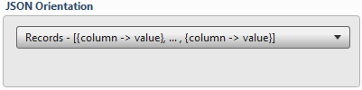
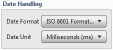

.. sectionauthor:: Paul Morel <paul.morel@tartansolutions.com>

Export to Json
================

.. toctree::
   :maxdepth: 2
   :includehidden:

.. sidebar:: This Page

   .. contents::
      :local:   

+---------------------+----------------------------+
| Parameter           | Value                      |
+=====================+============================+
| **Category**        | Export                     |
+---------------------+----------------------------+
| **Operation**       | export\_json               |
+---------------------+----------------------------+
| **Workflow Icon**   | |Icon|                     |
+---------------------+----------------------------+
| **Input Type**      | PlaidCloud Analyze Table   |
+---------------------+----------------------------+
| **Output Type**     | PlaidCloud Document File   |
+---------------------+----------------------------+

Description
-----------

Export an Analyze data table to PlaidCloud Document as a JSON file. There are several options (shown below) for
data orientation.

For more details on JSON files, see the JSON official website here:
http://json.org/.

 .. important:: JSON files do *not* retain column order. The column
    order in the source data table does not necessarily reflect the
    column order in the exported file.

Export Parameters
-----------------

Source and Target
~~~~~~~~~~~~~~~~~

See details here: 
`Source and Target <../transforms/common_features#source-and-target>`__

JSON Orientation
~~~~~~~~~~~~~~~~

Consider the following data set:

+------+----------+----------+---------+
| ID   | Name     | Gender   | State   |
+======+==========+==========+=========+
| 1    | Jack     | M        | MO      |
+------+----------+----------+---------+
| 2    | Jill     | F        | MO      |
+------+----------+----------+---------+
| 3    | George   | M        | VA      |
+------+----------+----------+---------+
| 4    | Abe      | M        | KY      |
+------+----------+----------+---------+

JSON files can be exported into one of four data formats:

-  Records: Data is stored in Python dictionary sets, with each row
   stored in {Column -> Value, ...} format. For example:
   **[{"ID":1,"Name":"Jack","Gender":"M","State":"MO"},{"ID":2,"Name":"Jill","Gender":"F","State":"MO"},{"ID":3,"Name":"George","Gender":"M","State":"VA"},{"ID":4,"Name":"Abe","Gender":"M","State":"KY"}]**
-  Index: Data is stored in nested Python dictionary sets, with each row
   stored in {Index -> {Column -> Value, ...},...} format. For example:
   **{"0":{"ID":1,"Name":"Jack","Gender":"M","State":"MO"},"1":{"ID":2,"Name":"Jill","Gender":"F","State":"MO"},"2":{"ID":3,"Name":"George","Gender":"M","State":"VA"},"3":{"ID":4,"Name":"Abe","Gender":"M","State":"KY"}}**
-  Split: Data is stored in a single Python dictionary set, values are
   stored in lists. For example:
   **{"columns":["ID","Name","Gender","State"],"index":[0,1,2,3],"data":[[1,"Jack","M","MO"],[2,"Jill","F","MO"],[3,"George","M","VA"],[4,"Abe","M","KY"]]}**
-  Values: Data is stored in multiple Python lists. For example:
   **[[1,"Jack","M","MO"],[2,"Jill","F","MO"],[3,"George","M","VA"],[4,"Abe","M","KY"]]**

Date Handling
~~~~~~~~~~~~~

Specify **Date Format** using the dropdown menu. Choose from the
following formats:

-  **Epoch (Unix Timestamp - Seconds since 1/1/1970)**
-  **ISO 8601 Format (YYYY-MM-DD HH:MM:SS with timeproject offset)**

Specify **Date Unit** using the dropdown menu. Choose from the following
formats, listed in order of increasing precision:

-  **Seconds (s)**
-  **Milliseconds (ms)**
-  **Microseconds (us)**
-  **Nanoseconds (ns)**

Double Precision
~~~~~~~~~~~~~~~~

See details here: 
`Source and Target <../transforms/common_features#double-precision>`__

Force ASCII
~~~~~~~~~~~

Select this checkbox to ensure that all strings are encoded in proper
ASCII format. This is enabled by default.

.. include:: ../common/output_file_type.rst

Table Data Selection
--------------------

Remember that JSON files do *not* retain column order. Adjustments to
column order during this step may not be accurately reflected in the
exported JSON file.

See details here: 
`Table Data Selection <../transforms/common_features#table-data-selection>`__

.. include:: ../common/data_filters.rst

.. include:: ../common/select_subset_of_source_data.rst

.. include:: ../common/duplicates.rst

Source Table Slicing (Limit)
~~~~~~~~~~~~~~~~~~~~~~~~~~~~

See details here: 
`Source Table Slicing <../transforms/common_features#source-table-slicing-limit>`__

Select Subset of Final Data
~~~~~~~~~~~~~~~~~~~~~~~~~~~

See details here: 
`Select Subset of Final Data <../transforms/common_features#select-subset-of-final-data>`__

Final Data Table Slicing (Limit)
~~~~~~~~~~~~~~~~~~~~~~~~~~~~~~~~

See details here: 
`Final Data Table Slicing <../transforms/common_features#final-data-table-slicing-limit>`__

Workflow Configuration Forms
----------------------------

Examples
--------

In this example, the Analyze Source Table *Import Google Spreadsheet* is
exported to the json file *Export JSON Records orientation* in the
*Analyze Demo Output* directory of PlaidCloud Document.

Next, all columns are mapped in the **Table Data Selection**. No
additional operations are performed. Remember that column order is not
necessarily retained in the output json file.

.. |Icon| image:: https://plaidcloud.com/client/resource/fugue/icons/json.png
