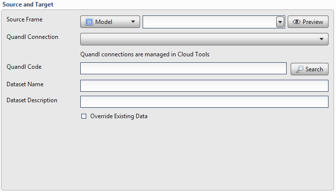
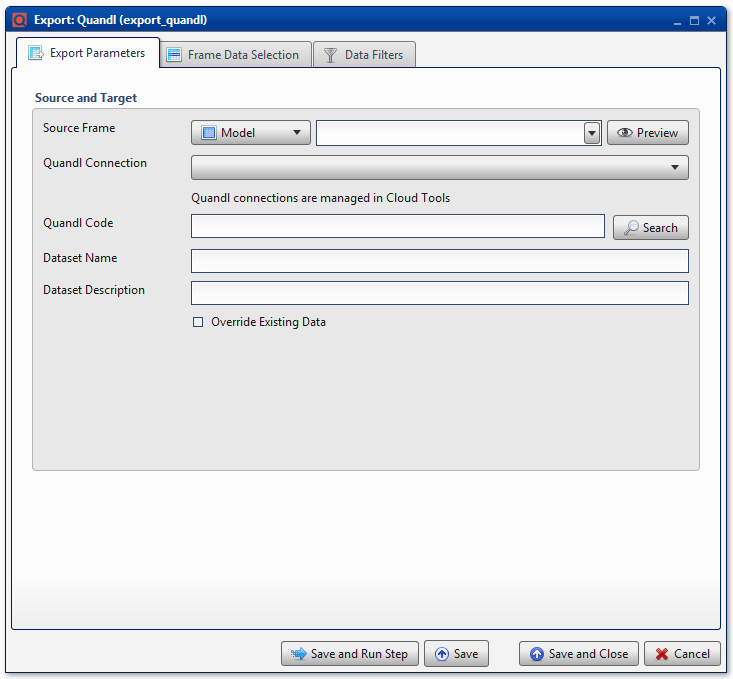

.. sectionauthor:: Paul Morel <paul.morel@tartansolutions.com>
.. sectionauthor:: Michael Rea <michael.rea@tartansolutions.com>

Export Quandl
=============================

.. toctree::
   :maxdepth: 2
   :includehidden:

.. sidebar:: This Page

   .. contents::
      :local: 

+---------------------+----------------------------+
| Parameter           | Value                      |
+=====================+============================+
| **Category**        | Export                     |
+---------------------+----------------------------+
| **Operation**       | export\_quandl             |
+---------------------+----------------------------+
| **Workflow Icon**   | |Icon|                     |
+---------------------+----------------------------+
| **Input Type**      | PlaidCloud Analyze Table   |
+---------------------+----------------------------+
| **Output Type**     | Quandl Dataset             |
+---------------------+----------------------------+

Description
-----------

Export an Analyze data table to Quandl's database.

Source and Target
-----------------

Specify the following parameters:

-  **Source Table**: Analyze data table to export
-  **Quandl Connection**: Accessing Quandl data sets requires a user
   account or a guest account with limited access. This requires set up in 
   Tools. For details on setting up a Quandl account connection,
   see here: `PlaidCloud Tools -
   Connection <../../tools/connection>`__
-  **Quandl Code**: Use the **Search** button to search for data sets.
   Alternatively, data sets can be entered manually. This requires the
   user to enter the portion of the URL after "http://www.quandl.com". For
   example, to import the data set for Microsoft stock, which can be
   found here (http://www.quandl.com/GOOG/NASDAQ_MSFT), enter
   *GOOG/NASDAQ\_MSFT* in the Quandl Code field
-  **Dataset Name**: Name of the dataset to be exported to Quandl
-  **Dataset Description**: Description of dataset to be exported to
   Quandl

.. include:: ../common/table_data_selection.rst

.. include:: ../common/data_filters.rst

.. include:: ../common/select_subset_of_source_data.rst

.. include:: ../common/duplicates.rst

Source Table Slicing (Limit)
~~~~~~~~~~~~~~~~~~~~~~~~~~~~

See details here: 
`Source Table Slicing <../transforms/common_features#source-table-slicing-limit>`__

Select Subset of Final Data
~~~~~~~~~~~~~~~~~~~~~~~~~~~

See details here: 
`Select Subset of Final Data <../transforms/common_features#select-subset-of-final-data>`__

Final Data Table Slicing (Limit)
~~~~~~~~~~~~~~~~~~~~~~~~~~~~~~~~

See details here: 
`Final Data Table Slicing <../transforms/common_features#final-data-table-slicing-limit>`__

Workflow Configuration Forms
----------------------------

Examples
--------

No examples for Export Quandl yet.

.. |Icon| image:: https://plaidcloud.com/client/resource/fugue/icons/quandl.png
