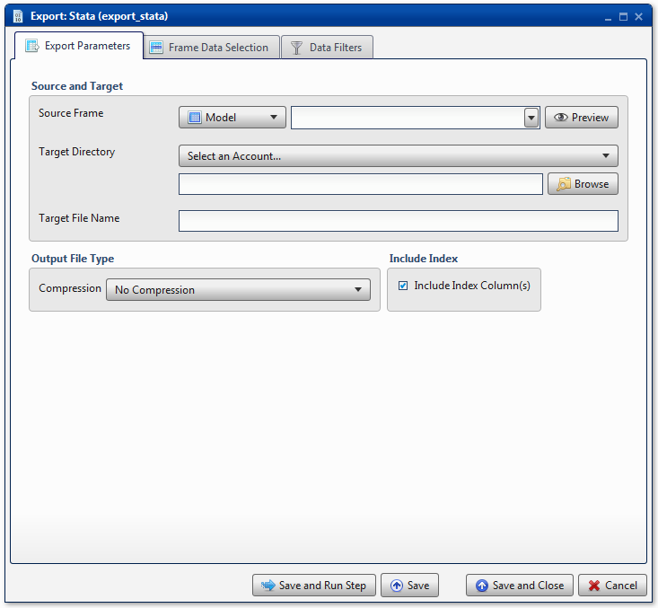
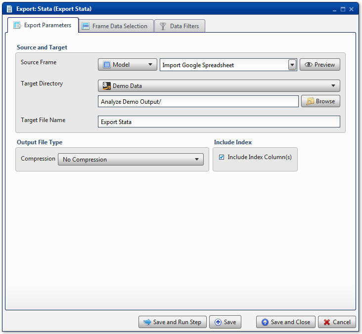
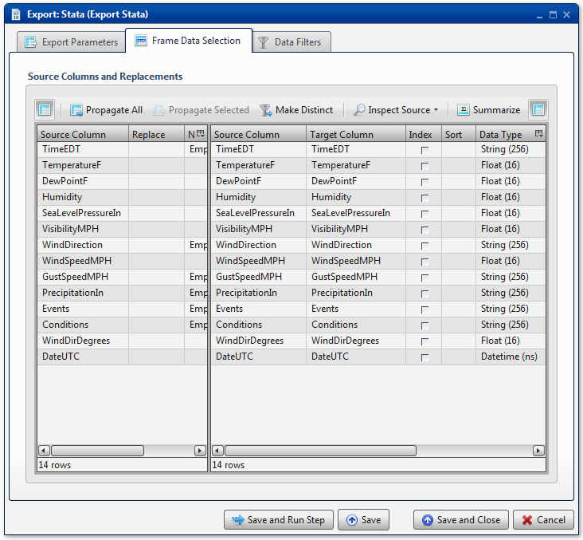

.. sectionauthor:: Paul Morel <paul.morel@tartansolutions.com>
.. sectionauthor:: Michael Rea <michael.rea@tartansolutions.com>

Export Stata
=============================

.. toctree::
   :maxdepth: 2
   :includehidden:

.. sidebar:: This Page

   .. contents::
      :local: 

+---------------------+----------------------------+
| Parameter           | Value                      |
+=====================+============================+
| **Category**        | Export                     |
+---------------------+----------------------------+
| **Operation**       | export\_stata              |
+---------------------+----------------------------+
| **Workflow Icon**   | |Icon|                     |
+---------------------+----------------------------+
| **Input Type**      | PlaidCloud Analyze Table   |
+---------------------+----------------------------+
| **Output Type**     | PlaidCloud Document File   |
+---------------------+----------------------------+

Description
-----------

Export an Analyze data table to PlaidCloud Document as a Stata file.

Export Parameters
-----------------

Source and Target
~~~~~~~~~~~~~~~~~

See details here: 
`Source and Target <../transforms/common_features#source-and-target>`__

.. include:: ../common/output_file_type.rst

.. include:: ../common/table_data_selection.rst

.. include:: ../common/data_filters.rst

.. include:: ../common/select_subset_of_source_data.rst

.. include:: ../common/duplicates.rst

Source Table Slicing (Limit)
~~~~~~~~~~~~~~~~~~~~~~~~~~~~

See details here: 
`Source Table Slicing <../transforms/common_features#source-table-slicing-limit>`__

Select Subset of Final Data
~~~~~~~~~~~~~~~~~~~~~~~~~~~

See details here: 
`Select Subset of Final Data <../transforms/common_features#select-subset-of-final-data>`__

Final Data Table Slicing (Limit)
~~~~~~~~~~~~~~~~~~~~~~~~~~~~~~~~

See details here: 
`Final Data Table Slicing <../transforms/common_features#final-data-table-slicing-limit>`__

Workflow Configuration Forms
----------------------------

Examples
--------

Export Stata File
~~~~~~~~~~~~~~~~~

| In this example, the Analyze Source Table *Import Google Spreadsheet*
  is exported to the Stata file *Export Stata* in the *Analyze Demo
  Output* directory of PlaidCloud Document.
  
| |Export Stata 1|

Next, all columns are mapped in the **Table Data Selection**. No
additional operations are performed. 

.. todo:: Add screenshots, description, and update parameters

|Export Stata 2|

.. todo:: Update icon to match PlaidCloud Workflow indicator

.. |Icon| image:: https://plaidcloud.com/client/resource/fugue/icons/poop.png

