.. sectionauthor:: Paul Morel <paul.morel@tartansolutions.com>
.. sectionauthor:: Michael Rea <michael.rea@tartansolutions.com>

Import CSV
=============================

.. toctree::
   :maxdepth: 2
   :includehidden:

.. sidebar:: This Page

   .. contents::
      :local: 

+---------------------+----------------------------+
| Parameter           | Value                      |
+=====================+============================+
| **Category**        | Import                     |
+---------------------+----------------------------+
| **Operation**       | import\_csv                |
+---------------------+----------------------------+
| **Workflow Icon**   | |Icon|                     |
+---------------------+----------------------------+
| **Input Type**      | PlaidCloud Document File   |
+---------------------+----------------------------+
| **Output Type**     | PlaidCloud Analyze Table   |
+---------------------+----------------------------+

Description
-----------

Import delimited text files from PlaidCloud Document. This includes, but is not limited to, the following
delimiter types:

-  comma
-  pipe
-  semicolon
-  tab
-  space
-  other/custom (tilde, dash, etc)

Import Parameters
-----------------

Source and Target
~~~~~~~~~~~~~~~~~

.. include:: ../common/source_and_target.rst

Inspect Selected Source File
~~~~~~~~~~~~~~~~~~~~~~~~~~~~

Analyze provides built-in functionality to preview source file data so
users are not required to find the original file and open to recall its 
contents. Simply select **Inspect Source File** and
a new window will open with a data preview (file stats are also available
in a separate tab). Since some files can be quite large, the default
limit is set to preview only 300 rows, but this can be adjusted as
necessary.

Inspecting the source file will also give Analyze a chance to determine
the delimiter being used.

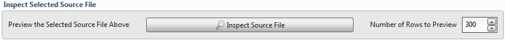

Data Format
~~~~~~~~~~~

As mentioned above, **Inspect Source File** will attempt to determine
the delimiter in the source file. If another delimiter is desired, use
this section to specify the delimiter. Users can choose from a
list of standard delimiters or specify a different value as needed.

-  Excel CSV (comma separated)
-  Excel TSV (tab separated)
-  User Defined Separator -->

   -  comma (,)
   -  pipe (\|)
   -  semicolon (;)
   -  tab
   -  space ( )
   -  other/custom (tilde, dash, etc)

To specify a custom delimiter, select **User Defined Separator -->** and
then **Other -->**, and type the custom delimiter into the text box.

The **Text Qualifier** section allows users to specify how to handle the
data with regards to quotation marks and escape characters. Choose from
the following settings:

-  Special Characters (QUOTE\_MINIMAL): Quote fields with special
   characters (anything that would confuse a parser configured with the
   same dialect and options). This is the default setting.
-  All (QUOTE\_ALL): Quote everything, regardless of type.
-  Non-Numeric (QUOTE\_NONNUMERIC): Quote all fields that are not
   integers or floats. When used with the reader, input fields that are
   not quoted are converted to floats.
-  None (QUOTE\_NONE): Do not quote anything on output. Quote characters
   are included in output with the escape character provided by the
   user. Note that only a single escape character can be provided.

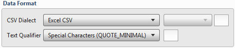

Dates and Numbers
~~~~~~~~~~~~~~~~~

.. todo:: dates and numbers

Row Skipping
~~~~~~~~~~~~

For input files with extraneous records, you can specify any number of
rows to ignore from the top and/or bottom of the input file. This is
especially helpful for files with control sums at the bottom.

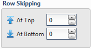

Column Headers
~~~~~~~~~~~~~~

Data Quality
~~~~~~~~~~~~

Choose from any of the following options:

-  Skip Quality Check: Analyze inspects each input file to ensure that
   each row of data contains the same number of columns. It also checks
   to make sure that quotation marks are not unbalanced, which could
   create data errors upon loading the file.
-  Error on Bad Data Lines: If any rows have too few or too many
   columns, an error will be raised and the target data table will not
   be created. By default, this is turned off and bad lines are simply
   dropped from the target data table.
-  Skip Space After Delimiter: Ignore a single space after the
   delimiter. This is enabled by default.

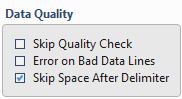

.. note:: Selecting the **Skip Quality Check** box reduces overhead
    by removing an additional pass to each import step. While the
    quality check is helpful in determining the quality of source
    files, it can impact performance for larger files. Turn this setting
    **ON** to skip the check for large files that have structural
    integrity.

File Encoding Conversion
~~~~~~~~~~~~~~~~~~~~~~~~

.. todo:: file encoding conversion

Parsing Overrides
~~~~~~~~~~~~~~~~~

Analyze handles boolean and null values specially. This section provides
the ability to specify values which should be treated specially.

-  Values Considered TRUE: Any values which should be converted to
   boolean TRUE value should be entered here. Use a comma delimiter to
   specify multiple values. For example, adding **YES** would convert
   all instances of **YES** to **TRUE**.
-  Values Considered FALSE: Any values which should be converted to
   boolean FALSE value should be entered here. Use a comma delimiter to
   specify multiple values. For example, adding **NO** would convert all
   instances of **NO** to **FALSE**.
-  Enable NA Conversion: Any values which should be converted to
   **NULL** values should be entered here. Use a comma delimiter to
   specify multiple values. For example, adding the failed Microsoft
   Excel vlookup value of **#N/A** would convert all instances of
   **#N/A** to **NULL**.

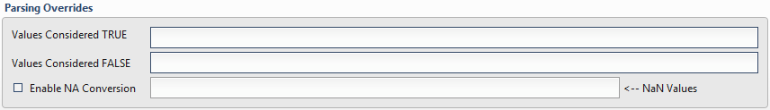

.. include:: ../common/table_data_selection.rst

.. include:: ../common/data_filters.rst

.. include:: ../common/select_subset_of_source_data.rst

.. include:: ../common/duplicates.rst

Source Table Slicing (Limit)
~~~~~~~~~~~~~~~~~~~~~~~~~~~~

.. include:: ../common/source_table_slicing.rst

Select Subset of Final Data
~~~~~~~~~~~~~~~~~~~~~~~~~~~

.. include:: ../common/select_subset_of_final_data.rst

Final Data Table Slicing (Limit)
~~~~~~~~~~~~~~~~~~~~~~~~~~~~~~~~

.. include:: ../common/final_data_table_slicing.rst 

Text Replacement
----------------

To perform basic Find/Replace operations, right click and select **Insert
Row** or **Append Row** to add a new row prior to your selection or at
the end of the list, respectively. Then, fill out the **Find** and
**Replace With** fields. This will replace all instances found in the
target data table, regardless of column position. Keep in mind that text
replacement is case sensitive, so searching for *analyze* is not the
same as searching for *Analyze*.

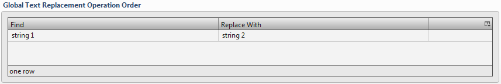

.. note:: Do **not** wrap replacement strings in quotation marks
    unless you are looking for quotation-mark-wrapped strings within the
    data. This is different from typical string expressions found
    elsewhere in Analyze, which do require strings to be wrapped in
    quotation marks.

Workflow Configuration Forms
----------------------------

|Import CSV Parameters| |Import CSV Text Replacement|

Examples
--------

Import CSV Comma Delimited
~~~~~~~~~~~~~~~~~~~~~~~~~~

In this example, the text file, *Export CSV comma delimited.csv*, is
imported from the *Analyze Demo Output* directory of PlaidCloud Document
into a data table named *Import CSV*. The **Inspect Source File** button
was used to correctly determine the **CSV Dialect** value of *Excel
CSV*.

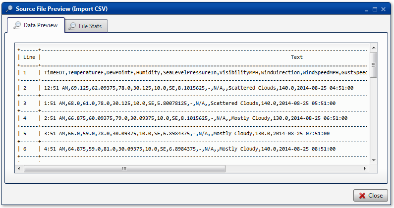

No changes are made to the default settings in the **Import Parameters**
tab.

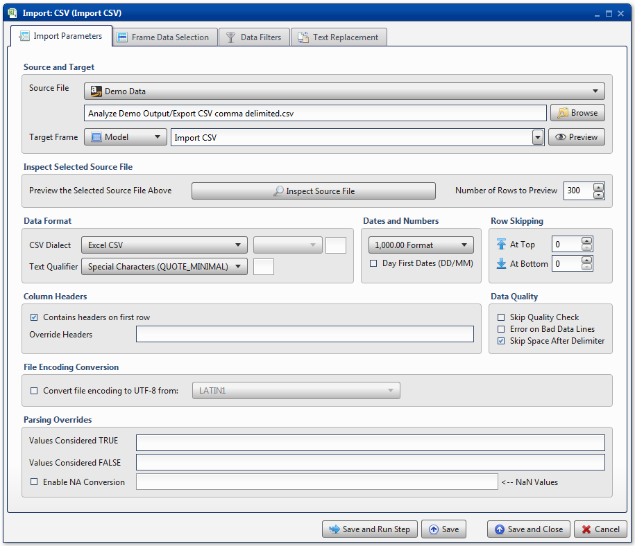

All columns are mapped from source to target as *Float*, *String*, or
*Datetime* data types, for number data, string data, and date data,
respectively. No additional operations are performed.

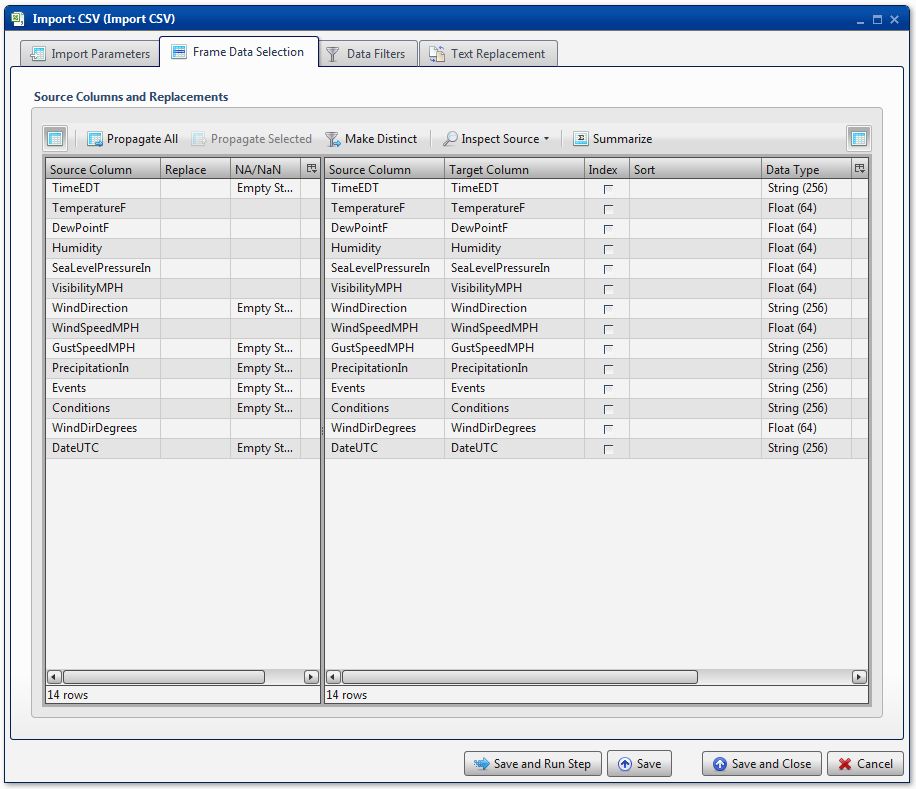

The modeler has optimistically chosen to replace a few instances of
weather conditions. *Mostly Cloudy* becomes *Partly Sunny*, while
*Partly Cloudy* becomes *Mostly Sunny*. Note that the text replacement
strings are **not** wrapped in quotation marks.

BCS Demo - Import Tab-Delimited Text
~~~~~~~~~~~~~~~~~~~~~~~~~~~~~~~~~~~~

For an example showing how to import a tab-delimited text file, please
see the `Import
CSV <../../analyze/models/demo_2013_bcs_rankings#import-csv>`__ section
of the BCS Demo.

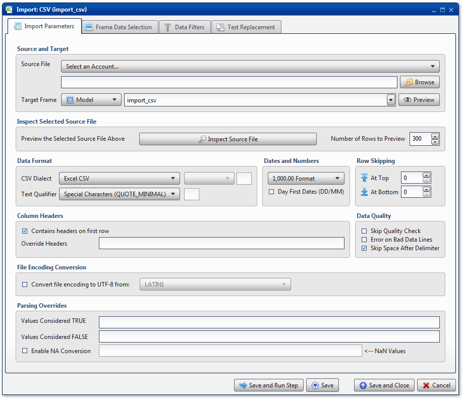
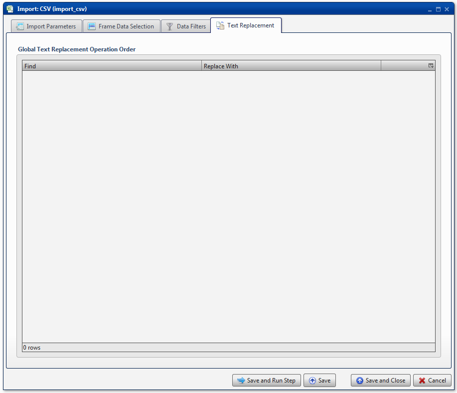

.. |Icon| image:: https://plaidcloud.com/client/resource/fugue/icons/document-excel-csv.png

