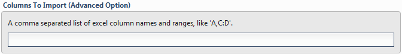
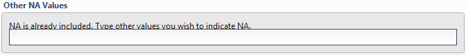
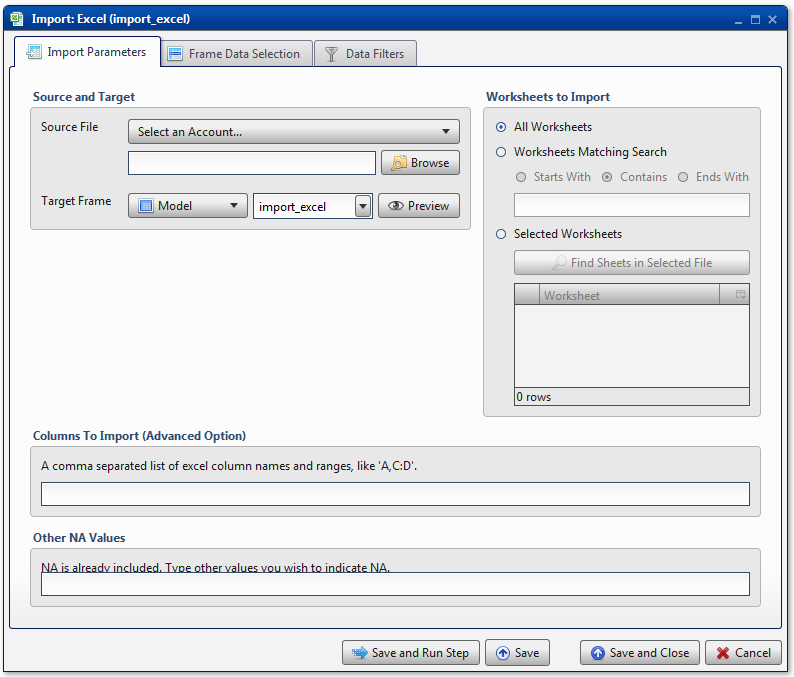
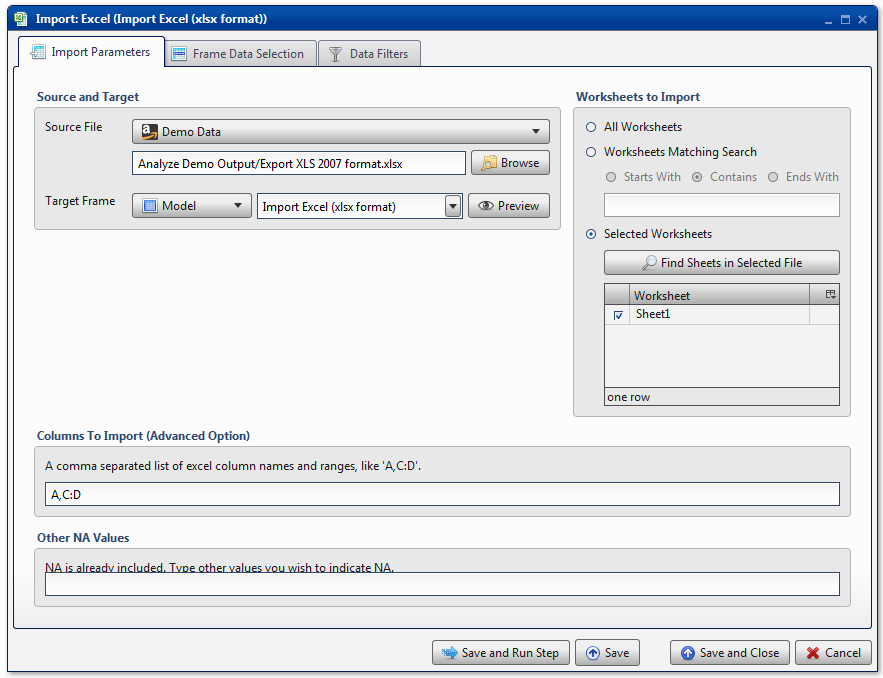
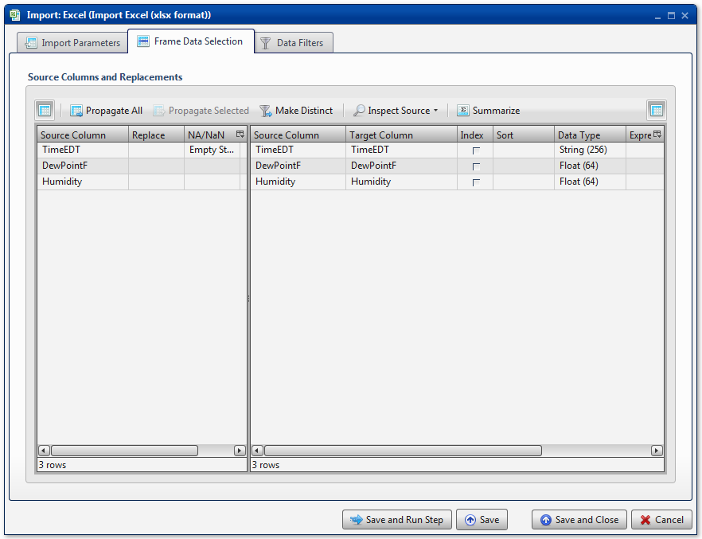
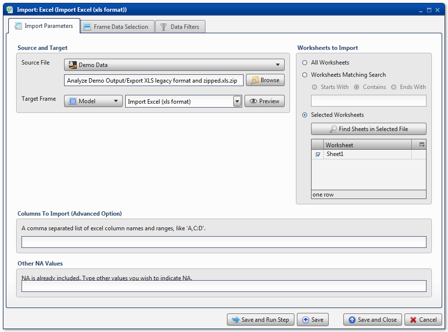
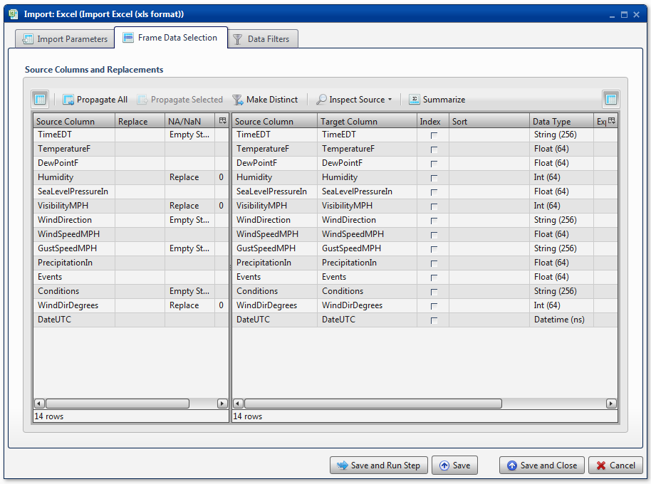
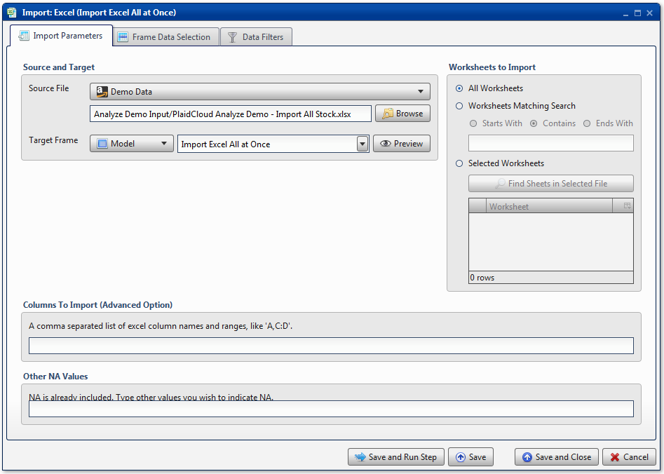
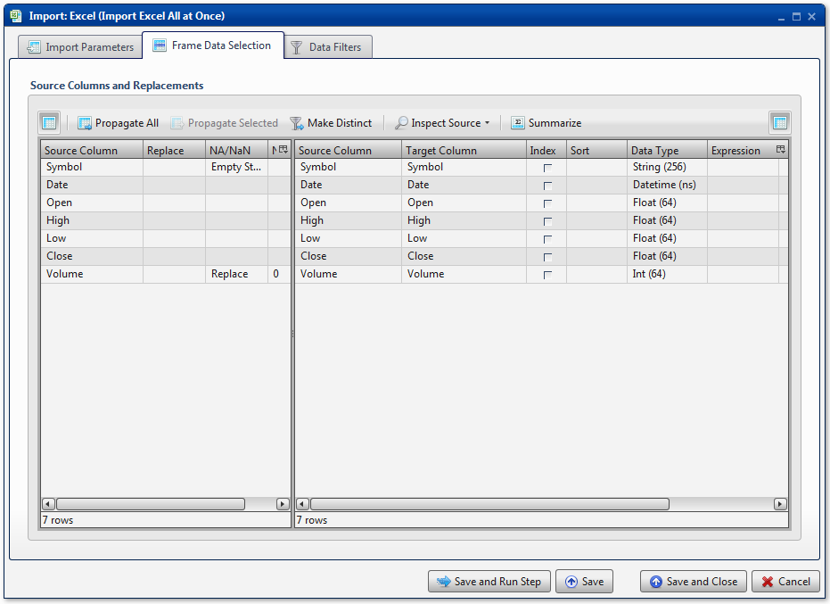

.. sectionauthor:: Paul Morel <paul.morel@tartansolutions.com>
.. sectionauthor:: Michael Rea <michael.rea@tartansolutions.com>

Import Excel
=============================

.. toctree::
   :maxdepth: 2
   :includehidden:

.. sidebar:: This Page

   .. contents::
      :local: 

+---------------------+----------------------------+
| Parameter           | Value                      |
+=====================+============================+
| **Category**        | Import                     |
+---------------------+----------------------------+
| **Operation**       | import\_excel              |
+---------------------+----------------------------+
| **Workflow Icon**   | |Icon|                     |
+---------------------+----------------------------+
| **Input Type**      | PlaidCloud Document File   |
+---------------------+----------------------------+
| **Output Type**     | PlaidCloud Analyze Table   |
+---------------------+----------------------------+

Description
-----------

Import specific worksheets from Microsoft Excel files from PlaidCloud Document. 
Analyze supports the legacy Excel format (XP/2003) as well as the new format (2007/2010/2013). This
includes, but is not limited to, the following file types:

-  XLS
-  XLSX
-  XLSB
-  XLSM

Import Parameters
-----------------

Source and Target
~~~~~~~~~~~~~~~~~

.. include:: ../common/source_and_target.rst

Worksheets to Import
~~~~~~~~~~~~~~~~~~~~

.. todo:: worksheets to import

Columns to Import
~~~~~~~~~~~~~~~~~

Specify the columns to import into the target data table. A single value
like *B* means to import only column B. Specify consecutive column
ranges with a colon (:) delimiter, such as *A:H* to import the first 8
columns. Use a comma (,) delimiter to specify non-consecutive columns such as
"A,C,E,G" to import every other column. Additionally, mixed delimiters
are allowed. An entry such as *A,C:E* will import columns A, C, D, and E
only.

.. note:: If uncertain, leave this section blank and use `Table Data
    Selection <../transforms/common_features#table-data-selection>`__ to
    select the target data table columns to include.

Other NA Values
~~~~~~~~~~~~~~~

Convert values to **Null**. By default, **NA** is included. If there are
additional values, specify them with a comma (,) delimiting each item.

.. include:: ../common/table_data_selection.rst

.. include:: ../common/data_filters.rst

.. include:: ../common/select_subset_of_source_data.rst

.. note:: It is advisable to not use the **Select Subset of Source
   Data** feature when importing multiple worksheets because the filter
   is only applied to the first worksheet. Subsequent worksheets will
   be imported with no regard to the subsetting expression.

.. include:: ../common/duplicates.rst

.. note:: It is advisable to not use the **Duplicates** feature when
   importing multiple worksheets because the duplicates are only
   checked on the first worksheet. Subsequent worksheets will be
   imported with no regard to the existence of duplicates.

Source Table Slicing (Limit)
~~~~~~~~~~~~~~~~~~~~~~~~~~~~

.. include:: ../common/source_table_slicing.rst

.. note:: It is advisable to not use the **Source Table Slicing
    (Limit)** feature when importing multiple worksheets because the
    slice is only applied to the first worksheet. Subsequent worksheets
    will be imported with no regard to the slicing limits.

Select Subset of Final Data
~~~~~~~~~~~~~~~~~~~~~~~~~~~

.. include:: ../common/select_subset_of_final_data.rst

Final Data Table Slicing (Limit)
~~~~~~~~~~~~~~~~~~~~~~~~~~~~~~~~

.. include:: ../common/final_data_table_slicing.rst 

Workflow Configuration Forms
----------------------------

Examples
--------

Import Excel 2007 File
~~~~~~~~~~~~~~~~~~~~~~

In this example, a file with the *.xlsx* file extension is imported.
First, the file, *Export XLS 2007 format.xlsx*, is selected from the
appropriate Document directory, *Analyze Demo Output*. In this instance,
*Sheet1* is the only worksheet available, so it is selected from the
**Selected Worksheets** section. The **Columns to Import** option is
used to specify a subset of columns. By using the subset, *A,C:D*, only
columns A, C, and D are included. No **Other NA Values** are given.

Next, all available columns are mapped in the **Table Data Selection**.
Keep in mind that since the **Columns to Import** option was used in the
**Import Parameters** tab, only 3 columns are available here. No
additional operations are performed.

Import Zipped Excel Legacy File
~~~~~~~~~~~~~~~~~~~~~~~~~~~~~~~

In this example, a file with the *.xls* file extension is imported.
First, the file, *Export XLS Legacy format and zipped.xls.zip*, is
selected from the appropriate Document directory, *Analyze Demo Output*.
Notice that Analyze will automatically unzip this file if needed. No
parameters are required to specify that the file needs to be unzipped. In this
instance, *Sheet1* is the only worksheet available, so it is selected
from the **Selected Worksheets** section. The **Columns to Import**
option is not used, nor is the **Other NA Values** option.

Next, all available columns are mapped in the **Table Data Selection**.
No additional operations are performed.

Import Multiple Worksheets From the Same File
~~~~~~~~~~~~~~~~~~~~~~~~~~~~~~~~~~~~~~~~~~~~~

In this example, a collection of stock prices is imported from an Excel
workbook, *PlaidCloud Analyze Demo - Import All Stock.xlsx*, from the
appropriate Document directory, *Analyze Demo Input*. Once the workbook
is selected from the dropdown menu, the Analyze **Target Table** name is
set to *Import Excel All at Once*. Next, the **All Worksheets** button
was used to import all available worksheets.

Next, all available columns are mapped in the **Table Data Selection**.
No additional operations are performed.

BCS Demo - Import Computer Rankings
~~~~~~~~~~~~~~~~~~~~~~~~~~~~~~~~~~~

For an example showing how to import Microsoft Excel data, please see
the `Import
Excel <../../analyze/models/demo_2013_bcs_rankings#import-excel>`__
section of the BCS Demo.

.. |Icon| image:: https://plaidcloud.com/client/resource/fugue/icons/document-excel-table.png
