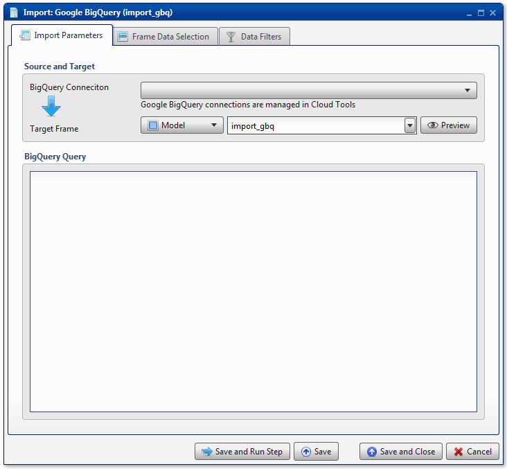

.. sectionauthor:: Paul Morel <paul.morel@tartansolutions.com>
.. sectionauthor:: Michael Rea <michael.rea@tartansolutions.com>

Import Google BigQuery
=============================

.. toctree::
   :maxdepth: 2
   :includehidden:

.. sidebar:: This Page

   .. contents::
      :local: 

+---------------------+----------------------------+
| Parameter           | Value                      |
+=====================+============================+
| **Category**        | Import                     |
+---------------------+----------------------------+
| **Operation**       | import\_gbq                |
+---------------------+----------------------------+
| **Workflow Icon**   | |Icon|                     |
+---------------------+----------------------------+
| **Input Type**      | Google Big Query           |
+---------------------+----------------------------+
| **Output Type**     | PlaidCloud Analyze Table   |
+---------------------+----------------------------+

Description
-----------

Import Google BigQuery files.

Workflow Configuration Forms
----------------------------

Examples
--------

No examples for Import Google BigQuery yet.

.. todo:: Add examples and screenshots

.. todo:: Update icon to match PlaidCloud Workflow indicator

.. |Icon| image:: https://plaidcloud.com/client/resource/fugue/icons/poop.png
