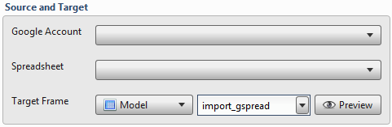
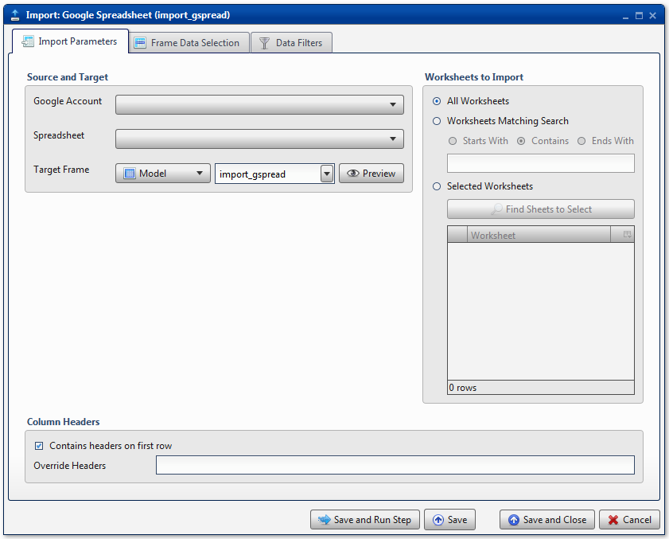
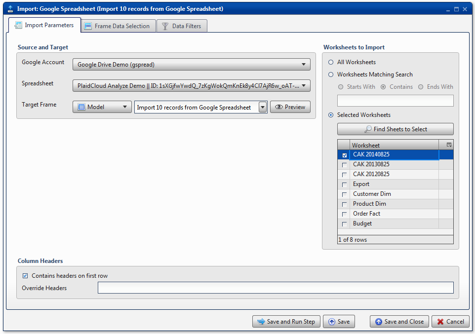
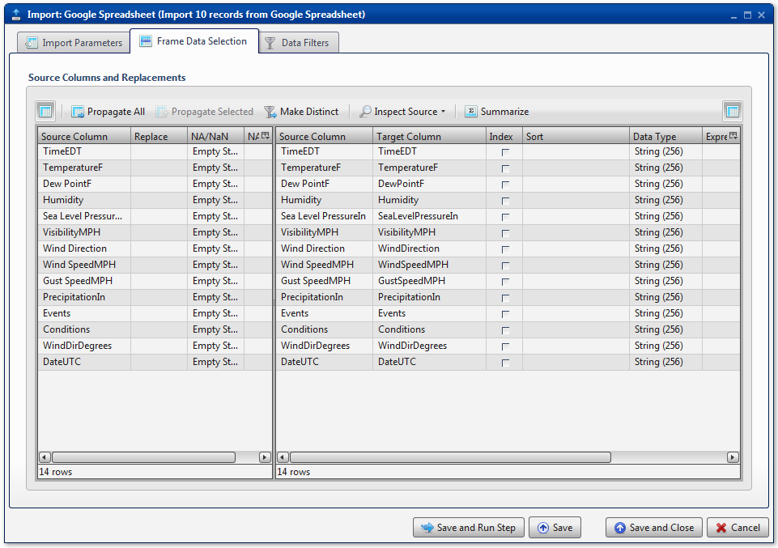
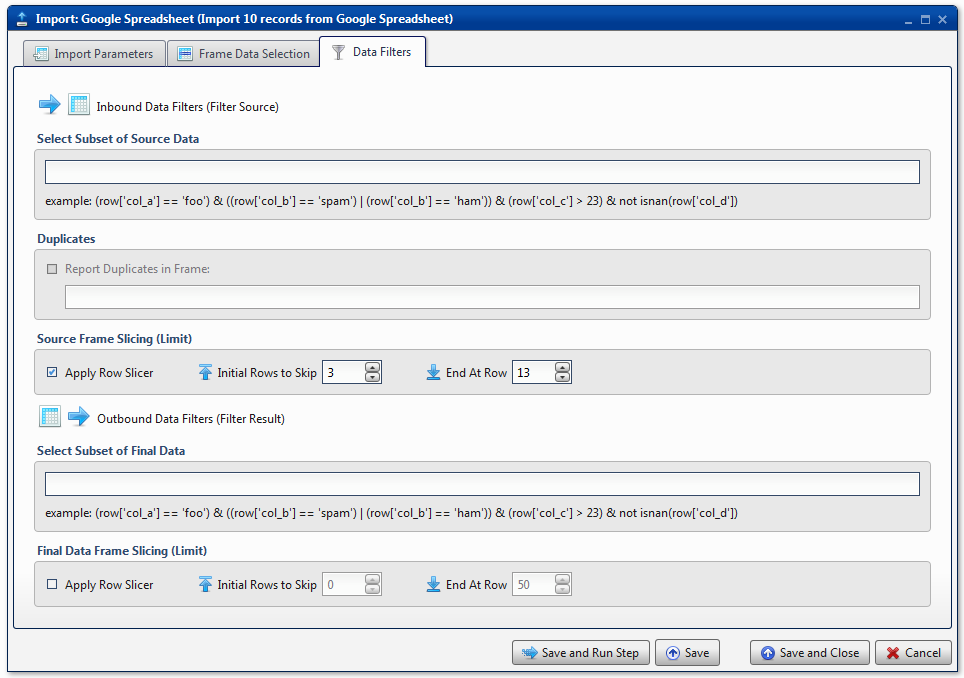
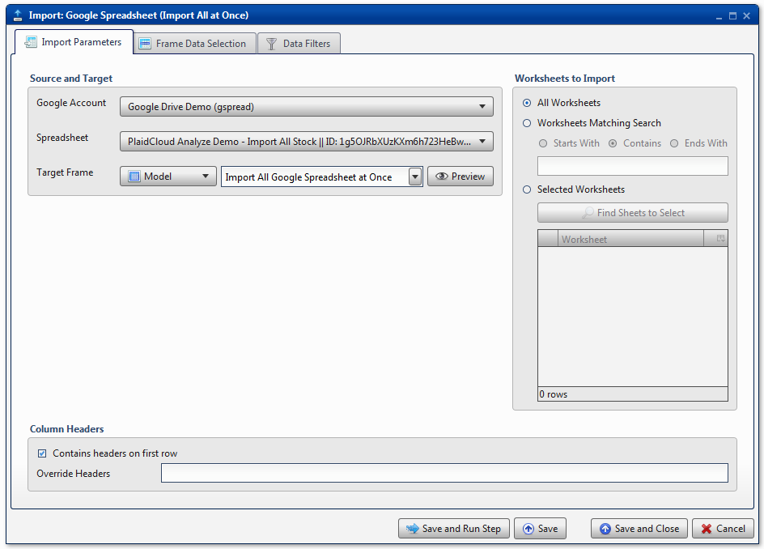
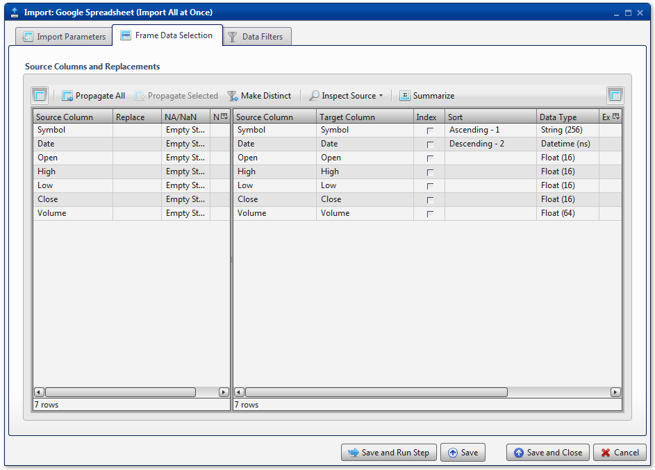

.. sectionauthor:: Paul Morel <paul.morel@tartansolutions.com>
.. sectionauthor:: Michael Rea <michael.rea@tartansolutions.com>

Import Google Spreadsheet
=============================

.. toctree::
   :maxdepth: 2
   :includehidden:

.. sidebar:: This Page

   .. contents::
      :local: 

+---------------------+----------------------------+
| Parameter           | Value                      |
+=====================+============================+
| **Category**        | Import                     |
+---------------------+----------------------------+
| **Operation**       | import\_gspread            |
+---------------------+----------------------------+
| **Workflow Icon**   | |Icon|                     |
+---------------------+----------------------------+
| **Input Type**      | Google Spreadsheet         |
+---------------------+----------------------------+
| **Output Type**     | PlaidCloud Analyze Table   |
+---------------------+----------------------------+

Description
-----------

Import specific worksheets from Google Spreadsheet files.

Import Parameters
-----------------

Source and Target
~~~~~~~~~~~~~~~~~

Accessing Google Spreadsheet data requires a valid Google user account.
This requires set up in Tools. For details on setting up a Google
account connection, see here: `PlaidCloud Tools -
Connection <../../tools/connection>`__.

Once all necessary accounts have been set up, select the appropriate
**Google Account** from the drop down list.

Next, specify the **Spreadsheet** to import from the dropdown menu
containing all available files associated with the specified **Google
Account**.

Finally, be sure to provide a valid **Target Table** name for the data
set. For target naming conventions, see details here: 

.. important:: Make sure the provided user account has access to
    the specified file, especially if the file is owned by another user.

Worksheets to Import
~~~~~~~~~~~~~~~~~~~~

.. todo:: Worksheets to import

Column Headers
~~~~~~~~~~~~~~

.. note:: Due to technical limitations, all columns from Google
   Spreadsheets are imported as String data type. Boolean, Numerical
   and/or Date/Time data types must be explicitly specified by the
   modeler during the import process.

.. include:: ../common/data_filters.rst

.. include:: ../common/select_subset_of_source_data.rst

.. note:: Use of the **Select Subset of Source
   Data** feature is not recommended when importing multiple spreadsheets because the
   filter is only applied to the first spreadsheet. Subsequent
   spreadsheets will be imported with no regard to the subsetting
   expression.

.. include:: ../common/duplicates.rst

.. note:: Use of the the **Duplicates** feature is not recommended when
   importing multiple spreadsheets because the duplicates are only
   checked on the first spreadsheet. Subsequent spreadsheets will be
   imported with no regard to the existence of duplicates.

Source Table Slicing (Limit)
~~~~~~~~~~~~~~~~~~~~~~~~~~~~

.. include:: ../common/source_table_slicing.rst

.. note:: Use of the **Source Table Slicing
    (Limit)** feature is not recommended when importing multiple spreadsheets because the
    slice is only applied to the first spreadsheet. Subsequent
    spreadsheets will be imported with no regard to the slicing limits.

Select Subset of Final Data
~~~~~~~~~~~~~~~~~~~~~~~~~~~

.. include:: ../common/select_subset_of_final_data.rst

Final Data Table Slicing (Limit)
~~~~~~~~~~~~~~~~~~~~~~~~~~~~~~~~

.. include:: ../common/final_data_table_slicing.rst

Workflow Configuration Forms
----------------------------

Examples
--------

Import Single Spreadsheet
~~~~~~~~~~~~~~~~~~~~~~~~~

In this example, the Google Spreadsheet file *PlaidCloud Analyze Demo*
is imported from Google Drive. Once the Spreadsheet was selected from
the dropdown menu, the Analyze **Target Table** name is set to *Import
Google Spreadsheet*. Next, the **Find Sheets in Selected File** button
in the **Selected Worksheets** section was used to provide a list of all
available Spreadsheets. Finally, all the Spreadsheets except for *CAK
20140825* were deselected, leaving only this single Spreadsheet to be
imported.

All columns are mapped from source to target. Initially, all data types
were set to *String*, but they have been manually changed to *Float*,
*String*, or *Datetime* data types, for number data, string data, and
date data, respectively.

A data filter is applied, with the **Source Table Slicing (Limit)**
restricting the input data set to a maximum of 100 rows of data.

Import Multiple Spreadsheets at Once
~~~~~~~~~~~~~~~~~~~~~~~~~~~~~~~~~~~~

In this example, a collection of stock prices is imported from a Google
Spreadsheet, *PlaidCloud Analyze Demo - Import All Stock*. Once the
Spreadsheet was selected from the dropdown menu, the Analyze **Target
Table** name is set to *Import All Google Spreadsheets at Once*. Next,
the **All Worksheets** button was used to import all available
Spreadsheets.

All columns are mapped from source to target. Initially, all data types
were set to *String*, but they have been manually changed to *Float*,
*String*, or *Datetime* data types, for number data, string data, and
date data, respectively. Additionally, the columns are sorted, first by
*Symbol* in ascending order to ensure stock prices are grouped by ticker
value. Next, the columns are sorted by *Date* in descending order, to show 
the most recent prices first.

.. note:: Be aware that large numbers may not fit within the
    *Int(16)* or *Float(16)* data types. In this example, *Volume*
    needed to be set to a larger data type, *Float(64)* to accommodate
    all numbers.

BCS Demo - Import Human Polls
~~~~~~~~~~~~~~~~~~~~~~~~~~~~~

For another example showing how to import Google Spreadsheets, please
see the `Import Google
Spreadsheet <../../analyze/models/demo_2013_bcs_rankings#import-google-spreadsheet>`__
section of the BCS Demo.

.. |Icon| image:: https://plaidcloud.com/client/resource/fugue/icons/drive-upload.png
