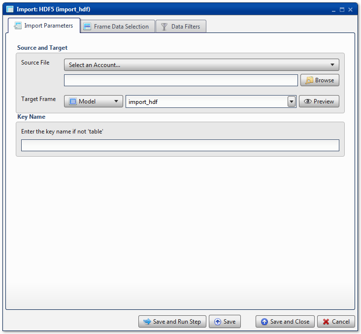
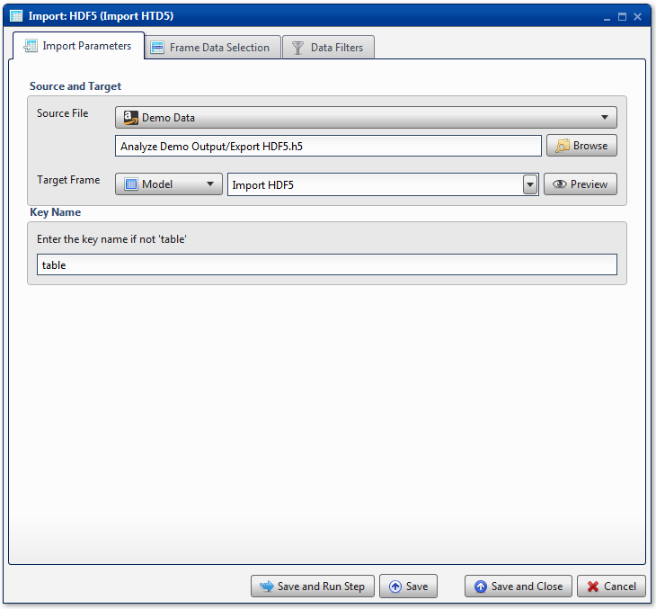
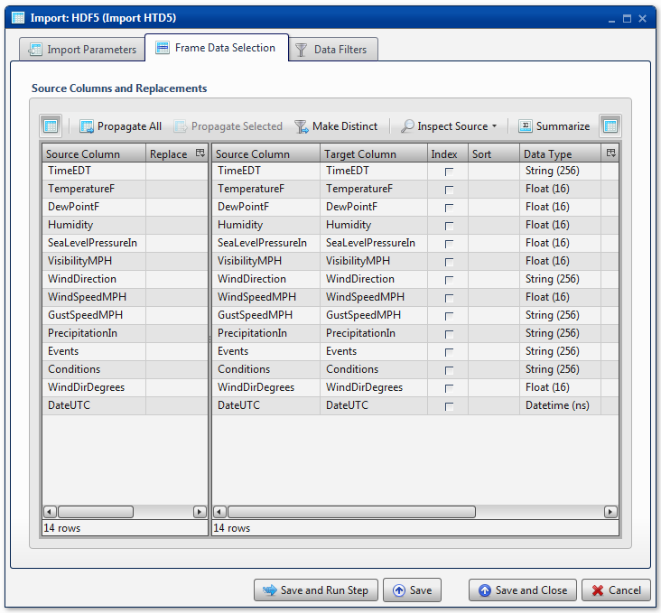

.. sectionauthor:: Paul Morel <paul.morel@tartansolutions.com>
.. sectionauthor:: Michael Rea <michael.rea@tartansolutions.com>

Import HDF
=============================

.. toctree::
   :maxdepth: 2
   :includehidden:

.. sidebar:: This Page

   .. contents::
      :local: 

+---------------------+----------------------------+
| Parameter           | Value                      |
+=====================+============================+
| **Category**        | Import                     |
+---------------------+----------------------------+
| **Operation**       | import\_hdf                |
+---------------------+----------------------------+
| **Workflow Icon**   | |Icon|                     |
+---------------------+----------------------------+
| **Input Type**      | PlaidCloud Document File   |
+---------------------+----------------------------+
| **Output Type**     | PlaidCloud Analyze Table   |
+---------------------+----------------------------+

Description
-----------

Import HDF5 files from PlaidCloud Document.

For more details on HDF5 files, see the HDF Group's official website
here: http://www.hdfgroup.org/HDF5/.

Import Parameters
-----------------

Source and Target
~~~~~~~~~~~~~~~~~

.. include:: ../common/source_and_target.rst

Key Name
~~~~~~~~

HDF files store data in a path structure. A key (path) is needed as the
destination for the table within the HDF file. In most situations, this
will be *table*.

.. include:: ../common/table_data_selection.rst

.. include:: ../common/data_filters.rst

.. include:: ../common/select_subset_of_source_data.rst

.. include:: ../common/duplicates.rst

Source Table Slicing (Limit)
~~~~~~~~~~~~~~~~~~~~~~~~~~~~

.. include:: ../common/source_table_slicing.rst

Select Subset of Final Data
~~~~~~~~~~~~~~~~~~~~~~~~~~~

.. include:: ../common/select_subset_of_final_data.rst

Final Data Table Slicing (Limit)
~~~~~~~~~~~~~~~~~~~~~~~~~~~~~~~~

.. include:: ../common/final_data_table_slicing.rst

Workflow Configuration Forms
----------------------------

   
Examples
--------

Import HDF
~~~~~~~~~~

In this example, the HDF file *Export HDF5.h5* is imported from the
*Analyze Demo Output* directory of PlaidCloud Document. The **Key Name**
is entered as *table*. The Analyze target table is *Import HDF5*.
|Import HDF 1|

All columns are mapped from source to target as *Float*, *String*, or
*Datetime* data types, for number data, string data, and date data,
respectively. |Import HDF 2|

No **Data Filters** are used.

.. |Icon| image:: https://plaidcloud.com/client/resource/fugue/icons/table.png
