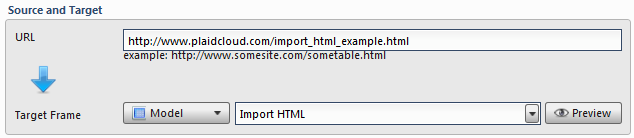
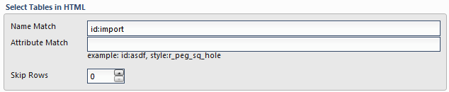
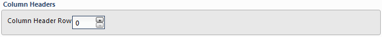
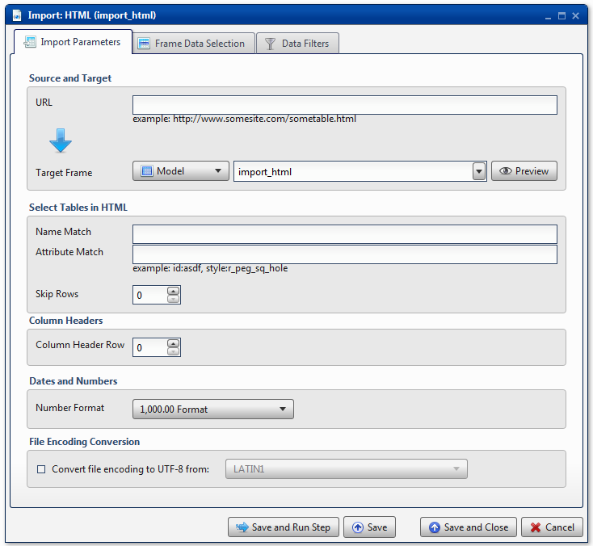

.. sectionauthor:: Paul Morel <paul.morel@tartansolutions.com>
.. sectionauthor:: Michael Rea <michael.rea@tartansolutions.com>

Import HTML
=============================

.. toctree::
   :maxdepth: 2
   :includehidden:

.. sidebar:: This Page

   .. contents::
      :local: 

+---------------------+----------------------------+
| Parameter           | Value                      |
+=====================+============================+
| **Category**        | Import                     |
+---------------------+----------------------------+
| **Operation**       | import\_html               |
+---------------------+----------------------------+
| **Workflow Icon**   | |Icon|                     |
+---------------------+----------------------------+
| **Input Type**      | PlaidCloud Document File   |
+---------------------+----------------------------+
| **Output Type**     | PlaidCloud Analyze Table   |
+---------------------+----------------------------+

Description
-----------

Import HTML table data from the internet.

Import Parameters
-----------------

Source and Target
~~~~~~~~~~~~~~~~~

Specify the URL of the source data.

Specify a name for the target data table. Note that data tables must
follow Linux naming conventions. As such, we recommend that names only
consist of alphanumeric characters. Analyze will automatically scrub any
invalid characters from the name. Additionally, it will limit the length
to 256 characters, so be concise!

Select Tables in HTML
~~~~~~~~~~~~~~~~~~~~~

Since it is possible to have multiple tables on a web page, the user
must specify which table to import. To do so, specify **Name** and/or
**Attribute** values to match.

For example, consider the following table:

.. code:: html

    <table border="1" id="import">
        <tr>
            <th>Hello</th><th>World</th>
        </tr>
        <tr>
            <td>1</td><td>2</td>
        </tr>
        <tr>
            <td>3</td><td>4</td>
        </tr>
    </table>

To import this table, specify *id:import* in the **Name Match** field.

Additionally, there is an option to skip rows at the beginning of the
table.

Column Headers
~~~~~~~~~~~~~~

Specify the row to use for header information. By default, the **Column
Header Row** is 0.

Dates and Numbers
~~~~~~~~~~~~~~~~~

.. todo:: Dates_and_Numbers

File Encoding Conversion
~~~~~~~~~~~~~~~~~~~~~~~~

.. include:: ../common/table_data_selection.rst

.. include:: ../common/data_filters.rst

.. include:: ../common/select_subset_of_source_data.rst

.. include:: ../common/duplicates.rst

Source Table Slicing (Limit)
~~~~~~~~~~~~~~~~~~~~~~~~~~~~

.. include:: ../common/source_table_slicing.rst

Select Subset of Final Data
~~~~~~~~~~~~~~~~~~~~~~~~~~~

.. include:: ../common/select_subset_of_final_data.rst

Final Data Table Slicing (Limit)
~~~~~~~~~~~~~~~~~~~~~~~~~~~~~~~~

.. include:: ../common/final_data_table_slicing.rst

Workflow Configuration Forms
----------------------------

Examples
--------

Import HTML by ID
~~~~~~~~~~~~~~~~~

Consider the 
`Hello World sample table <../models/import_html_sample#id-import>`__.

Import HTML by Class
~~~~~~~~~~~~~~~~~~~~

Coming soon

.. |Icon| image:: https://plaidcloud.com/client/resource/fugue/icons/document-xaml.png
