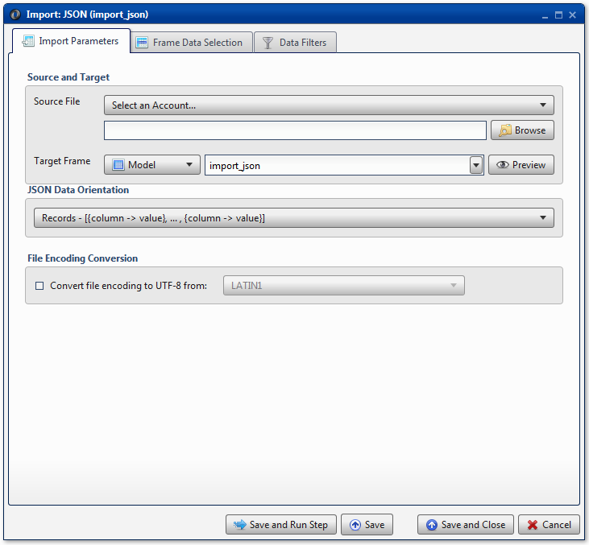
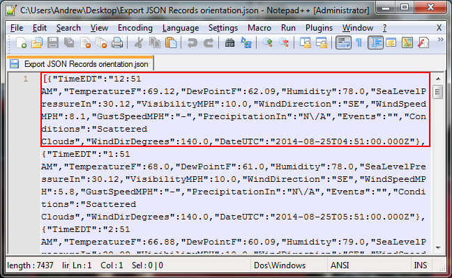
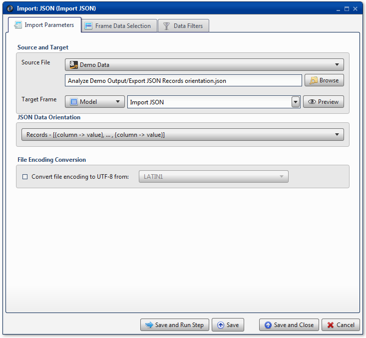
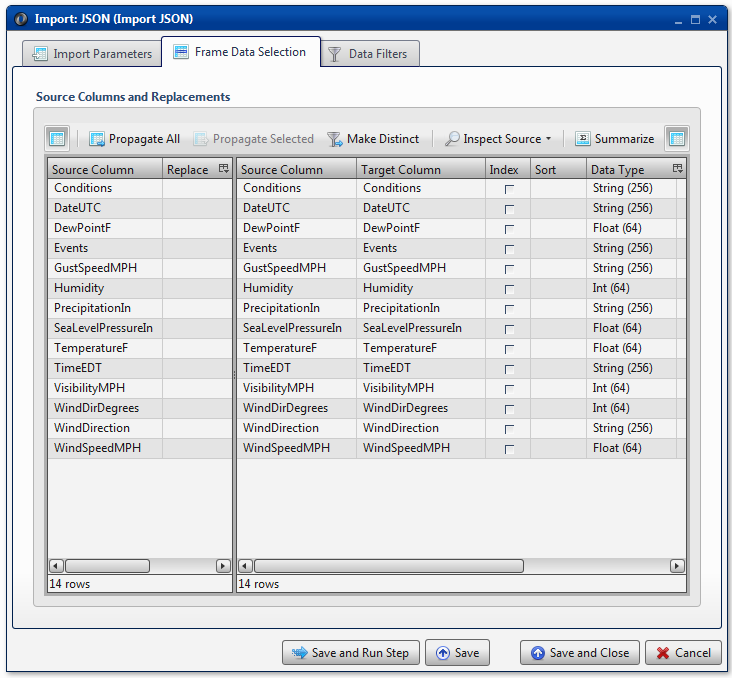

.. sectionauthor:: Paul Morel <paul.morel@tartansolutions.com>
.. sectionauthor:: Michael Rea <michael.rea@tartansolutions.com>

Import JSON
=============================

.. toctree::
   :maxdepth: 2
   :includehidden:

.. sidebar:: This Page

   .. contents::
      :local: 

+---------------------+----------------------------+
| Parameter           | Value                      |
+=====================+============================+
| **Category**        | Import                     |
+---------------------+----------------------------+
| **Operation**       | import\_json               |
+---------------------+----------------------------+
| **Workflow Icon**   | |Icon|                     |
+---------------------+----------------------------+
| **Input Type**      | PlaidCloud Document File   |
+---------------------+----------------------------+
| **Output Type**     | PlaidCloud Analyze Table   |
+---------------------+----------------------------+

Description
-----------

Import JSON text files from PlaidCloud Document.

For more details on JSON files, see the JSON official website here:
http://json.org/.

JSON files do *not* retain column order. The column 
order in the source file does not necessarily reflect the column
order in the imported data table.

Import Parameters
-----------------

Source and Target
~~~~~~~~~~~~~~~~~

.. include:: ../common/source_and_target.rst

JSON Data Orientation
~~~~~~~~~~~~~~~~~~~~~

Consider the following data set:

+------+----------+----------+---------+
| ID   | Name     | Gender   | State   |
+======+==========+==========+=========+
| 1    | Jack     | M        | MO      |
+------+----------+----------+---------+
| 2    | Jill     | F        | MO      |
+------+----------+----------+---------+
| 3    | George   | M        | VA      |
+------+----------+----------+---------+
| 4    | Abe      | M        | KY      |
+------+----------+----------+---------+

JSON files can be imported from one of three data formats:

-  Records: Data is stored in Python dictionary sets, with each row
   stored in {Column -> Value, ...} format. For example:
   
.. code-block:: json

   [{
     "ID": 1,
     "Name": "Jack",
     "Gender": "M",
     "State": "MO"
       }, {
     "ID": 2,
     "Name": "Jill",
     "Gender": "F",
     "State": "MO"
   }, {
     "ID": 3,
     "Name": "George",
     "Gender": "M",
     "State": "VA"
   }, {
     "ID": 4,
     "Name": "Abe",
     "Gender": "M",
     "State": "KY"
   }]

-  Index: Data is stored in nested Python dictionary sets, with each row
   stored in {Index -> {Column -> Value, ...},...} format. For example:

.. code-block:: JSON

   {
     "0": {
       "ID": 1,
       "Name": "Jack",
       "Gender": "M",
       "State": "MO"
     },
     "1": {
       "ID": 2,
       "Name": "Jill",
       "Gender": "F",
       "State": "MO"
     },
     "2": {
       "ID": 3,
       "Name": "George",
       "Gender": "M",
       "State": "VA"
     },
     "3": {
       "ID": 4,
       "Name": "Abe",
       "Gender": "M",
       "State": "KY"
     }
   }

-  Split: Data is stored in a single Python dictionary set, values
   stored in lists. For example:

.. code-block:: JSON

   {
     "columns": ["ID", "Name", "Gender", "State"],
     "index": [0, 1, 2, 3],
     "data": [
       [1, "Jack", "M", "MO"],
       [2, "Jill", "F", "MO"],
       [3, "George", "M", "VA"],
       [4, "Abe", "M", "KY"]
     ]
   }

File Encoding Conversion
~~~~~~~~~~~~~~~~~~~~~~~~

.. todo:: file_encoding_conversion

Table Data Selection
--------------------

Remember that JSON files do *not* retain column order. Adjustments to
column order may be required during this step.

.. include:: ../common/data_filters.rst

.. include:: ../common/select_subset_of_source_data.rst

.. include:: ../common/duplicates.rst

Source Table Slicing (Limit)
~~~~~~~~~~~~~~~~~~~~~~~~~~~~

.. include:: ../common/source_table_slicing.rst

Select Subset of Final Data
~~~~~~~~~~~~~~~~~~~~~~~~~~~

.. include:: ../common/select_subset_of_source_data.rst

Final Data Table Slicing (Limit)
~~~~~~~~~~~~~~~~~~~~~~~~~~~~~~~~

.. include:: ../common/final_data_table_slicing.rst

Workflow Configuration Forms
----------------------------

Examples
--------

Import Record-oriented JSON Data
~~~~~~~~~~~~~~~~~~~~~~~~~~~~~~~~

In this example, the JSON data is stored in the record-oriented format.
The first record is highlighted within the red box below. Note that each
**Column -> Value** pair is comma-delimited and that the entire record
is enclosed within curly braces ({ }) because it is a Python dictionary
set.

Note that the **JSON Data Orientation** is listed as *Records* to
reflect the structure accordingly.

Finally, the target columns are specified in the **Table Data
Selection** tab. As previously mentioned, note that the target data
table did not retain the column order listed in the original file. If
desired, the columns can be rearranged as necessary.

.. |Icon| image:: https://plaidcloud.com/client/resource/fugue/icons/json.png
