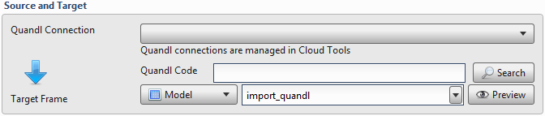
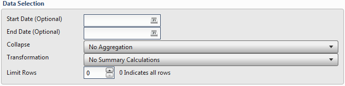
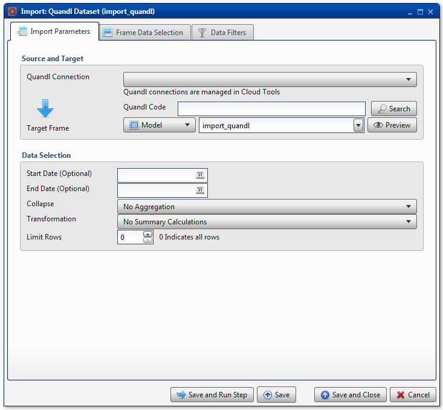
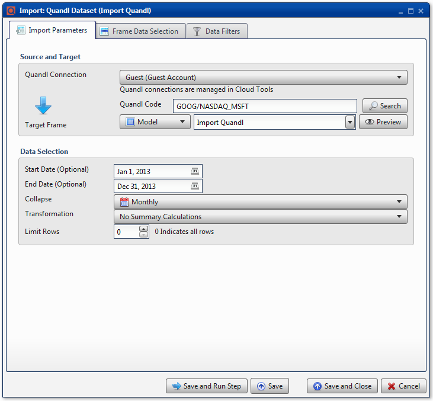
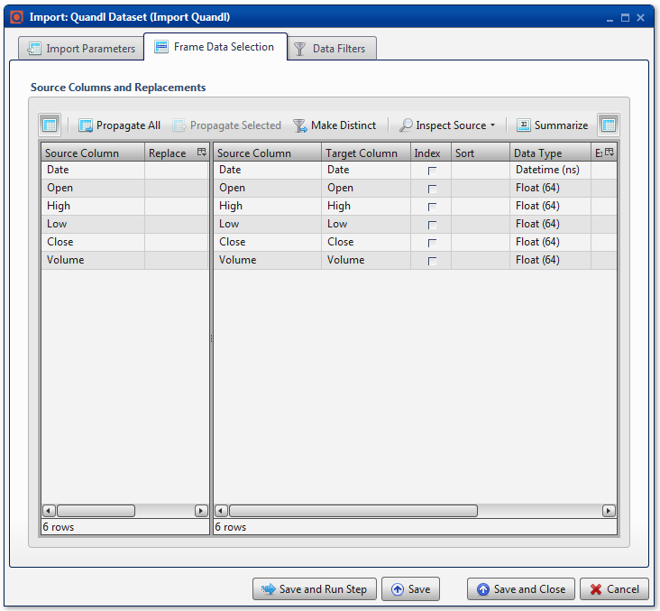

.. sectionauthor:: Paul Morel <paul.morel@tartansolutions.com>
.. sectionauthor:: Michael Rea <michael.rea@tartansolutions.com>

Import Quandl
=============================

.. toctree::
   :maxdepth: 2
   :includehidden:

.. sidebar:: This Page

   .. contents::
      :local: 

+---------------------+----------------------------+
| Parameter           | Value                      |
+=====================+============================+
| **Category**        | Import                     |
+---------------------+----------------------------+
| **Operation**       | import\_quandl             |
+---------------------+----------------------------+
| **Workflow Icon**   | |Icon|                     |
+---------------------+----------------------------+
| **Input Type**      | Quandl Dataset             |
+---------------------+----------------------------+
| **Output Type**     | PlaidCloud Analyze Table   |
+---------------------+----------------------------+

Description
-----------

Imports data sets from Quandl's repository of millions of data sets.

For more details on Quandl data sets, see the Quandl official website
here: http://www.quandl.com/.

Import Parameters
-----------------

Source and Target
~~~~~~~~~~~~~~~~~

Accessing Quandl data sets requires a user account or a guest account
with limited access. This requires set up in Tools. For details on
setting up a Quandl account connection, see here: `PlaidCloud
Tools - Connection <../../tools/connection>`__.

Once all necessary accounts have been set up, select the appropriate
account from the drop down list.

Next, enter criteria for the desired Quandl code. Users can use the
**Search** functionality to search for data sets. Alternatively, data
sets can be entered manually. This requires the user to enter the
portion of the URL after "http://www.quandl.com". For example, to import
the data set for Microsoft stock, which can be found here
(http://www.quandl.com/GOOG/NASDAQ_MSFT), enter *GOOG/NASDAQ\_MSFT* in
the Quandl Code field.

Data Selection
~~~~~~~~~~~~~~

It is possible to slice Quandl data sets upon import. Available options
include the following:

-  Start Date: Use the date picker to select the desired
   date.
-  End Date: Use the date picker to select the desired date.
-  Collapse: Aggregate results on a daily, weekly, monthly, quarterly,
   or annual basis. There is no aggregation by default.
-  Transformation: Summary calculations.
-  Limit Rows: The default value of 0 returns all rows. Any other
   positive integer value will specify the limit of rows to return from
   the data set.

.. include:: ../common/table_data_selection.rst

.. include:: ../common/data_filters.rst

.. include:: ../common/select_subset_of_source_data.rst

.. include:: ../common/duplicates.rst

Source Table Slicing (Limit)
~~~~~~~~~~~~~~~~~~~~~~~~~~~~

.. include:: ../common/source_table_slicing.rst 

Select Subset of Final Data
~~~~~~~~~~~~~~~~~~~~~~~~~~~

.. include:: ../common/select_subset_of_final_data.rst 

Final Data Table Slicing (Limit)
~~~~~~~~~~~~~~~~~~~~~~~~~~~~~~~~

.. include:: ../common/final_data_table_slicing.rst 

Workflow Configuration Forms
----------------------------

   
Examples
--------

In this example, the data set for Microsoft stock,
(http://www.quandl.com/GOOG/NASDAQ_MSFT), is imported into a data table.
The **Quandl Connection** is *Guest*, while the **Quandl Code** is
*GOOG/NASDAQ\_MSFT*. The data is filtered to show all data from *Jan 1,
2013* through *Dec 31, 2013*, a full year. The data is set to
**Collapse** with *Monthly* aggregation.

All columns are mapped from source to target. Analyze automatically
detects the data types for all columns.

.. |Icon| image:: https://plaidcloud.com/client/resource/fugue/icons/quandl.png
