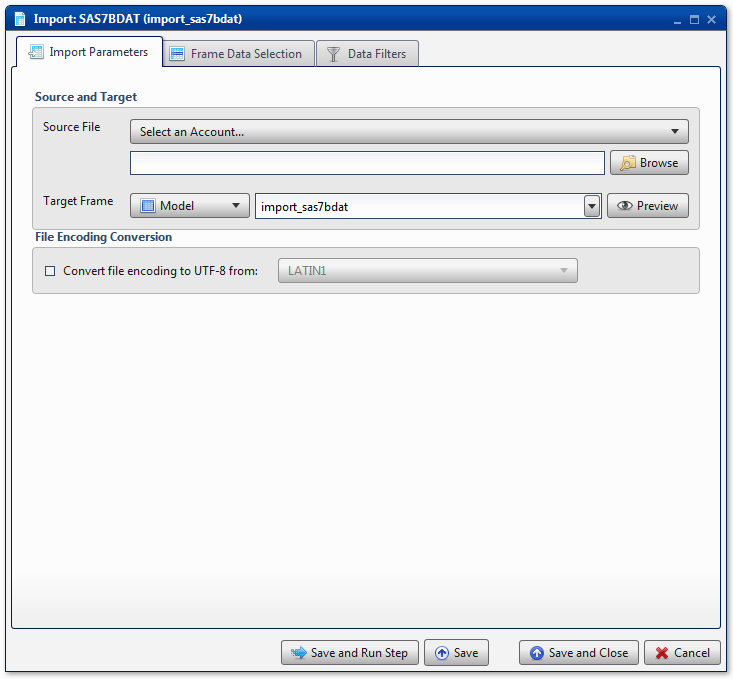
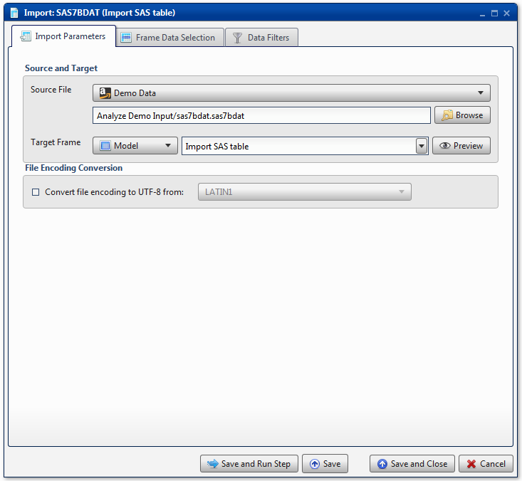
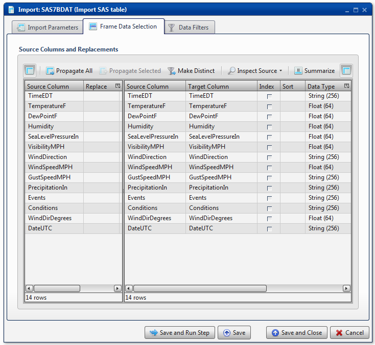

.. sectionauthor:: Paul Morel <paul.morel@tartansolutions.com>
.. sectionauthor:: Michael Rea <michael.rea@tartansolutions.com>

Import SAS7BDAT
=============================

.. toctree::
   :maxdepth: 2
   :includehidden:

.. sidebar:: This Page

   .. contents::
      :local: 

+---------------------+----------------------------+
| Parameter           | Value                      |
+=====================+============================+
| **Category**        | Import                     |
+---------------------+----------------------------+
| **Operation**       | import\_sas7bdat           |
+---------------------+----------------------------+
| **Workflow Icon**   | |Icon|                     |
+---------------------+----------------------------+
| **Input Type**      | PlaidCloud Document File   |
+---------------------+----------------------------+
| **Output Type**     | PlaidCloud Analyze Table   |
+---------------------+----------------------------+

Description
-----------

Import SAS table files from PlaidCloud Document.

Import Parameters
-----------------

Source and Target
~~~~~~~~~~~~~~~~~

.. include:: ../common/source_and_target.rst 

File Encoding Conversion
~~~~~~~~~~~~~~~~~~~~~~~~

See details here: 
`File Encoding Conversion <../transforms/common_features#file-encoding-conversion>`__

.. include:: ../common/table_data_selection.rst

.. include:: ../common/data_filters.rst

.. include:: ../common/select_subset_of_source_data.rst

.. include:: ../common/duplicates.rst

Source Table Slicing (Limit)
~~~~~~~~~~~~~~~~~~~~~~~~~~~~

.. include:: ../common/source_table_slicing.rst 

Select Subset of Final Data
~~~~~~~~~~~~~~~~~~~~~~~~~~~

.. include:: ../common/select_subset_of_final_data.rst

Final Data Table Slicing (Limit)
~~~~~~~~~~~~~~~~~~~~~~~~~~~~~~~~

.. include:: ../common/final_data_table_slicing.rst 

Workflow Configuration Forms
----------------------------

Examples
--------

Import SAS Table
~~~~~~~~~~~~~~~~

In this example, the SAS table *sas7bdat.sas7bdat* is imported from the
*Analyze Demo Input* directory of PlaidCloud Document. The Analyze
Target Table is *Import SAS Table*. |Import SAS 1|

All columns are mapped from source to target as *Float* or *String* data
types, for number data and string data, respectively. |Import SAS 2|

No **Data Filters** are used.

.. |Icon| image:: https://plaidcloud.com/client/resource/fugue/icons/document-table.png
