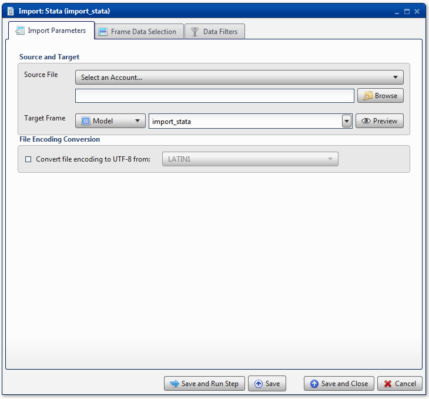
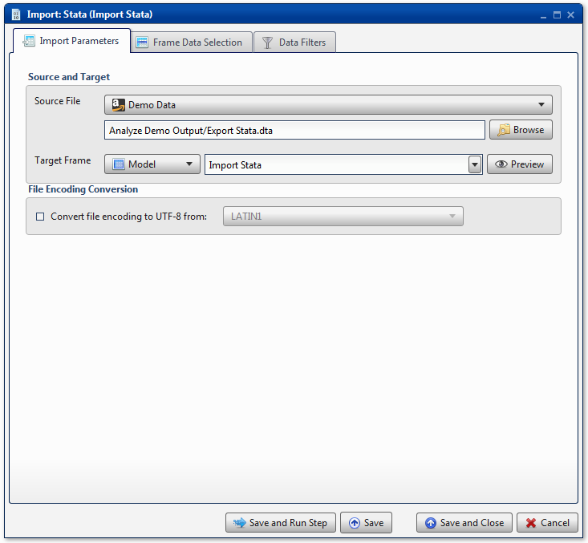
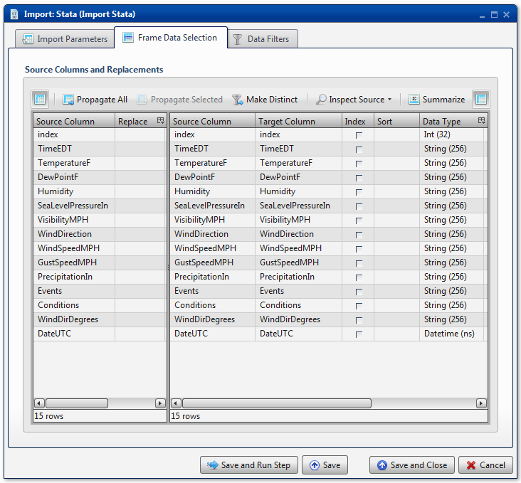

.. sectionauthor:: Paul Morel <paul.morel@tartansolutions.com>
.. sectionauthor:: Michael Rea <michael.rea@tartansolutions.com>

Import Stata
=============================

.. toctree::
   :maxdepth: 2
   :includehidden:

.. sidebar:: This Page

   .. contents::
      :local: 

+---------------------+----------------------------+
| Parameter           | Value                      |
+=====================+============================+
| **Category**        | Import                     |
+---------------------+----------------------------+
| **Operation**       | import\_stata              |
+---------------------+----------------------------+
| **Workflow Icon**   | |Icon|                     |
+---------------------+----------------------------+
| **Input Type**      | PlaidCloud Document File   |
+---------------------+----------------------------+
| **Output Type**     | PlaidCloud Analyze Table   |
+---------------------+----------------------------+

Description
-----------

Import Stata files from PlaidCloud Document.

Import Parameters
-----------------

Source and Target
~~~~~~~~~~~~~~~~~

.. include:: ../common/source_and_target.rst

File Encoding Conversion
~~~~~~~~~~~~~~~~~~~~~~~~

See details here: 
`File Encoding Conversion <../transforms/common_features#file-encoding-conversion>`__

.. include:: ../common/table_data_selection.rst

.. include:: ../common/data_filters.rst

.. include:: ../common/select_subset_of_source_data.rst

.. include:: ../common/duplicates.rst

Source Table Slicing (Limit)
~~~~~~~~~~~~~~~~~~~~~~~~~~~~

.. include:: ../common/source_table_slicing.rst 

Select Subset of Final Data
~~~~~~~~~~~~~~~~~~~~~~~~~~~

.. include:: ../common/select_subset_of_final_data.rst  

Final Data Table Slicing (Limit)
~~~~~~~~~~~~~~~~~~~~~~~~~~~~~~~~

.. include:: ../common/final_data_table_slicing.rst 

Workflow Configuration Forms
----------------------------

Examples
--------

Import Stata File
~~~~~~~~~~~~~~~~~

In this example, the Stata file *Export Stata.dta* is imported from the
*Analyze Demo Output* directory of PlaidCloud Document. The Analyze
Target Table is *Import Stata*. |Import Stata 1|

Note that almost all of the columns are imported with a **Data Type**
value of *String(256)*. The modeler must manually change the **Data
Type** value to numeric format, as needed. |Import Stata 2|

No **Data Filters** are used.

.. todo:: Examples and screenshots coming soon

.. |Icon| image:: https://plaidcloud.com/client/resource/fugue/icons/database.png

