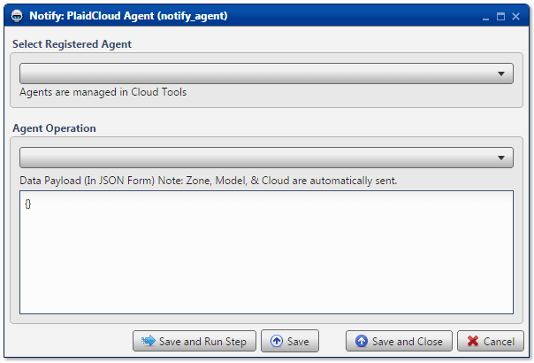

.. sectionauthor:: Paul Morel <paul.morel@tartansolutions.com>
.. sectionauthor:: Michael Rea <michael.rea@tartansolutions.com>

Notify Agent
=============================

.. toctree::
   :maxdepth: 2
   :includehidden:

.. sidebar:: This Page

   .. contents::
      :local: 

+---------------------+-----------------+
| Parameter           | Value           |
+=====================+=================+
| **Category**        | Notify          |
+---------------------+-----------------+
| **Operation**       | notify\_agent   |
+---------------------+-----------------+
| **Workflow Icon**   | |Icon|          |
+---------------------+-----------------+
| **Input Type**      |                 |
+---------------------+-----------------+
| **Output Type**     |                 |
+---------------------+-----------------+

Description
-----------

Notify a PlaidCloud Agent.

Select Registered Agent
~~~~~~~~~~~~~~~~~~~~~~~

Agent Operation
~~~~~~~~~~~~~~~

Workflow Configuration Forms
----------------------------

Examples
--------

No examples for Notify PlaidCloud Agent yet.

.. todo:: Examples and screenshots coming soon

.. |Icon| image:: https://plaidcloud.com/client/resource/fugue/icons/mails.png
